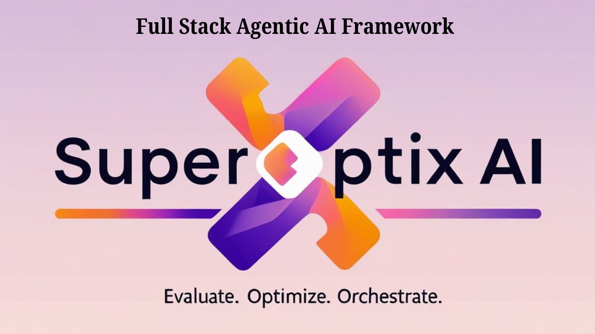

<div align="center">
  <h1>🚀 SuperOptiX AI</h1>
  
  <h3><strong>Full Stack Agentic AI Framework</strong></h3>
  
  
  
  <div style="margin: 20px 0;">
    <a href="https://badge.fury.io/py/superoptix">
      
    </a>
    <a href="LICENSE">
      
    </a>
    <a href="https://www.python.org/downloads/">
      
    </a>
    <a href="https://super-agentic.ai">
      
    </a>
    <a href="https://support.super-agentic.ai">
      
    </a>
  </div>
  
  <p style="font-size: 1.2em; color: #666; margin: 20px 0;">
    <strong>Evaluation-First • Optimization-Core • Orchestration-Ready</strong>
  </p>
  
  <div style="background: linear-gradient(90deg, #10B981, #3B82F6, #8B5CF6); color: white; padding: 10px 20px; border-radius: 25px; margin: 20px 0; display: inline-block;">
    <strong>🎉 Oracles & Genies are FREE to try!</strong>
  </div>
</div>

---

## 🎯 What is SuperOptiX?

SuperOptiX is a **Full-Stack Agentic AI Framework** designed to help developers and teams build optimized, production-grade AI agents from day one. It brings together declarative agent specification, automatic optimization, built-in evaluation, and multi-agent orchestration—all grounded in the principles of test-driven development and context engineering.

### 🌟 Key Features

- **🎯 Evaluation-First by Design** - Agents are defined and validated using BDD-style specs
- **⚡ DSPy-Powered Optimization** - Declarative optimization of agents, prompts, and protocols
- **🧠 Built-in Memory System** - Modular memory layers for short-term, vector, and long-term storage
- **📊 Native Evaluation Suite** - Functional, behavioral, and optimization-level tests
- **🤖 Multi-Model Support** - Works with OpenAI, Anthropic, HuggingFace, Ollama, and more
- **🏪 Marketplace** - Pre-built agents and tools for faster development

---

## 🎭 Agent Tiers

SuperOptiX offers a **5-tier evolutionary system** that scales from simple automation to enterprise-grade AI operations:

### 🆓 **Free Tiers** (No Credit Card Required)

- **🧙‍♂️ Oracle** - Simple Q&A and basic automation
- **🧞‍♂️ Genie** - Multi-step reasoning with tools and memory

### 💼 **Commercial Tiers** (Contact Sales)

- **🎭 Protocol** - Complex workflows with MCP/A2A protocols
- **🤖 Superagent** - Multi-agent coordination and orchestration
- **👑 Sovereign** - Autonomous enterprise AI systems

[📊 View Complete Tier Comparison](https://super-agentic.ai/guides/tiers/)

---

## 📚 Documentation

| Resource | Description | Link |
|----------|-------------|------|
| 📖 **Full Documentation** | Complete guides, tutorials, and API reference | [docs.super-agentic.ai](https://docs.super-agentic.ai) |
| 🚀 **Quick Start Guide** | Get up and running in minutes | [Quick Start](https://super-agentic.ai/quick-start/) |
| 🎭 **Agent Tiers** | Understand the tier system | [Tiers Guide](https://super-agentic.ai/guides/tiers/) |
| 📄 **SuperSpec DSL** | Learn our declarative language | [SuperSpec Guide](https://super-agentic.ai/guides/superspec/) |
| 🏪 **Marketplace** | Pre-built agents and tools | [Marketplace](https://super-agentic.ai/guides/marketplace/) |

---

## 🛠️ Installation

### Prerequisites

- Python 3.11 or higher
- pip or uv package manager

### Basic Installation

```bash
# Using pip
pip install superoptix

# Using uv (recommended)
uv pip install superoptix

# Verify installation
super --version
```

### Optional Dependencies

```bash
# Install with vector database support
pip install "superoptix[vectordb]"

# Install with UI components
pip install "superoptix[ui]"

# Install with observability tools
pip install "superoptix[observability]"

# Install everything
pip install "superoptix[all]"
```

---


## 🆘 Support & Community

<div align="center" style="margin: 20px 0;">
  <a href="https://support.super-agentic.ai" style="text-decoration: none; margin: 0 10px;">
    
  </a>
  <a href="mailto:support@super-agentic.ai" style="text-decoration: none; margin: 0 10px;">
    
  </a>
  <a href="https://super-agentic.ai" style="text-decoration: none; margin: 0 10px;">
    
  </a>
</div>

- **📧 Email Support**: support@super-agentic.ai
- **🌐 Website**: [super-agentic.ai](https://super-agentic.ai)
- **📖 Documentation**: [SuperOptiX Docs](https://superagenticai.github.io/superoptix-ai)

---

## 📄 License

This project is licensed under a proprietary license. For licensing inquiries, contact [licensing@super-agentic.ai](mailto:licensing@super-agentic.ai).

**Note**: Oracles and Genies tiers are available for free trial without any licensing restrictions.

---

<div align="center" style="margin: 40px 0; padding: 20px; background: linear-gradient(135deg, #667eea 0%, #764ba2 100%); color: white; border-radius: 10px;">
  <h2>🚀 Ready to Build the Future?</h2>
  <p style="font-size: 1.1em; margin: 10px 0;">
    <strong>Start with SuperOptiX • Read the Docs • Join the Revolution</strong>
  </p>
  <p style="margin: 10px 0;">
    <em>Powered by DSPy. Refined by Superagentic AI.</em>
  </p>
</div> 