This guide explains AI Agents in SuperOptiX and the 5-tier evolutionary system that scales from simple automation to enterprise-grade AI operations.

---

## 🤖 What are AI Agents?

There is no standard definition of AI Agents yet in the industry, but we can define them in SuperOptiX as:

AI Agents are intelligent software systems that can:

- **Perceive** their environment through data and inputs
- **Reason** about tasks and goals using language models
- **Act** by executing tools, making decisions, or generating outputs
- **Learn** from interactions to improve performance over time

In SuperOptiX, agents are built using **DSPy (Declarative Self-Improving Python)** - a framework that optimizes prompts and reasoning chains automatically.

---

## 🎭 The 5-Tier Evolutionary System

SuperOptiX introduces a progressive architecture inspired by Nick Bostrom's **Superintelligence** book and Sam Altman's **5 tiers to AGI**. Each tier builds upon the previous one, adding complexity and capabilities.

**Note**: The industry is still figuring out agent communication protocols and patterns, so these will evolve with time as standards emerge.

```mermaid
graph TD
    A[🧙‍♂️ Oracles<br/>Simple Q&A] --> B[🧞‍♂️ Genies<br/>Tools & Memory]
    B --> C[🎭 Protocols<br/>Emerging Protocols like MCP/A2A]
    C --> D[🤖 Superagents<br/>Multi-Agent Systems with different topologies]
    D --> E[👑 Sovereigns<br/>Autonomous Operations Agent Self Discovery]
    
    style A fill:#4CAF50
    style B fill:#2196F3
    style C fill:#FF9800
    style D fill:#9C27B0
    style E fill:#F44336
```



---

## 🧙‍♂️ Oracles Tier - Entry Level

**Status**: ✅ Proprietary  
**Complexity**: Low  
**Best For**: Simple automation, Q&A systems

### What Oracles Can Do

Oracles are single-purpose agents that provide fast question-answering capabilities. They interact directly with language models and respond to queries without external connections.

**Note**: Oracles are designed for demos and prototypes. Their output is not configured for chaining in multi-agentic systems or orchestras, and they are not optimized to work with parallel configurations.

**Key Capabilities:**

- 🧩 **Single-step reasoning** — Direct question-to-answer mapping
- 📝 **Template-based responses** — Consistent output formats
- ⚡ **Built-in optimization** — DSPy-powered prompt tuning
- 🛡️ **Simple validations** — Basic output verification
- 🤖 **Any LLM support** — Works with any language model

### Example Use Cases

```yaml
# FAQ Bot
# In the Agent Playbook we can use this as:
apiVersion: agent/v1
kind: Agent
metadata:
  name: faq-bot
  tier: oracle
spec:
  tasks:
    - name: answer_faq
      template: "Answer this FAQ: {question}"
```

```yaml
# Data Formatter
# In the Agent Playbook we can use this as:
apiVersion: agent/v1
kind: Agent
metadata:
  name: data-formatter
  tier: oracle
spec:
  tasks:
    - name: format_data
      template: "Format this data as JSON: {input}"
```

**Perfect for:** Simple Q&A, data formatting, basic automation, prototyping

---

## 🧞‍♂️ Genies Tier - Intermediate

**Status**: ✅ Proprietary  
**Complexity**: Medium  
**Best For**: Customer service, content creation, complex problem-solving

### What Genies Can Do

Genies are multi-step reasoning agents that can interact with external systems through tools, memory, and RAG (Retrieval-Augmented Generation). They use reasoning and action (ReAct) patterns.

**Note**: Genies are designed for demos and prototypes. Their output is not configured for chaining in multi-agentic systems or orchestras, and they are not optimized to work with parallel configurations.

**Key Capabilities:**

- 🧠 **Multi-step reasoning** — Chain-of-thought problem solving
- 🛠️ **Dynamic tool selection** — Intelligent tool usage
- 🗂️ **Memory integration** — Learning from interactions
- 📚 **RAG support** — Knowledge retrieval from vector databases
- 📞 **Function calling** — Advanced LLM capabilities

### Example Use Cases

```yaml
# Customer Service Agent
# In the Agent Playbook we can use this as:
apiVersion: agent/v1
kind: Agent
metadata:
  name: customer-service
  tier: genie
spec:
  context:
    memory: true
    tools: true
    retrieval: true
  tasks:
    - name: handle_inquiry
      description: "Handle customer inquiries with context"
    - name: lookup_order
      description: "Look up order information"
    - name: process_return
      description: "Process return requests"
```

```yaml
# Content Creator
# In the Agent Playbook we can use this as:
apiVersion: agent/v1
kind: Agent
metadata:
  name: content-creator
  tier: genie
spec:
  context:
    memory: true
    tools: ["research", "writing", "editing"]
    retrieval: true
  tasks:
    - name: research_topic
      description: "Research content topics"
    - name: write_content
      description: "Create engaging content"
    - name: edit_content
      description: "Polish and refine content"
```

**Perfect for:** Customer service, content creation, research, tool-based workflows

---

## 🎭 Protocols Tier - Advanced

**Status**: 🔒 Closed Source (Contact Us)  
**Complexity**: High  
**Best For**: Business processes, decision making, complex workflows

### What Protocols Can Do

Protocols support emerging protocols like MCP (Model Context Protocol) and A2A (Agent-to-Agent) communication. They combine all Oracle and Genie capabilities with advanced orchestration.

**Key Capabilities:**

- 🔗 **Advanced agent protocols** — MCP, A2A integration
- 🏗️ **Complex workflow management** — Multi-step business processes
- 🧵 **Parallel orchestration** — Concurrent agent execution
- 🚀 **Production deployment** — Enterprise-grade infrastructure
- 🧬 **Advanced optimization** — Custom DSPy pipelines

### Example Use Cases

```yaml
# Sales Qualification Agent
# In the Agent Playbook we can use this as:
apiVersion: agent/v1
kind: Agent
metadata:
  name: sales-qualifier
  tier: protocol
spec:
  context:
    memory: true
    tools: ["crm", "email", "calendar"]
    protocols: ["mcp", "a2a"]
  workflow:
    - name: lead_analysis
      type: "parallel"
    - name: qualification_scoring
      type: "sequential"
    - name: follow_up_scheduling
      type: "orchestrated"
```

```yaml
# Risk Assessment Agent
# In the Agent Playbook we can use this as:
apiVersion: agent/v1
kind: Agent
metadata:
  name: risk-assessor
  tier: protocol
spec:
  context:
    memory: true
    tools: ["risk_models", "regulatory_db"]
    protocols: ["mcp", "a2a"]
  workflow:
    - name: data_collection
      type: "parallel"
    - name: risk_calculation
      type: "sequential"
    - name: compliance_check
      type: "orchestrated"
```

**Perfect for:** Complex business workflows, decision-making systems, enterprise applications

---

## 🤖 Superagents Tier - Expert

**Status**: 🔒 Closed Source (Work in Progress)  
**Complexity**: Expert  
**Best For**: Complex multi-agent systems, research teams, e-commerce platforms

### What Superagents Can Do

Superagents are multi-agent systems where a lead agent manages and coordinates other agents. They can spawn ephemeral subagents and work with other superagents using AgentLines orchestration. This tier involves **agent architectures** and **agent topologies** for higher levels of orchestration.

**Key Capabilities:**

- 🤝 **Multi-agent coordination** — Lead agent management
- 🪄 **Dynamic subagent spawning** — On-demand agent creation
- 🕸️ **AgentLines integration** — Advanced orchestration
- 🛰️ **High-level protocols** — Beyond MCP and A2A
- 🗄️ **Resource management** — Compute and memory optimization

### Example Use Cases

```yaml
# E-commerce Platform
# In the Agent Playbook we can use this as:
apiVersion: superagent/v1
kind: Superagent
metadata:
  name: ecommerce-platform
  tier: superagent
spec:
  subagents:
    - name: inventory-manager
      role: stock_management
    - name: pricing-optimizer
      role: dynamic_pricing
    - name: customer-service
      role: support_coordination
    - name: recommendation-engine
      role: product_suggestions
  coordination: "agentlines"
```

```yaml
# Research Team
# In the Agent Playbook we can use this as:
apiVersion: superagent/v1
kind: Superagent
metadata:
  name: research-team
  tier: superagent
spec:
  subagents:
    - name: data-collector
      role: information_gathering
    - name: analyst
      role: data_analysis
    - name: synthesizer
      role: insight_generation
    - name: writer
      role: report_creation
  coordination: "agentlines"
```

**Perfect for:** Complex multi-agent systems, research and development, e-commerce platforms

---

## 👑 Sovereigns Tier - Enterprise

**Status**: 🔒 Closed Source (Coming Soon)  
**Complexity**: Enterprise  
**Best For**: Large-scale AI operations, AI-powered companies, research labs

### What Sovereigns Can Do

Sovereigns are autonomous AI systems that can discover agents based on tasks, make decisions, and handle complex enterprise workflows. They represent the highest level of AI autonomy with advanced **agent architectures** and **agent topologies** for sovereign-level orchestration.

**Key Capabilities:**

- 🦾 **Autonomous decision-making** — Independent operation
- 🔍 **Agent discovery** — Automatic agent selection
- 🌐 **Cross-domain synthesis** — Multi-domain knowledge
- 🕰️ **Real-time governance** — Dynamic management
- 🛡️ **Enterprise-grade security** — Production security

### Example Use Cases

```yaml
# AI-Powered Company
# In the Agent Playbook we can use this as:
apiVersion: sovereign/v1
kind: Sovereign
metadata:
  name: ai-company
  tier: sovereign
spec:
  capabilities:
    - agent_discovery
    - cross_domain_synthesis
    - real_time_governance
    - autonomous_decision_making
  governance: "enterprise_grade"
  security: "production_ready"
```

```yaml
# Research Lab
# In the Agent Playbook we can use this as:
apiVersion: sovereign/v1
kind: Sovereign
metadata:
  name: research-lab
  tier: sovereign
spec:
  capabilities:
    - research_coordination
    - experiment_management
    - publication_assistance
    - collaboration_facilitation
  governance: "academic_grade"
```

**Perfect for:** Large-scale AI operations, AI-powered companies, research laboratories

---

## 📊 Complexity Progression

| Tier | Reasoning | Tools | Memory | Orchestration | Deployment |
|------|-----------|-------|--------|---------------|------------|
| **🧙‍♂️ Oracles** | Single-step | Basic | Simple | Sequential | Demo |
| **🧞‍♂️ Genies** | Multi-step | Advanced | Multi-layer | Sequential | Demo |
| **🎭 Protocols** | Complex | Protocol-based | Layered | Parallel | Production |
| **🤖 Superagents** | Orchestrated | Multi-agent | Advanced | AgentLines | Enterprise |
| **👑 Sovereigns** | Autonomous | Discovery | Sovereign | Autonomous | Sovereign |

---

## 🚀 Choosing Your Tier

### Start Simple - Oracles
- **When**: You need basic automation or Q&A
- **Example**: FAQ bot, data formatter, simple chatbot
- **Complexity**: Low - perfect for beginners

### Add Power - Genies
- **When**: You need tools, memory, or complex reasoning
- **Example**: Customer service agent, content creator, research assistant
- **Complexity**: Medium - great for most use cases

### Scale Up - Protocols
- **When**: You need complex workflows or production deployment
- **Example**: Sales qualification, risk assessment, business processes
- **Complexity**: High - for advanced applications

### Go Multi-Agent - Superagents
- **When**: You need multiple agents working together
- **Example**: E-commerce platform, research team, complex systems
- **Complexity**: Expert - for sophisticated multi-agent systems

### Enterprise Scale - Sovereigns
- **When**: You need autonomous AI operations
- **Example**: AI-powered company, research lab, government systems
- **Complexity**: Enterprise - for large-scale operations

---

## 🎯 Common Patterns by Tier

### Oracles Patterns
- **Q&A Templates** - Standard question-answer formats
- **Data Transformation** - Input/output formatting
- **Simple Validation** - Basic output verification

### Genies Patterns
- **ReAct Loops** - Reasoning and action cycles
- **Tool Integration** - External system connections
- **Memory Management** - Context preservation
- **RAG Workflows** - Knowledge retrieval patterns

### Protocols Patterns
- **Multi-Step Workflows** - Complex business processes
- **Parallel Execution** - Concurrent task processing
- **Protocol Integration** - MCP and A2A patterns
- **Production Deployment** - Enterprise infrastructure

### Superagents Patterns
- **Agent Coordination** - Lead agent management
- **Subagent Spawning** - Dynamic agent creation
- **Resource Management** - Compute optimization
- **AgentLines Orchestration** - Advanced workflow patterns

### Sovereigns Patterns
- **Agent Discovery** - Automatic agent selection
- **Autonomous Decision Making** - Independent operation
- **Cross-Domain Synthesis** - Multi-domain knowledge
- **Real-Time Governance** - Dynamic oversight

---

## 💡 Getting Started

1. **Choose your tier** based on your use case and complexity needs
2. **Start with Oracles** if you're new to AI agents
3. **Upgrade gradually** as your needs grow
4. **Follow the patterns** for your chosen tier
5. **Leverage SuperSpec** for declarative agent specifications

**Note**: The Playbook uses Agent Specification with SuperSpec format which is human-readable and optimized for Context Engineering and Agent Engineering.

Ready to build your first agent? Check out the [Quick Start Guide](quick-start.md) to get started with SuperOptiX! 🚀 