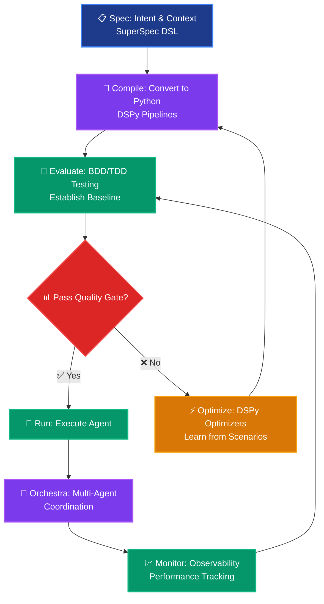

# 🚀 Agent Development Life Cycle in SuperOptiX

SuperOptiX follows a **evaluation-first, BDD-driven development approach** that ensures your agents are production-ready from day one. This guide walks you through the complete lifecycle of building, testing, and deploying AI agents.

---

## 🎯 **The SuperOptiX Development Lifecycle**



---

## 🏗️ **Phase 1: Specification & Context Engineering**

### **SuperSpec DSL: Define Intent & Context**

The foundation of every agent starts with the **SuperSpec DSL** - a declarative language for defining agent behavior, context, and capabilities.

```bash
# Generate agent with context engineering
super spec generate genies developer --rag --memory --tools
```

**What happens:**

- 🎭 **Persona Definition** - Agent personality and behavioral traits

- 🧠 **Memory Systems** - Short-term, long-term, and episodic memory

- 🛠️ **Tool Integration** - Web search, file operations, code analysis

- 📚 **RAG Capabilities** - Knowledge retrieval (document ingestion is configured separately)

- 📋 **Task Specifications** - What your agent should do

- 🔒 **Safety Constraints** - What your agent should NOT do

**Example Playbook Structure:**
```yaml
apiVersion: agent/v1
kind: AgentSpec
metadata:
  name: "Developer Assistant"
  tier: "genies"
  namespace: "software"

spec:
  persona: |
    You are an expert software developer with 10+ years of experience.
    You specialize in Python, React, and cloud architecture.
    Always provide practical, production-ready solutions.
  
  context:
    memory:
      short_term: true
      long_term: true
      episodic: true
    
    tools:
      - web_search
      - code_formatter
      - git_analyzer
      - docker_helper
    
    rag:
      enabled: true
      # RAG sources are configured in the vector database, not directly in the playbook.
      # This flag enables the agent to use the pre-configured RAG system.
      sources: []
  
  tasks:
    - name: "code_review"
      description: "Review code for best practices"
    - name: "architecture_design"
      description: "Design system architecture"
```

---

## 🛠️ **Phase 2: Tool & Memory Integration**

The real power of Genies-tier agents comes from their ability to use tools and memory.

### **Available Tools**

Your agent has access to a variety of built-in tools.

- **`WebSearchTool`**: Performs web searches to gather information.
  > ⚠️ **Note:** The default `WebSearchTool` is a non-functional placeholder. To use it, you must integrate a real search API (e.g., DuckDuckGo, Serper, Tavily) by modifying the tool's implementation in `superoptix/tools/categories/core.py`.

- **`CalculatorTool`**: For performing mathematical calculations.

- **`FileReaderTool`**: To read the contents of local files.

- **`CodeFormatterTool`**: To format and pretty-print code snippets.

### **Memory Systems**

- **Short-Term Memory**: Remembers the immediate context of a conversation.
- **Long-Term Memory**: Stores and recalls information over extended periods.
- **Episodic Memory**: Remembers past interactions to learn from experience.
---

## 🔨 **Phase 3: Compilation - YAML to Python**

### **Transform Playbooks into Executable Pipelines**

```bash
super agent compile developer
```

**What happens:**

- 📋 **YAML Playbook** → **Python Pipeline**

- 🎯 **DSPy Integration** - Automatic pipeline generation

- 🔧 **Framework Selection** - Tier-appropriate optimizations

- 📁 **File Generation** - `developer_pipeline.py` created

<details>
<summary>🔨 Compilation Output</summary>

```
================================================================================
🔨 Compiling agent 'developer'...
╭───────────────────────────────────────── ⚡ Compilation Details ─────────────────────────────────────────╮
│                                                                                                          │
│  🤖 COMPILATION IN PROGRESS                                                                              │
│                                                                                                          │
│  🎯 Agent: Developer Assistant                                                                           │
│  🏗️ Framework: DSPy Genies Pipeline — other frameworks coming soon                                      │
│  🔧 Process: YAML playbook → Executable Python pipeline                                                  │
│  📁 Output: swe/agents/developer/pipelines/developer_pipeline.py                                        │
│                                                                                                          │
╰──────────────────────────────────────────────────────────────────────────────────────────────────────────╯
✅ Compilation successful! Agent 'developer' is ready for evaluation.
```

</details>

---

## 🧪 **Phase 3: Evaluation-First Development**

### **BDD/TDD: Test Before You Optimize**

**🚨 CRITICAL: Always evaluate before optimizing!**

```bash
super agent evaluate developer
```

**Why Evaluation-First?**

- 📊 **Baseline Measurement** - Know your starting point

- 🎯 **Quality Gates** - Ensure scenarios are well-written

- 💡 **Optimization Strategy** - Plan improvements based on failures

- ✅ **Fail-Fast Feedback** - Catch issues early

<details>
<summary>🧪 Evaluation Output</summary>

```
🎭 Running BDD Test Suite for Agent: developer
============================================================

🎭 Executing BDD Scenarios...
  📝 Running: basic_api_endpoint_creation
    ✅ PASSED
  📝 Running: data_structure_design
    ✅ PASSED
  📝 Running: algorithm_implementation
    ❌ FAILED: semantic meaning differs significantly
  📝 Running: robust_error_handling
    ✅ PASSED
  📝 Running: test_code_generation
    ✅ PASSED

📊 BDD Test Results Summary:
========================================
Total Scenarios: 5
Passed: 4 ✅
Failed: 1 ❌
Pass Rate: 80.0%
BDD Score: 0.800

💡 Recommendations:
   🔧 Fix 1 failing scenarios to improve reliability
   🎯 Common issue (1 scenarios): semantic meaning differs significantly

🎉 BDD Test Suite: EXCELLENT (80.0%)
```

</details>

### **Quality Gates**

| Pass Rate | Status | Action Required |
|-----------|--------|-----------------|
| **≥ 80%** | ✅ **Production Ready** | Deploy with confidence |
| **60-79%** | ⚠️ **Needs Improvement** | Optimize and re-evaluate |
| **< 60%** | ❌ **Significant Work** | Fix scenarios and recompile |

---

## ⚡ **Phase 4: Optimization - DSPy Magic**

### **Learn from Your BDD Scenarios**

```bash
super agent optimize developer
```

**What Optimization Does:**

- 📚 **Training Data** - Uses your BDD scenarios as examples

- 🧠 **DSPy BootstrapFewShot** - Automatic prompt improvement

- 📈 **Performance Enhancement** - Better reasoning and responses

- 💾 **Optimized Weights** - Saved to `developer_optimized.json`

<details>
<summary>⚡ Optimization Output</summary>

```
================================================================================
🚀 Optimizing agent 'developer'...

╭───────────────────────────────────────── ⚡ Optimization Details ─────────────────────────────────────────╮
│                                                                                                          │
│  🤖 OPTIMIZATION IN PROGRESS                                                                            │
│                                                                                                          │
│  🎯 Agent: Developer Assistant                                                                           │
│  🔧 Strategy: DSPy BootstrapFewShot                                                                      │
│  📊 Data Source: BDD scenarios from playbook                                                            │
│  💾 Output: swe/agents/developer/pipelines/developer_optimized.json                                     │
│                                                                                                          │
╰──────────────────────────────────────────────────────────────────────────────────────────────────────────╯

🎯 Using 5 BDD scenarios for optimization...
📈 Learning from scenario: basic_api_endpoint_creation
📈 Learning from scenario: data_structure_design
📈 Learning from scenario: algorithm_implementation
📈 Learning from scenario: robust_error_handling
📈 Learning from scenario: test_code_generation

✅ Optimization complete! Agent performance enhanced.
```

</details>

### **Re-Evaluate to Measure Improvement**

```bash
super agent evaluate developer
```

**Expected Results:**

- 📈 **Improved Pass Rate** - Should be higher than baseline

- 🎯 **Better Quality** - More accurate and relevant responses

- ⚡ **Faster Execution** - Optimized weights load automatically

---

## 🚀 **Phase 5: Execution - Run Your Agent**

### **Deploy Your Optimized Agent**

```bash
super agent run developer --goal "Create a REST API with FastAPI"
```

**What Happens:**

- 🔄 **Load Optimized Pipeline** - Uses `developer_optimized.json`

- 🧠 **Context-Aware Processing** - Memory, tools, and RAG integration

- 📊 **Real-time Execution** - Interactive agent responses

- 🎯 **Goal-Oriented Behavior** - Focused on your specific task

<details>
<summary>🚀 Execution Output</summary>

```
🚀 Running agent 'developer'...

Loading pipeline... ━━━━━━━━━━━━━━━━━━━━━━━━━━━━━━━━━━━━━━━━ 100%
🚀 Using pre-optimized pipeline from developer_optimized.json

🎯 Goal: Create a REST API with FastAPI

🤖 Developer Assistant: I'll help you create a comprehensive REST API using FastAPI. Let me break this down into a well-structured solution.

📋 Implementation Plan:
1. Project structure setup
2. FastAPI application with proper configuration
3. Database models and schemas
4. CRUD operations
5. Authentication and validation
6. Error handling and logging

🔧 Let me start with the core implementation...

[Detailed implementation follows...]
```

</details>

---

## 🎼 **Phase 6: Orchestration - Multi-Agent Coordination**

### **Coordinate Multiple Agents**

```bash
# Add more agents to your team
super agent pull devops_engineer
super agent pull qa_engineer

# Compile and optimize all agents
super agent compile --all
super agent optimize devops_engineer
super agent optimize qa_engineer

# Create coordinated workflow
super orchestra create sdlc
super orchestra run sdlc --goal "Build a complete web application"
```

**What Happens:**

- 🤝 **Agent Coordination** - Seamless communication between agents

- 📊 **Workflow Management** - Sequential or parallel execution

- 🔄 **Data Flow** - Output from one agent feeds into another

- 📋 **Production Artifacts** - Complete implementation, tests, and deployment

---

## 📈 **Phase 7: Monitoring & Continuous Improvement**

### **Observability & Performance Tracking**

```bash
# Enable observability
super observe enable developer

# Monitor performance
super observe dashboard

# Debug specific issues
super observe debug agent developer

# View detailed traces
super observe traces developer
```

**Monitoring Capabilities:**

- 📊 **Real-time Metrics** - Performance, latency, success rates

- 🔍 **Detailed Traces** - Step-by-step execution analysis

- 🐛 **Debugging Tools** - Identify and fix issues

- 📈 **Trend Analysis** - Long-term performance tracking

---

## 🔄 **The Complete Workflow**

### **Proper BDD/TDD Development Cycle**

```bash
# 1. Define your agent (Spec)
super spec generate genies developer --rag --memory --tools

# 2. Compile to executable code
super agent compile developer

# 3. Establish baseline performance (CRITICAL)
super agent evaluate developer

# 4. Optimize based on evaluation results
super agent optimize developer

# 5. Measure improvement
super agent evaluate developer

# 6. Deploy when quality gates pass
super agent run developer --goal "Your production task"

# 7. Monitor and iterate
super observe dashboard
```

### **Advanced Development Tips**

#### **🔧 Customize DSPy Pipelines**
```python
# Modify generated pipeline for custom logic
# File: agents/developer/pipelines/developer_pipeline.py

class CustomDeveloperPipeline(DeveloperPipeline):
    def __init__(self):
        super().__init__()
        # Add custom tools
        self.tools.append(CustomCodeAnalyzer())
        
    def forward(self, query):
        # Add custom preprocessing
        enhanced_query = self.preprocess_query(query)
        return super().forward(enhanced_query)
```

#### **🎯 Smart Optimization Strategies**
```bash
# Force re-optimization
super agent optimize developer --force

# Runtime optimization for experiments
super agent run developer --goal "task" --optimize
```

#### **📊 Quality-Driven Development**

- **Write Specific Scenarios** - Include concrete examples and expected outputs

- **Cover Edge Cases** - Test error conditions and boundary cases

- **Use Realistic Data** - Make scenarios representative of real usage

- **Iterate Based on Results** - Use evaluation feedback to improve scenarios

---

## 🎯 **Best Practices**

### **✅ DO's**

- **Always evaluate before optimizing** - Establish baseline performance

- **Write comprehensive BDD scenarios** - Cover all important use cases

- **Use quality gates** - Don't deploy until pass rate ≥ 80%

- **Monitor in production** - Track performance and iterate

- **Version your playbooks** - Track changes and improvements

### **❌ DON'Ts**

- **Don't optimize without baseline** - You won't know if you improved

- **Don't skip evaluation after optimization** - Validate your improvements

- **Don't deploy without quality gates** - Ensure production readiness

- **Don't ignore failing scenarios** - They indicate real problems

---

## 🚀 **Production Deployment Checklist**

### **Pre-Deployment**

- ✅ **Quality Gates Pass** - ≥ 80% BDD pass rate

- ✅ **Optimization Complete** - Optimized weights generated

- ✅ **Monitoring Enabled** - Observability configured

- ✅ **Error Handling** - Robust error management

- ✅ **Performance Validated** - Latency and throughput acceptable

### **Post-Deployment**

- 📊 **Monitor Performance** - Track key metrics

- 🔍 **Analyze Traces** - Identify optimization opportunities

- 📈 **Measure Impact** - Compare to baseline

- 🔄 **Iterate** - Continuous improvement cycle

---

## 🎉 **Success Metrics**

### **Development Velocity**

- **Time to First Agent** - < 30 minutes

- **Time to Production** - < 2 hours

- **Scenario Coverage** - 100% of critical paths

- **Optimization Cycles** - < 3 iterations to 80% pass rate

### **Production Quality**

- **BDD Pass Rate** - ≥ 80%

- **Response Quality** - High relevance and accuracy

- **System Reliability** - 99.9% uptime

- **Performance** - < 5 second response time

---

**🎯 Remember: SuperOptiX is built for production-ready AI agents from day one. Follow the evaluation-first workflow, and you'll build reliable, scalable agentic systems that deliver real business value! 🚀** 