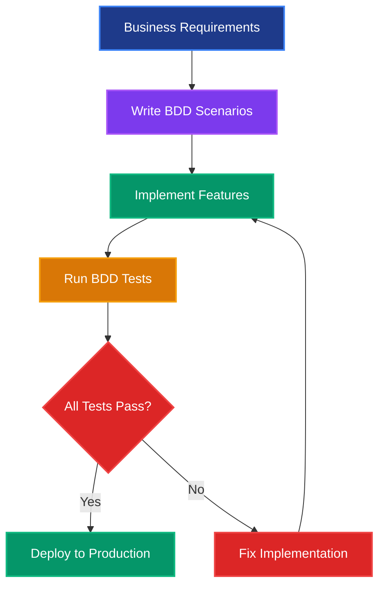
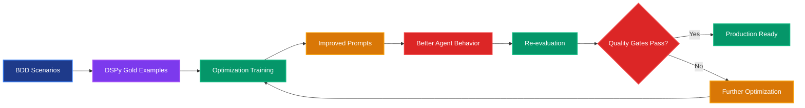
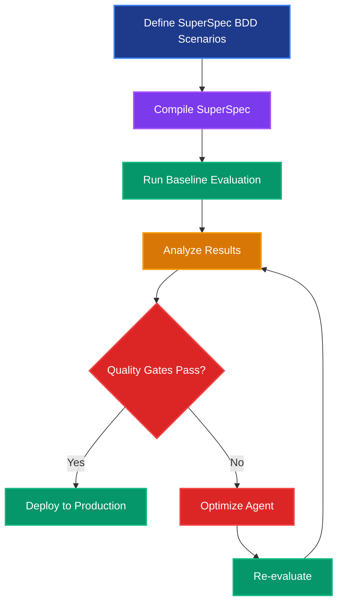
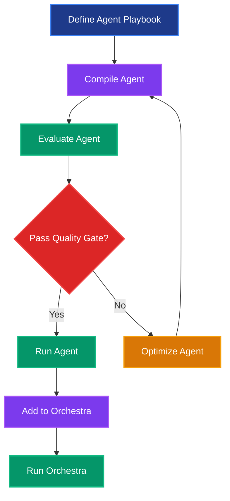

# 🎭 Behavior-Driven Development (BDD) in SuperOptiX

## 🎯 **What is BDD?**

**Behavior-Driven Development (BDD)** is a software development methodology that bridges the gap between technical and non-technical stakeholders by describing software behavior in natural language. BDD focuses on **behavior** rather than implementation details.

### **Core BDD Principles**


### **Original BDD Structure (Gherkin)**

```gherkin
Feature: User Authentication
  As a user
  I want to log into the system
  So that I can access my account

  Scenario: Successful login with valid credentials
    Given I am on the login page
    When I enter valid username and password
    And I click the login button
    Then I should be redirected to the dashboard
    And I should see my profile information
```

## 🏗️ **BDD in Software Development**

### **Why BDD Works**

BDD transforms software development by:

- ✅ **Shared Understanding**: Business and technical teams speak the same language
- 🎯 **Focus on Behavior**: Describes what the system should do, not how
- 🔄 **Living Documentation**: Scenarios serve as executable specifications
- 🧪 **Test-Driven**: Every behavior is testable and validated
- 📊 **Quality Gates**: Clear pass/fail criteria for deployment

### **BDD Workflow in Original Development**



## 🤖 **BDD for AI Agent Development**

### **The Perfect Match: BDD + AI Agents**

BDD is **perfectly suited** for AI agent development because:

#### 🎯 **1. Behavior-First Approach**
- AI agents are defined by their **behavioral capabilities**
- BDD scenarios describe **expected agent responses**
- Focus on **what the agent should do**, not internal implementation

#### 🔄 **2. Iterative Improvement**
- BDD scenarios become **training data** for optimization
- **Test → Optimize → Test** cycle drives continuous improvement
- **Quality gates** ensure reliable agent behavior

#### 🧪 **3. Testable Specifications**
- Every agent capability can be **specified and tested**
- **Pass/fail criteria** for each behavioral expectation
- **Regression testing** prevents quality degradation

### **BDD in SuperOptiX: SuperSpec Feature Specifications**

SuperOptiX implements BDD through **SuperSpec**, our domain-specific language for agent specifications. BDD scenarios are defined as **feature_specifications** within the SuperSpec playbook structure:

```yaml
# SuperSpec Feature Specifications (BDD Scenarios)
feature_specifications:
  scenarios:
    - name: "robust_api_endpoint_creation"
      description: "Given a REST API requirement, the agent should generate secure, validated, well-documented endpoints"
      input:
        feature_requirement: "Create a user authentication endpoint with email validation, password hashing, rate limiting, and comprehensive error handling"
      expected_output:
        implementation: |
          from fastapi import APIRouter, HTTPException, Depends
          from pydantic import BaseModel, EmailStr
          from passlib.context import CryptContext
          from slowapi import Limiter, _rate_limit_exceeded_handler
          
          pwd_context = CryptContext(schemes=["bcrypt"], deprecated="auto")
          limiter = Limiter(key_func=lambda: "global")
          
          class AuthRequest(BaseModel):
              email: EmailStr
              password: str
          
          @router.post("/auth/login")
          @limiter.limit("5/minute")
          async def authenticate_user(request: AuthRequest):
              # Validate email format (handled by EmailStr)
              if not request.password or len(request.password) < 8:
                  raise HTTPException(status_code=400, detail="Invalid password format")
              
              # Hash password for comparison
              hashed_password = pwd_context.hash(request.password)
              
              # Database lookup would go here
              return {"status": "success", "token": "jwt_token_here"}
```

## 🔄 **BDD + DSPy: The Evaluation-First Revolution**

### **Why BDD is Perfect for DSPy's Evaluation-First Approach**

DSPy's evaluation-first methodology aligns perfectly with BDD principles:

#### 🎯 **1. Specification-Driven Development**


#### 🔄 **2. Dual-Purpose Scenarios**
Your BDD scenarios serve **two critical functions**:

1. **📚 Training Data**: Converted to DSPy gold examples for optimization
2. **🧪 Test Cases**: Used for evaluation and quality assurance

#### ⚡ **3. Continuous Feedback Loop**
```bash
# The SuperOptiX BDD/DSPy Workflow
super agent compile developer    # Compile with BDD scenarios
super agent evaluate developer   # Establish baseline (BDD tests)
super agent optimize developer   # DSPy optimization using BDD scenarios
super agent evaluate developer   # Re-evaluate (measure improvement)
super agent run developer        # Production execution
```

## 🎭 **Professional BDD Spec Runner**

SuperOptiX features a revolutionary BDD specification framework with professional-grade tooling that rivals pytest, cucumber, and other industry-standard testing tools.

### **🚀 Quick Start**

```bash
# Standard specification execution
super agent evaluate developer

# Detailed analysis with verbose output
super agent evaluate developer --verbose

# Auto-tuning for improved results
super agent evaluate developer --auto-tune
```

### **Professional Output Formats**

```bash
# Table format (default) - beautiful console output
super agent evaluate developer --format table

# JSON format - for CI/CD integration
super agent evaluate developer --format json

# Save detailed report to file
super agent evaluate developer --save-report test_results.json
```

## 📊 **Multi-Criteria Evaluation System**

### **Evaluation Metrics**

Each BDD specification is evaluated using four weighted criteria:

| Criterion | Weight | Description |
|-----------|--------|-------------|
| **Semantic Similarity** | 50% | How closely the output matches expected meaning |
| **Keyword Presence** | 20% | Important terms and concepts inclusion |
| **Structure Match** | 20% | Format, length, and organization similarity |
| **Output Length** | 10% | Basic sanity check for response completeness |

### **Quality Gates**

- 🎉 **≥ 80%**: EXCELLENT - Production ready
- ⚠️ **60-79%**: GOOD - Minor improvements needed
- ❌ **< 60%**: NEEDS WORK - Significant improvements required

### **Scoring System**

```
Confidence Score = (
    semantic_similarity × 0.5 +
    keyword_presence × 0.2 +
    structure_match × 0.2 +
    output_length × 0.1
)
```

## 🎯 **Professional Spec Runner Features**

### **1. Session Information Panel**

The spec runner starts with a professional session overview:

```
╭──────────────────────────── 📋 Spec Execution Session ────────────────────────────╮
│ 🎯 Agent:               developer                                                 │
│ 📅 Session:             2025-01-07 14:30:15                                       │
│ 🔧 Mode:                Standard validation                                       │
│ 📊 Verbosity:           Summary                                                   │
╰────────────────────────────────────────────────────────────────────────────────────╯
```

### **2. Real-Time Progress Tracking**

Watch your specifications execute in real-time with spinners and status updates:

```
✅ Pipeline loaded
🔍 Discovering BDD Specifications...
📋 Found 5 BDD specifications
🧪 Executing BDD Specification Suite
  ⚡ Executing: developer_comprehensive_task...
  ⚡ Executing: developer_problem_solving...
```

### **3. Beautiful Specification Results Table**

Professional tabular output showing all specification results at a glance:

```
┏━━━━━━━━━━━━━━━━━━━━━━━━━━━━━━━━┳━━━━━━━━━━━━┳━━━━━━━━━━┳━━━━━━━━━━━━━━━━━━━━━━━━━━━━━━━━━━━━━━━━━━┓
┃ Specification                  ┃   Status   ┃  Score   ┃ Description                              ┃
┡━━━━━━━━━━━━━━━━━━━━━━━━━━━━━━━━╇━━━━━━━━━━━━╇━━━━━━━━━━╇━━━━━━━━━━━━━━━━━━━━━━━━━━━━━━━━━━━━━━━━━━┩
│ developer_comprehensive_task   │  ✅ PASS   │   0.87   │ Complex software requirements handl...   │
│ developer_problem_solving      │  ❌ FAIL   │   0.45   │ Problem-solving approach demonstra...    │
│ developer_best_practices       │  ✅ PASS   │   0.78   │ Industry standards and guidelines...     │
└────────────────────────────────┴────────────┴──────────┴──────────────────────────────────────────┘
```

### **4. Comprehensive Summary Dashboard**

Color-coded quality gates with detailed metrics:

```
╭──────────────────────────────────────── 🟡 Specification Results Summary ─────────────────────────────────────────╮
│                                                                                                                    │
│  📊 Total Specs:         5                🎯 Pass Rate:         60.0%                                              │
│  ✅ Passed:              3                🤖 Model:             llama3.1:8b                                        │
│  ❌ Failed:              2                💪 Capability:        0.68                                               │
│  🏆 Quality Gate:        ⚠️  GOOD         🚀 Status:            🚀 Optimized                                      │
│                                                                                                                    │
╰────────────────────────────────────────────────────────────────────────────────────────────────────────────────────╯
```

### **5. Intelligent Failure Analysis**

Detailed breakdown of failing specifications with specific fix suggestions:

```
🔍 Failure Analysis
──────────────────────────────────────────────────
┏━━━━━━━━━━━━━━━━━━━━━━━━━━━━━━━━┳━━━━━━━━━━━━━━━━━━━━━━━━━━━━━━━━┳━━━━━━━━━━━━━━━━━━━━━━━━━━━━━━━━━━━━━┓
┃ Failed Specification           ┃ Issue                          ┃ Fix Suggestion                      ┃
┡━━━━━━━━━━━━━━━━━━━━━━━━━━━━━━━━╇━━━━━━━━━━━━━━━━━━━━━━━━━━━━━━━━╇━━━━━━━━━━━━━━━━━━━━━━━━━━━━━━━━━━━━━┩
│ developer_problem_solving      │ semantic meaning differs       │ Improve response relevance         │
│ api_error_handling             │ missing key terms or concepts  │ Include technical terms             │
└────────────────────────────────┴────────────────────────────────┴─────────────────────────────────────┘
```

## 🔍 **Verbose Mode - Deep Analysis**

Use `--verbose` flag for detailed test analysis:

```bash
super agent evaluate developer --verbose
```

### **Detailed Test Results**

Each failing specification gets a comprehensive analysis panel:

```
╭─────────────────────────────────────────── Spec #2: ❌ FAILED ───────────────────────────────────────────╮
│                                                                                                          │
│  Specification: developer_problem_solving                                                                 │
│  Description: When facing software challenges, the agent should demonstrate systematic problem-solving   │
│  Confidence Score: 0.452                                                                                 │
│  Semantic Similarity: 0.234                                                                              │
│  Failure Reason: semantic meaning differs significantly                                                  │
│                                                                                                          │
│  💡 Fix Guidance:                                                                                        │
│  • Review and improve the response quality                                                               │
│  • Ensure the output addresses all aspects of the input                                                  │
│  • Make the response more relevant to the expected output                                                │
│  • Use similar terminology and concepts                                                                  │
│                                                                                                          │
╰──────────────────────────────────────────────────────────────────────────────────────────────────────────╯
```

## 🛠️ **Advanced Techniques**

### **Auto-Tuning**

Automatically adjust evaluation criteria based on model performance:

```bash
super agent evaluate developer --auto-tune
```

### **Ignore Checks (Development Mode)**

Skip validation for rapid development:

```bash
super agent evaluate developer --ignore-checks
```

### **CI/CD Integration**

```yaml
# GitHub Actions example
- name: Evaluate Agent
  run: |
    super agent evaluate developer --format json --save-report results.json
    
- name: Check Quality Gate
  run: |
    python -c "
    import json
    results = json.load(open('results.json'))
    if results['quality_gate'] != 'EXCELLENT':
        exit(1)
    "
```

## 🎭 **BDD in SuperOptiX: Real-World Example**

### **Step 1: Define BDD Scenarios in SuperSpec Playbook**

```yaml
# agents/developer/playbook/developer_playbook.yaml (SuperSpec DSL)
feature_specifications:
  scenarios:
    - name: "developer_comprehensive_task"
      description: "Given a complex software requirement, the agent should provide detailed analysis and recommendations"
      input:
        feature_requirement: "Design a microservices architecture for an e-commerce platform with user authentication, product catalog, order management, and payment processing"
      expected_output:
        implementation: |
          **Microservices Architecture Design**
          
          **1. Service Decomposition:**
          - User Service: Authentication, profiles, preferences
          - Product Service: Catalog, inventory, search
          - Order Service: Order lifecycle, status tracking
          - Payment Service: Payment processing, refunds
          - Notification Service: Email, SMS, push notifications
          
          **2. Technology Stack:**
          - API Gateway: Kong or AWS API Gateway
          - Service Mesh: Istio for inter-service communication
          - Database: PostgreSQL for each service (database per service pattern)
          - Message Queue: RabbitMQ or Apache Kafka
          - Monitoring: Prometheus + Grafana
          
          **3. Security Considerations:**
          - JWT tokens for authentication
          - API rate limiting
          - Data encryption in transit and at rest
          - Service-to-service authentication
```

### **Step 2: Compile SuperSpec and Evaluate**

```bash
# Compile SuperSpec playbook with BDD scenarios
super agent compile developer

# Run BDD evaluation (establishes baseline)
super agent evaluate developer
```

**Output:**
```
╭─────────────────────────────────────── 📋 Spec Execution Session ────────────────────────────────────────╮
│ 🎯 Agent:               developer                                                                        │
│ 📅 Session:             2025-01-07 14:30:15                                                              │
│ 🔧 Mode:                Standard validation                                                              │
│ 📊 Verbosity:           Summary                                                                          │
╰──────────────────────────────────────────────────────────────────────────────────────────────────────────╯

🧪 Executing BDD Specification Suite
────────────────────────────────────────────────────────────
Progress: 🧪 Running 5 BDD specifications...
⠋ ━━━━━━━━━━━━━━━━━━━━━━━━━━━━━━━━━━━━━━━━ 0/5

┏━━━━━━━━━━━━━━━━━━━━━━━━━━━━━━━━━━━━━━━━━━━━┳━━━━━━━━━━━━┳━━━━━━━━━━┳━━━━━━━━━━━━━━━━━━━━━━━━━━━━━━━━━━━━━━━━━━┓
┃ Specification                              ┃   Status   ┃  Score   ┃ Description                              ┃
┡━━━━━━━━━━━━━━━━━━━━━━━━━━━━━━━━━━━━━━━━━━━━╇━━━━━━━━━━━━╇━━━━━━━━━━╇━━━━━━━━━━━━━━━━━━━━━━━━━━━━━━━━━━━━━━━━━━┩
│ developer_comprehensive_task               │  ✅ PASS   │   0.87   │ Complex software requirements handl...   │
│ developer_problem_solving                  │  ❌ FAIL   │   0.45   │ Problem-solving approach demonstra...    │
│ developer_best_practices                   │  ✅ PASS   │   0.78   │ Industry standards and guidelines...     │
└────────────────────────────────────────────────┴────────────┴──────────┴──────────────────────────────────────────┘

╭──────────────────────────────────────── 🟡 Specification Results Summary ─────────────────────────────────────────╮
│                                                                                                                    │
│  📊 Total Specs:         5                🎯 Pass Rate:         60.0%                                              │
│  ✅ Passed:              3                🤖 Model:             llama3.1:8b                                        │
│  ❌ Failed:              2                💪 Capability:        0.68                                               │
│  🏆 Quality Gate:        ⚠️  GOOD         🚀 Status:            🚀 Optimized                                      │
│                                                                                                                    │
╰────────────────────────────────────────────────────────────────────────────────────────────────────────────────────╯
```

### **Step 3: Optimize Using SuperSpec BDD Scenarios**

```bash
# DSPy optimization using SuperSpec BDD scenarios as training data
super agent optimize developer
```

**What happens during optimization:**
1. **SuperSpec BDD scenarios** are converted to **DSPy gold examples**
2. **DSPy BootstrapFewShot** uses scenarios to improve prompts
3. **Optimized pipeline** is saved for future use

### **Step 4: Re-evaluate SuperSpec and Measure Improvement**

```bash
# Re-run BDD tests to measure improvement
super agent evaluate developer
```

**Expected improvement:**
```
╭──────────────────────────────────────── 🟢 Specification Results Summary ─────────────────────────────────────────╮
│                                                                                                                    │
│  📊 Total Specs:         5                🎯 Pass Rate:         80.0%                                              │
│  ✅ Passed:              4                🤖 Model:             llama3.1:8b                                        │
│  ❌ Failed:              1                💪 Capability:        0.82                                               │
│  🏆 Quality Gate:        🎉 EXCELLENT    🚀 Status:            🚀 Optimized                                      │
│                                                                                                                    │
╰────────────────────────────────────────────────────────────────────────────────────────────────────────────────────╯
```

## 📊 **BDD Evaluation Metrics in SuperOptiX**

### **Multi-Criteria Evaluation System**

SuperOptiX uses **4 weighted criteria** for SuperSpec BDD evaluation:

| Criterion | Weight | Description |
|-----------|--------|-------------|
| **Semantic Similarity** | 50% | How closely the output matches expected meaning |
| **Keyword Presence** | 20% | Important terms and concepts inclusion |
| **Structure Match** | 20% | Format, length, and organization similarity |
| **Output Length** | 10% | Basic sanity check for completeness |

### **Quality Gates**

- 🎉 **≥ 80%**: EXCELLENT - Production ready
- ⚠️ **60-79%**: GOOD - Minor improvements needed
- ❌ **< 60%**: NEEDS WORK - Significant improvements required

### **Detailed Scoring**

```json
{
  "scenario_name": "robust_error_handling",
  "description": "When implementing functionality that can fail...",
  "passed": true,
  "confidence_score": 0.82,
  "semantic_similarity": 0.85,
  "criteria_breakdown": {
    "semantic_similarity": 0.85,
    "output_length": 1.0,
    "keyword_presence": 0.75,
    "structure_match": 0.80
  },
  "failure_reason": null,
  "expected": {...},
  "actual": {...},
  "threshold_used": 0.6
}
```

## 🎯 **BDD Best Practices for AI Agents**

### **✅ DO's**

#### **1. Write Specific, Testable Scenarios**
```yaml
# Good: Specific and testable
- name: "secure_password_validation"
  description: "When validating user passwords, the agent should enforce security requirements"
  input:
    feature_requirement: "Implement password validation with minimum 8 characters, uppercase, lowercase, number, and special character"
  expected_output:
    implementation: |
      def validate_password(password):
          if len(password) < 8:
              return False, "Password must be at least 8 characters"
          if not re.search(r'[A-Z]', password):
              return False, "Password must contain uppercase letter"
          # ... additional validation
          return True, "Password is valid"
```

#### **2. Cover Multiple Behavioral Aspects**
```yaml
# Comprehensive scenario coverage
- name: "happy_path_scenario"      # Normal operation
- name: "error_handling_scenario"  # Error conditions
- name: "edge_case_scenario"       # Boundary conditions
- name: "security_scenario"        # Security requirements
- name: "performance_scenario"     # Performance expectations
```

#### **3. Use Realistic, Representative Data**
```yaml
# Realistic input data
input:
  feature_requirement: "Create a REST API for user registration with email validation, password hashing, and rate limiting"
```

### **❌ DON'Ts**

#### **1. Don't Write Vague Scenarios**
```yaml
# Bad: Too vague
- name: "create_function"
  description: "Make a function"
  input:
    feature_requirement: "Function that does something"
  expected_output:
    implementation: "def func(): pass"
```

#### **2. Don't Ignore Error Cases**
```yaml
# Missing error handling scenarios
# Always include scenarios for:
# - Invalid input handling
# - Error response formats
# - Edge case behavior
```

#### **3. Don't Over-Complicate Scenarios**
```yaml
# Keep scenarios focused on single responsibilities
# One scenario = one specific behavior
# Multiple scenarios = comprehensive coverage
```

## 🔄 **BDD Development Workflow**

### **The Complete SuperSpec BDD/TDD Cycle**



### **Command Sequence**

```bash
# 1. Define SuperSpec BDD scenarios in playbook
vim agents/developer/playbook/developer_playbook.yaml

# 2. Compile SuperSpec with BDD scenarios
super agent compile developer

# 3. Establish baseline performance
super agent evaluate developer

# 4. Optimize using SuperSpec scenarios as training data
super agent optimize developer

# 5. Measure improvement
super agent evaluate developer

# 6. Deploy if quality gates pass
super agent run developer --goal "Your production task"
```

## 🚀 **Advanced BDD Features**

### **Verbose Mode for Deep Analysis**

```bash
# Detailed analysis of each SuperSpec scenario
super agent evaluate developer --verbose
```

**Output includes:**
- Detailed failure analysis for SuperSpec scenarios
- Specific fix recommendations
- Confidence score breakdown
- Expected vs actual output comparison

### **Custom Validation Criteria**

```yaml
# Enhanced scenarios with validation hints
- name: "security_focused_implementation"
  description: "Agent should generate secure code with proper input validation"
  input:
    feature_requirement: "Create a password reset endpoint with security best practices"
  expected_output:
    implementation: |
      # Expected secure implementation here
  validation_criteria:  # Optional hints
    - "Uses secure random token generation"
    - "Includes rate limiting"
    - "Validates email format"
    - "Handles edge cases gracefully"
```

### **Scenario Categories**

```yaml
feature_specifications:
  scenarios:
    # Basic functionality
    - name: "happy_path_scenario"
      category: "functionality"
      # ...
    
    # Error handling  
    - name: "error_handling_scenario"
      category: "error_handling"
      # ...
    
    # Performance
    - name: "efficiency_scenario"
      category: "performance"
      # ...
    
    # Security
    - name: "security_scenario"
      category: "security"
      # ...
```

## 🎯 **BDD vs Traditional Testing**

### **Traditional Unit Testing**
```python
def test_password_validation():
    assert validate_password("weak") == False
    assert validate_password("Strong123!") == True
```

### **SuperSpec BDD in SuperOptiX**
```yaml
- name: "password_validation_behavior"
  description: "When validating passwords, the agent should enforce security requirements"
  input:
    feature_requirement: "Implement password validation with security requirements"
  expected_output:
    implementation: |
      def validate_password(password):
          # Comprehensive validation logic
          # Security-focused implementation
          # Clear error messages
```

### **Key Differences**

| Aspect | Traditional Testing | BDD in SuperOptiX |
|--------|-------------------|-------------------|
| **Focus** | Implementation details | Behavioral expectations |
| **Language** | Technical code | Natural language + examples |
| **Stakeholders** | Developers only | Business + Technical |
| **Training Data** | No | Yes (SuperSpec → DSPy optimization) |
| **Quality Gates** | Pass/Fail | Multi-criteria scoring |

## 🎉 **Conclusion**

SuperSpec BDD in SuperOptiX represents a **revolutionary approach** to AI agent development that combines:

- 🎯 **Behavior-driven specifications** that focus on what agents should do
- 🔄 **SuperSpec + DSPy integration** that uses scenarios for both training and testing
- 🧪 **Evaluation-first development** that ensures quality before deployment
- 📊 **Multi-criteria quality gates** that provide comprehensive validation
- 🚀 **Continuous improvement** through iterative optimization cycles

### **The SuperOptiX BDD Advantage**

1. **🎭 Professional Spec Runner**: Beautiful UI with detailed analysis
2. **🤖 AI-Powered Optimization**: BDD scenarios become DSPy training data
3. **📊 Quality Assurance**: Multi-criteria evaluation with clear metrics
4. **🔄 Iterative Development**: Continuous improvement through feedback loops
5. **🚀 Production Readiness**: Quality gates ensure reliable deployment

Start using SuperSpec BDD in SuperOptiX today and experience the difference of **scientifically validated, behavior-driven AI agents**!

## 🎯 **SuperOptiX Workflow Integration**

### **The Complete Workflow**



### **1. Define Agent Playbook**

Write declarative specifications using SuperSpec DSL:

```yaml
apiVersion: agent/v1
kind: Agent
metadata:
  name: customer-service
  tier: genie
spec:
  context:
    memory: true
    tools: true
  tasks:
    - name: "handle_inquiry"
      description: "Handle customer inquiries"
```

### **2. Compile Agent**

Translate playbooks into executable pipelines:

```bash
super agent compile customer-service
```

### **3. Evaluate Agent**

Run BDD specifications against the compiled agent:

```bash
super agent evaluate customer-service
```

### **4. Optimize Agent**

If evaluation fails, optimize based on feedback:

```bash
super agent optimize customer-service
```

### **5. Run Agent**

Once evaluation passes, run the agent:

```bash
super agent run customer-service --input "Help me with my order"
```

---

💡 **Pro Tip**: Start with 3-5 well-crafted SuperSpec BDD scenarios for your agents. Quality over quantity leads to better optimization and more reliable evaluation results. Remember: your SuperSpec BDD scenarios serve dual purposes - they're both your test cases AND your training data! 