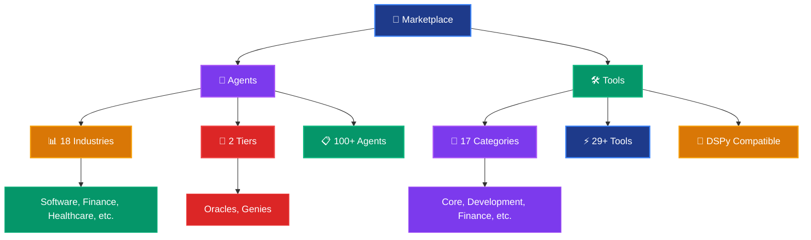

# 🏪 SuperOptiX Marketplace Guide

> **Your one-stop discovery hub for AI agents and tools across all industries**

---

## 🎯 What is the SuperOptiX Marketplace?

The SuperOptiX Marketplace is a **unified discovery hub** that provides access to a curated collection of pre-built agents and tools. Think of it as your "AI component library" where you can:

- **Discover** agents and tools across multiple industries
- **Browse** by categories and industries
- **Search** for specific capabilities
- **Get started quickly** with pre-built components
- **Learn** from examples and best practices

### 🚨 Important Note: Reference & Starting Point

> **⚠️ No agent or tool will fit your exact purpose out of the box!**
> 
> The marketplace provides **reference implementations** and **starting points**. You **must** modify and context-engineer your playbooks yourself to match your specific use case, requirements, and domain expertise.

---

## 🏗️ Marketplace Architecture

### Core Components



### Industry Coverage

The marketplace covers **18 major industries** with specialized agents:

| Industry | Agents | Description |
|----------|--------|-------------|
| **🤖 Software** | 10+ | Developers, DevOps, QA, Architects |
| **💰 Finance** | 5 | Advisors, Analysts, Planners |
| **🏥 Healthcare** | 5 | Medical Assistants, Health Educators |
| **🎓 Education** | 13 | Tutors, Coaches, Instructors |
| **🏢 Consulting** | 5 | Analysts, Strategists, Consultants |
| **🌾 Agriculture** | 4 | Crop Managers, Safety Inspectors |
| **⚡ Energy** | 4 | Grid Optimizers, Efficiency Consultants |
| **🏛️ Government** | 5 | Policy Analysts, Compliance Officers |
| **🎮 Gaming** | 5 | Designers, Analysts, Managers |
| **🏨 Hospitality** | 4 | Event Coordinators, Travel Planners |
| **👥 HR** | 5 | Recruiters, Coaches, Advisors |
| **⚖️ Legal** | 5 | Researchers, Analysts, Drafters |
| **🏭 Manufacturing** | 5 | Planners, Inspectors, Coordinators |
| **📢 Marketing** | 5 | Strategists, Creators, Managers |
| **🎬 Media** | 5 | Researchers, Strategists, Coordinators |
| **🏠 Real Estate** | 5 | Analysts, Managers, Advisors |
| **🛒 Retail** | 5 | Service, Optimizers, Planners |
| **🚚 Transportation** | 3 | Managers, Coordinators, Optimizers |

---

## 🚀 Getting Started with the Marketplace

### 1. **Marketplace Dashboard**

Start with the main marketplace overview:

```bash
super marketplace
```

**What you'll see:**
- 📊 **Agent Statistics**: Total agents, industries, tiers
- 🛠️ **Tool Statistics**: Total tools, categories
- ⭐ **Featured Items**: Popular agents and tools
- 🚀 **Quick Actions**: Common marketplace commands

### 2. **Browse Agents by Industry**

```bash
# Browse all agents
super marketplace browse agents

# Filter by specific industry
super marketplace browse agents --industry software
super marketplace browse agents --industry finance
super marketplace browse agents --industry healthcare

# Filter by tier
super marketplace browse agents --tier oracles
super marketplace browse agents --tier genies
```

### 3. **Browse Tools by Category**

```bash
# Browse all tools
super marketplace browse tools

# Filter by category
super marketplace browse tools --category core
super marketplace browse tools --category development
super marketplace browse tools --category finance
```

### 4. **Universal Search**

Search across all agents and tools:

```bash
# Search for specific capabilities
super marketplace search "customer service"
super marketplace search "web search"
super marketplace search "financial analysis"
super marketplace search "code review"
```

---

## 📋 Detailed Component Information

### View Agent Details

```bash
super marketplace show developer
super marketplace show financial_advisor
super marketplace show qa_engineer
```

**Shows:**
- 📝 **Full Description**: Agent capabilities and purpose
- 🎯 **Tier Information**: Oracle or Genie capabilities
- 🛠️ **Required Tools**: Dependencies and integrations
- 📊 **Usage Examples**: How to use the agent
- 🔧 **Installation**: Quick setup instructions

### View Tool Details

```bash
super marketplace show calculator
super marketplace show web_search
super marketplace show file_reader
```

**Shows:**
- 📝 **Tool Description**: What the tool does
- 🔧 **Parameters**: Input/output specifications
- 💡 **Usage Examples**: How to use the tool
- 🏷️ **Categories & Tags**: Classification information
- 🔗 **Integration**: How to use with agents

---

## 🛍️ Installation & Usage

### Install Agents

```bash
# Install via marketplace (same as super agent pull)
super marketplace install agent developer
super marketplace install agent financial_advisor
super marketplace install agent qa_engineer
```

### Install Tools

```bash
# Tools are automatically available once installed
super marketplace install tool calculator
super marketplace install tool web_search
```

> **💡 Pro Tip**: Tools are automatically available to all agents once installed. No additional configuration needed!

---

## 🎯 Featured Components

### Popular Agents

```bash
super marketplace featured
```

**Top Agents:**
- 🤖 **developer** (Software) - Most versatile coding assistant
- 💰 **financial_advisor** (Finance) - Popular for financial analysis
- 📝 **content_creator** (Marketing) - Great for content generation
- 🏥 **medical_assistant** (Healthcare) - Healthcare support specialist
- 🎓 **coding_mentor** (Education) - Programming tutor and guide

### Essential Tools

**Core Tools:**
- 🔍 **WebSearchTool** - Essential for information gathering
- 🧮 **CalculatorTool** - Most used mathematical tool
- 📄 **FileReaderTool** - Critical for document processing
- 🕐 **DateTimeTool** - Time and date utilities
- 📊 **TextAnalyzerTool** - Text analysis and statistics

---

## 🔍 Advanced Discovery

### Browse Industries

```bash
super marketplace browse industries
```

**Shows:**
- 📊 Industry statistics
- 🤖 Agent counts per industry
- 🎯 Tier distribution
- 🚀 Quick access to industry-specific agents

### Browse Categories

```bash
super marketplace browse categories
```

**Shows:**
- 📂 Tool categories with counts
- 🛠️ Category descriptions
- 🔧 Tool availability
- ⚡ Quick filtering options

---

## 🎨 Customization Workflow

### 1. **Discover & Explore**
```bash
# Find relevant agents and tools
super marketplace search "your domain"
super marketplace browse agents --industry your_industry
```

### 2. **Install & Examine**
```bash
# Install components
super marketplace install agent relevant_agent
super marketplace install tool relevant_tool

# Examine the playbook
cat agents/relevant_agent/relevant_agent_playbook.yaml
```

### 3. **Customize & Context-Engineer**
```bash
# Modify the playbook for your needs
# - Update persona and goals
# - Add your specific tools
# - Configure memory and RAG
# - Set up your domain context
```

### 4. **Test & Optimize**
```bash
# Compile and test your customized agent
super agent compile relevant_agent
super agent evaluate relevant_agent
super agent optimize relevant_agent
```

---

## 🚧 Current Limitations

### What's Available Now

✅ **Local Marketplace**: Pre-built agents and tools in the SuperOptiX package
✅ **Industry Coverage**: 18 industries with specialized agents
✅ **Tool Categories**: 17 categories with 29+ tools
✅ **Search & Browse**: Universal search and filtering
✅ **Quick Installation**: One-command agent installation

### What's Coming Soon

🔄 **Enhanced Discovery**: Integration with SuperAgents and Sovereigns
🌐 **Hosted Marketplace**: Dedicated hosted marketplace platform
🤖 **Auto-Discovery**: Automatic agent and tool discovery
📊 **User Contributions**: User-contributed agents and tools
🔗 **External Integrations**: Third-party agent and tool repositories

---

## 🎯 Best Practices

### 1. **Start with Exploration**
```bash
# Don't jump straight to installation
super marketplace browse agents --industry your_industry
super marketplace search "your specific need"
```

### 2. **Examine Before Installing**
```bash
# Check details first
super marketplace show agent_name
super marketplace show tool_name
```

### 3. **Customize for Your Needs**
- **Never use agents as-is** - Always customize for your domain
- **Context-engineer your playbooks** - Add your specific requirements
- **Test thoroughly** - Validate with your use cases
- **Iterate and improve** - Refine based on performance

### 4. **Combine Components**
```bash
# Install multiple related components
super marketplace install agent developer
super marketplace install agent qa_engineer
super marketplace install tool code_reviewer
super marketplace install tool test_coverage
```

---

## 🔗 Integration with Projects

### Project-Aware Discovery

When you run marketplace commands from within a SuperOptiX project:

```bash
# In your project directory (where .super file exists)
super marketplace browse agents
```

**You get:**
- 🎯 **Personalized recommendations** based on your project
- 📊 **Project context** in search results
- ⚡ **Quick install** options for your current project
- 🔍 **Dependency checking** for your existing agents

### Workspace Integration

```bash
# Install agents directly into your project
super marketplace install agent developer

# Agents are automatically added to your project structure
ls agents/
# → developer/
# → other_agents/
```

---

## 🚀 Quick Start Examples

### Example 1: Software Development Team

```bash
# Discover software development agents
super marketplace browse agents --industry software

# Install key team members
super marketplace install agent developer
super marketplace install agent qa_engineer
super marketplace install agent devops_engineer

# Install essential tools
super marketplace install tool code_reviewer
super marketplace install tool git_analyzer
super marketplace install tool api_tester
```

### Example 2: Financial Analysis Setup

```bash
# Find financial agents and tools
super marketplace search "financial analysis"

# Install financial components
super marketplace install agent financial_advisor
super marketplace install agent investment_researcher

# Install financial tools
super marketplace install tool currency_converter
super marketplace install tool investment_analyzer
super marketplace install tool budget_planner
```

### Example 3: Content Creation Pipeline

```bash
# Discover content creation components
super marketplace browse agents --industry marketing

# Install content team
super marketplace install agent content_creator
super marketplace install agent seo_specialist

# Install content tools
super marketplace install tool text_analyzer
super marketplace install tool web_search
```

---

## 🎯 Next Steps

1. **Explore the marketplace**: `super marketplace`
2. **Browse your industry**: `super marketplace browse agents --industry your_industry`
3. **Search for specific needs**: `super marketplace search "your requirement"`
4. **Install and customize**: `super marketplace install agent agent_name`
5. **Context-engineer**: Modify playbooks for your specific use case
6. **Test and optimize**: Use the full agent development lifecycle

---

## 🔗 Related Resources

- [Agent Discovery Guide](./agent-discovery.md) - Learn how to create custom agents
- [Tool Development Guide](./tool-development.md) - Create custom tools
- [Agent Development Guide](./agent-development.md) - Full development workflow
- [SuperSpec DSL Guide](./superspec.md) - Configure agents and tools
- [CLI Reference](../reference/cli.md) - Complete command reference

---

*Ready to discover the perfect agents and tools for your project? Start exploring the SuperOptiX marketplace today! 🏪* 