# 🤖 Model Intelligence Guide (Coming Soon)

> **🔮 Work in Progress - Advanced model management features coming in SuperAgents tiers**

---

## 🚧 Development Status

> **📢 Note: This feature is currently in development and expected to launch later this year as part of the SuperAgents tier system.**

The Model Intelligence system represents the next evolution of SuperOptiX's model management capabilities, bringing enterprise-grade features to the SuperAgents tier and beyond.

---

## 🎯 What is Model Intelligence?

SuperOptiX's Model Intelligence System is a **unified model management platform** that provides intelligent discovery, installation, optimization, and management of local language models across multiple backends. Think of it as your "AI model command center" that handles everything from finding the right model to optimizing its performance.

### 🧠 Key Features

- **🔍 Smart Discovery**: Find models by use case, performance, and requirements
- **📦 One-Click Installation**: Install models across different backends
- **⚡ Performance Optimization**: Automatic model tuning and optimization
- **🖥️ Server Management**: Start and manage local model servers
- **📊 Intelligent Recommendations**: Get model suggestions based on your needs
- **🔄 Cross-Backend Support**: Ollama, MLX, HuggingFace, LM Studio

---

## 🏗️ Model Intelligence Architecture

```mermaid
graph TD
    A[🤖 Model Intelligence] --> B[🔍 Discovery Engine]
    A --> C[📦 Installation Manager]
    A --> D[⚡ Performance Optimizer]
    A --> E[🖥️ Server Controller]
    A --> F[📊 Analytics Engine]
    
    B --> G[Use Case Analysis]
    B --> H[Performance Metrics]
    B --> I[Resource Requirements]
    
    C --> J[Backend Detection]
    C --> K[Dependency Management]
    C --> L[Progress Tracking]
    
    D --> M[Model Tuning]
    D --> N[Resource Optimization]
    D --> O[Performance Monitoring]
    
    E --> P[Port Management]
    E --> Q[Process Control]
    E --> R[Health Monitoring]
    
    F --> S[Usage Analytics]
    F --> T[Performance Tracking]
    F --> U[Resource Monitoring]
    
    style A fill:#1e3a8a,stroke:#3b82f6,stroke-width:2px,color:#ffffff
    style B fill:#7c3aed,stroke:#a855f7,stroke-width:2px,color:#ffffff
    style C fill:#059669,stroke:#10b981,stroke-width:2px,color:#ffffff
    style D fill:#d97706,stroke:#f59e0b,stroke-width:2px,color:#ffffff
    style E fill:#dc2626,stroke:#ef4444,stroke-width:2px,color:#ffffff
    style F fill:#059669,stroke:#10b981,stroke-width:2px,color:#ffffff
    style G fill:#1e40af,stroke:#3b82f6,stroke-width:1px,color:#ffffff
    style H fill:#6d28d9,stroke:#a855f7,stroke-width:1px,color:#ffffff
    style I fill:#047857,stroke:#10b981,stroke-width:1px,color:#ffffff
    style J fill:#7c3aed,stroke:#a855f7,stroke-width:1px,color:#ffffff
    style K fill:#059669,stroke:#10b981,stroke-width:1px,color:#ffffff
    style L fill:#d97706,stroke:#f59e0b,stroke-width:1px,color:#ffffff
    style M fill:#dc2626,stroke:#ef4444,stroke-width:1px,color:#ffffff
    style N fill:#059669,stroke:#10b981,stroke-width:1px,color:#ffffff
    style O fill:#7c3aed,stroke:#a855f7,stroke-width:1px,color:#ffffff
    style P fill:#1e3a8a,stroke:#3b82f6,stroke-width:1px,color:#ffffff
    style Q fill:#d97706,stroke:#f59e0b,stroke-width:1px,color:#ffffff
    style R fill:#dc2626,stroke:#ef4444,stroke-width:1px,color:#ffffff
    style S fill:#059669,stroke:#10b981,stroke-width:1px,color:#ffffff
    style T fill:#7c3aed,stroke:#a855f7,stroke-width:1px,color:#ffffff
    style U fill:#1e3a8a,stroke:#3b82f6,stroke-width:1px,color:#ffffff
```



---

## 🚀 Getting Started

### 1. **Model Discovery & Recommendations**

Start by discovering what models are available and getting intelligent recommendations:

```bash
# Get model recommendations based on your needs
super model recommend --use-case "code generation"
super model recommend --use-case "text analysis"
super model recommend --use-case "conversation"
super model recommend --use-case "reasoning"

# Discover models by performance characteristics
super model recommend --performance "fast"
super model recommend --performance "accurate"
super model recommend --performance "balanced"

# Get recommendations for specific resources
super model recommend --memory "4GB"
super model recommend --memory "8GB"
super model recommend --memory "16GB"
```

**Example Output:**
```
🎯 Model Recommendations for: code generation
═══════════════════════════════════════════════════════════════════════════════════

🏆 Top Recommendations:
┏━━━━━━━━━━━━━━━━━━━━━━━━━━━━━━━━━━━━━━━━━━┳━━━━━━━━━━━━━━━━┳━━━━━━━━━━━━━━┳━━━━━━━━━┳━━━━━━━━━━━┓
┃ Model                                    ┃    Backend     ┃ Performance  ┃  Size   ┃   Task    ┃
┡━━━━━━━━━━━━━━━━━━━━━━━━━━━━━━━━━━━━━━━━━━╇━━━━━━━━━━━━━━━━╇━━━━━━━━━━━━━━╇━━━━━━━━━╇━━━━━━━━━━━┩
│ llama3.2:8b                              │   🦙 ollama    │   ⭐⭐⭐⭐⭐   │ medium  │   chat    │
│ mlx-community/phi-2                      │     🍎 mlx     │   ⭐⭐⭐⭐    │  small  │   chat    │
│ microsoft/Phi-4                          │ 🤗 huggingface │   ⭐⭐⭐⭐    │  small  │   chat    │
└──────────────────────────────────────────┴────────────────┴──────────────┴─────────┴───────────┘

💡 Installation commands:
  super model install llama3.2:8b
  super model install -b mlx mlx-community/phi-2
  super model install -b huggingface microsoft/Phi-4

📊 Performance Analysis:
  • llama3.2:8b: Best for complex code generation, requires 8GB RAM
  • mlx-community/phi-2: Fast inference on Apple Silicon, 4GB RAM
  • microsoft/Phi-4: Good balance of speed and quality, 6GB RAM
```

### 2. **Comprehensive Model Discovery**

Explore all available models with detailed information:

```bash
# Get comprehensive discovery guide
super model discover

# Discover models by backend
super model discover --backend ollama
super model discover --backend mlx
super model discover --backend huggingface
super model discover --backend lmstudio

# Discover models by task type
super model discover --task chat
super model discover --task code
super model discover --task reasoning
super model discover --task embedding
```

**Example Output:**
```
🔍 SuperOptiX Model Discovery Guide
═══════════════════════════════════════════════════════════════════════════════════

🎯 Backend Overview:
┏━━━━━━━━━━━━━━━━━━━━━━━━━━━━━━━━━━━━━━━━━━┳━━━━━━━━━━━━━━━━┳━━━━━━━━━━━━━━┳━━━━━━━━━┳━━━━━━━━━━━┓
┃ Backend                                  ┃ Best For       ┃ Platform     ┃ Ease    ┃ Performance┃
┡━━━━━━━━━━━━━━━━━━━━━━━━━━━━━━━━━━━━━━━━━━╇━━━━━━━━━━━━━━━━╇━━━━━━━━━━━━━━╇━━━━━━━━━╇━━━━━━━━━━━┩
│ 🦙 Ollama                                │ Beginners      │ All platforms │ ⭐⭐⭐⭐⭐│ ⭐⭐⭐⭐   │
│ 🍎 MLX                                   │ Apple Silicon  │ macOS only    │ ⭐⭐⭐⭐ │ ⭐⭐⭐⭐⭐  │
│ 🎮 LM Studio                             │ Windows users  │ Windows/macOS│ ⭐⭐⭐  │ ⭐⭐⭐⭐   │
│ 🤗 HuggingFace                           │ Advanced users │ All platforms │ ⭐⭐   │ ⭐⭐⭐⭐⭐  │
└──────────────────────────────────────────┴────────────────┴──────────────┴─────────┴───────────┘

📊 Model Categories:
  • Tiny Models (1-3B): Fast inference, limited reasoning
  • Small Models (3-7B): Good balance, moderate resources
  • Medium Models (7-13B): Strong reasoning, more resources
  • Large Models (13B+): Best performance, high resources

🎯 Task-Specific Recommendations:
  • Chat: llama3.2:3b, phi-2, DialoGPT-small
  • Code: llama3.2:8b, codellama:7b, phi-2
  • Reasoning: llama3.2:8b, qwen2.5:7b, mistral:7b
  • Embedding: nomic-embed-text, all-MiniLM-L6-v2
```

### 3. **Intelligent Model Installation**

Install models with smart dependency management and progress tracking:

```bash
# Install with automatic backend detection
super model install llama3.2:3b

# Install with specific backend
super model install -b mlx mlx-community/phi-2
super model install -b huggingface microsoft/Phi-4
super model install -b lmstudio llama-3.2-1b-instruct

# Install with performance optimization
super model install llama3.2:8b --optimize
super model install -b mlx mlx-community/phi-2 --optimize

# Force reinstall if needed
super model install llama3.2:3b --force
```

**Example Installation Output:**
```
🚀 SuperOptiX Model Intelligence - Installing llama3.2:3b
═══════════════════════════════════════════════════════════════════════════════════

🔍 Analyzing requirements...
  • Backend: Ollama (auto-detected)
  • Size: 3B parameters
  • Memory: ~4GB RAM required
  • Disk: ~2GB storage

📦 Installing dependencies...
  ✅ Ollama CLI detected
  ✅ Server status: Running on port 11434

🦙 Pulling model llama3.2:3b from Ollama...
⏳ Progress: [██████████████████████████████████████████████] 100%
  • Downloaded: 2.0 GB
  • Verified: SHA256 checksum
  • Optimized: Model weights

⚡ Performance Optimization...
  • Quantization: 4-bit (auto-applied)
  • Memory usage: 3.2GB (optimized)
  • Inference speed: ~15 tokens/sec

✅ Installation completed successfully!

📊 Model Details:
  • Name: llama3.2:3b
  • Backend: Ollama
  • Size: Small (3B parameters)
  • Task: Chat/Conversation
  • Memory: 3.2GB RAM
  • Performance: ⭐⭐⭐⭐

💡 Next Steps:
  • Start using: super model info llama3.2:3b
  • Test performance: super model test llama3.2:3b
  • Optimize further: super model optimize llama3.2:3b
```

---

## 📊 Advanced Model Management

### 1. **Comprehensive Model Listing**

Get detailed information about all your models:

```bash
# List installed models with details
super model list

# List all available models (including uninstalled)
super model list --all

# Filter by backend
super model list --backend ollama
super model list --backend mlx
super model list --backend huggingface
super model list --backend lmstudio

# Filter by size
super model list --size tiny
super model list --size small
super model list --size medium
super model list --size large

# Filter by task
super model list --task chat
super model list --task code
super model list --task reasoning
super model list --task embedding

# Combine filters
super model list --backend ollama --size small --task chat

# Verbose information
super model list --verbose
```

**Example Output:**
```
                            🚀 SuperOptiX Model Intelligence - 9 models                  
═══════════════════════════════════════════════════════════════════════════════════════════════════════

┏━━━━━━━━━━━━━━━━━━━━━━━━━━━━━━━━━━━━━━━━━━┳━━━━━━━━━━━━━━━━┳━━━━━━━━━━━━━━┳━━━━━━━━━┳━━━━━━━━━━━┓
┃ Model                                    ┃    Backend     ┃    Status    ┃  Size   ┃   Task    ┃
┡━━━━━━━━━━━━━━━━━━━━━━━━━━━━━━━━━━━━━━━━━━╇━━━━━━━━━━━━━━━━╇━━━━━━━━━━━━━━╇━━━━━━━━━╇━━━━━━━━━━━┩
│ llama-3.2-1b-instruct                    │  🎮 lmstudio   │ ✅ installed │  small  │   chat    │
│ llama-3.3-70b-instruct                   │  🎮 lmstudio   │ ✅ installed │  large  │   chat    │
│ llama-4-scout-17b-16e-instruct           │  🎮 lmstudio   │ ✅ installed │ medium  │   chat    │
│ llama3.1:8b                              │   🦙 ollama    │ ✅ installed │ medium  │   chat    │
│ llama3.2:1b                              │   🦙 ollama    │ ✅ installed │  tiny   │   chat    │
│ microsoft/DialoGPT-small                 │ 🤗 huggingface │ ✅ installed │  small  │   chat    │
│ microsoft/Phi-4                          │ 🤗 huggingface │ ✅ installed │  small  │   chat    │
│ mlx-community_Llama-3.2-3B-Instruct-4bit │     🍎 mlx     │ ✅ installed │  small  │   chat    │
│ nomic-embed-text:latest                  │   🦙 ollama    │ ✅ installed │ Unknown │ embedding │
└──────────────────────────────────────────┴────────────────┴──────────────┴─────────┴───────────┘

📊 Summary:
  • Total Models: 9
  • Backends: 4 (Ollama, MLX, HuggingFace, LM Studio)
  • Size Distribution: 2 tiny, 4 small, 2 medium, 1 large
  • Task Distribution: 8 chat, 1 embedding

🔍 Discovery: super model discover
📥 Install: super model install <model_name>
⚡ Optimize: super model optimize <model_name>
```

### 2. **Detailed Model Information**

Get comprehensive information about specific models:

```bash
# Get detailed model information
super model info llama3.2:3b
super model info mlx-community/phi-2
super model info microsoft/Phi-4
super model info llama-3.2-1b-instruct
```

**Example Output:**
```
📊 Model Information: llama3.2:3b
═══════════════════════════════════════════════════════════════════════════════════

🔍 Basic Information:
  • Name: llama3.2:3b
  • Backend: Ollama
  • Status: ✅ Installed
  • Size: Small (3B parameters)
  • Task: Chat/Conversation

📦 Installation Details:
  • Install Date: 2024-01-15 14:30:22
  • Disk Size: 2.1 GB
  • Location: ~/.ollama/models/llama3.2:3b
  • Version: latest

⚡ Performance Metrics:
  • Memory Usage: 3.2 GB RAM
  • Inference Speed: ~15 tokens/sec
  • Quantization: 4-bit (auto-applied)
  • Context Length: 8192 tokens

🎯 Capabilities:
  • Code Generation: ⭐⭐⭐
  • Text Analysis: ⭐⭐⭐⭐
  • Reasoning: ⭐⭐⭐
  • Conversation: ⭐⭐⭐⭐

📊 Usage Statistics:
  • Last Used: 2024-01-15 16:45:12
  • Total Runs: 47
  • Average Response Time: 2.3s
  • Success Rate: 98.2%

🔧 Configuration:
  • Temperature: 0.7 (default)
  • Max Tokens: 2048 (default)
  • Top P: 0.9 (default)
  • Frequency Penalty: 0.0

💡 Recommendations:
  • Best for: General conversation, text analysis
  • Consider upgrading to: llama3.2:8b for better reasoning
  • Alternative: phi-2 for faster inference
```

### 3. **Model Performance Testing**

Test and benchmark your models:

```bash
# Test model performance
super model test llama3.2:3b
super model test mlx-community/phi-2

# Test with specific prompts
super model test llama3.2:3b --prompt "Write a Python function to sort a list"
super model test mlx-community/phi-2 --prompt "Explain quantum computing"

# Benchmark multiple models
super model benchmark llama3.2:3b phi-2 microsoft/Phi-4

# Performance analysis
super model analyze llama3.2:3b
```

**Example Test Output:**
```
🧪 Model Performance Test: llama3.2:3b
═══════════════════════════════════════════════════════════════════════════════════

📝 Test Prompt: "Write a Python function to sort a list"

⏱️ Performance Metrics:
  • Response Time: 2.1 seconds
  • Tokens Generated: 156
  • Tokens per Second: 74.3
  • Memory Usage: 3.2 GB

📊 Quality Assessment:
  • Code Correctness: ⭐⭐⭐⭐
  • Code Completeness: ⭐⭐⭐⭐
  • Documentation: ⭐⭐⭐
  • Best Practices: ⭐⭐⭐⭐

🎯 Response Quality:
  • Relevance: 95%
  • Accuracy: 92%
  • Completeness: 88%
  • Clarity: 90%

📈 Benchmark Comparison:
┏━━━━━━━━━━━━━━━━━━━━━━━━━━━━━━━━━━━━━━━━━━┳━━━━━━━━━━━━━━━━┳━━━━━━━━━━━━━━┳━━━━━━━━━┳━━━━━━━━━━━┓
┃ Model                                    ┃ Response Time  ┃ Quality Score┃ Memory   ┃ Tokens/sec┃
┡━━━━━━━━━━━━━━━━━━━━━━━━━━━━━━━━━━━━━━━━━━╇━━━━━━━━━━━━━━━━╇━━━━━━━━━━━━━━╇━━━━━━━━━╇━━━━━━━━━━━┩
│ llama3.2:3b                              │     2.1s      │     ⭐⭐⭐⭐   │ 3.2GB   │   74.3    │
│ phi-2                                    │     1.8s      │     ⭐⭐⭐    │ 2.8GB   │   86.7    │
│ microsoft/Phi-4                          │     2.5s      │     ⭐⭐⭐⭐   │ 4.1GB   │   62.4    │
└──────────────────────────────────────────┴────────────────┴──────────────┴─────────┴───────────┘

💡 Recommendations:
  • For speed: Use phi-2 (1.8s vs 2.1s)
  • For quality: Use llama3.2:3b or Phi-4
  • For memory efficiency: Use phi-2 (2.8GB vs 3.2GB)
```

---

## ⚡ Performance Optimization

### 1. **Automatic Model Optimization**

Optimize your models for better performance:

```bash
# Optimize model performance
super model optimize llama3.2:3b
super model optimize mlx-community/phi-2

# Optimize with specific targets
super model optimize llama3.2:3b --target speed
super model optimize llama3.2:3b --target memory
super model optimize llama3.2:3b --target quality

# Compare before/after optimization
super model optimize llama3.2:3b --compare
```

**Example Optimization Output:**
```
⚡ Model Optimization: llama3.2:3b
═══════════════════════════════════════════════════════════════════════════════════

🔍 Pre-Optimization Analysis:
  • Current Memory: 3.2 GB
  • Current Speed: 74.3 tokens/sec
  • Current Quality: ⭐⭐⭐⭐

🛠️ Optimization Process:
  • Quantization: 4-bit → 3-bit (memory reduction)
  • Attention Optimization: Enabled sparse attention
  • Cache Optimization: Increased KV cache efficiency
  • Thread Optimization: Auto-tuned thread count

📊 Optimization Results:
┏━━━━━━━━━━━━━━━━━━━━━━━━━━━━━━━━━━━━━━━━━━┳━━━━━━━━━━━━━━━━┳━━━━━━━━━━━━━━┳━━━━━━━━━┳━━━━━━━━━━━┓
┃ Metric                                   ┃ Before         ┃ After        ┃ Change  ┃ Impact    ┃
┡━━━━━━━━━━━━━━━━━━━━━━━━━━━━━━━━━━━━━━━━━━╇━━━━━━━━━━━━━━━━╇━━━━━━━━━━━━━━╇━━━━━━━━━╇━━━━━━━━━━━┩
│ Memory Usage                             │    3.2 GB     │   2.4 GB     │  -25%   │   🟢 Good │
│ Inference Speed                          │  74.3 t/s     │  89.7 t/s    │  +21%   │   🟢 Good │
│ Response Time                            │    2.1s       │   1.7s       │  -19%   │   🟢 Good │
│ Quality Score                            │   ⭐⭐⭐⭐     │   ⭐⭐⭐⭐     │  0%     │   🟡 Same │
└──────────────────────────────────────────┴────────────────┴──────────────┴─────────┴───────────┘

✅ Optimization completed successfully!
💡 Memory saved: 800MB
💡 Speed improved: 21%
💡 Quality maintained: No degradation
```

### 2. **Resource Management**

Monitor and manage model resources:

```bash
# Monitor model resource usage
super model monitor llama3.2:3b
super model monitor --all

# Get resource recommendations
super model resources llama3.2:3b
super model resources --recommendations

# Clean up unused models
super model cleanup
super model cleanup --dry-run
```

---

## 🖥️ Advanced Server Management

### 1. **Multi-Server Orchestration**

Run multiple model servers simultaneously:

```bash
# Start multiple servers on different ports
super model server mlx phi-2 --port 8000
super model server huggingface microsoft/Phi-4 --port 8001
super model server lmstudio llama-3.2-1b-instruct --port 1234

# Monitor all servers
super model servers --status
super model servers --monitor

# Stop specific server
super model server stop --port 8000
super model server stop --backend mlx

# Stop all servers
super model servers --stop-all
```

### 2. **Server Health Monitoring**

Monitor server health and performance:

```bash
# Check server health
super model health --port 8000
super model health --all

# Get server metrics
super model metrics --port 8000
super model metrics --all

# Server diagnostics
super model diagnose --port 8000
super model diagnose --all
```

---

## 🎯 Use Case Optimization

### 1. **Task-Specific Optimization**

Optimize models for specific use cases:

```bash
# Optimize for code generation
super model optimize llama3.2:8b --use-case code-generation

# Optimize for text analysis
super model optimize phi-2 --use-case text-analysis

# Optimize for conversation
super model optimize llama3.2:3b --use-case conversation

# Optimize for reasoning
super model optimize llama3.2:8b --use-case reasoning
```

### 2. **Workload-Specific Tuning**

Tune models for different workloads:

```bash
# Tune for high-throughput
super model tune llama3.2:3b --workload high-throughput

# Tune for low-latency
super model tune llama3.2:3b --workload low-latency

# Tune for memory-constrained
super model tune llama3.2:3b --workload memory-constrained

# Tune for quality-focused
super model tune llama3.2:3b --workload quality-focused
```

---

## 🔧 Advanced Configuration

### 1. **Model Configuration Management**

Manage model configurations:

```bash
# Save custom configuration
super model config save llama3.2:3b --name "my-config"

# Load configuration
super model config load llama3.2:3b --name "my-config"

# List configurations
super model config list

# Export configuration
super model config export llama3.2:3b --file config.yaml

# Import configuration
super model config import llama3.2:3b --file config.yaml
```

### 2. **Backend-Specific Features**

Leverage backend-specific capabilities:

```bash
# Ollama-specific features
super model ollama --features
super model ollama --optimize llama3.2:3b

# MLX-specific features
super model mlx --features
super model mlx --optimize phi-2

# HuggingFace-specific features
super model huggingface --features
super model huggingface --optimize microsoft/Phi-4

# LM Studio-specific features
super model lmstudio --features
super model lmstudio --optimize llama-3.2-1b-instruct
```

---

## 📊 Analytics & Insights

### 1. **Usage Analytics**

Track model usage and performance:

```bash
# Get usage analytics
super model analytics --model llama3.2:3b
super model analytics --all

# Performance trends
super model analytics --trends
super model analytics --trends --model llama3.2:3b

# Resource utilization
super model analytics --resources
super model analytics --resources --model llama3.2:3b
```

### 2. **Performance Insights**

Get detailed performance insights:

```bash
# Performance insights
super model insights llama3.2:3b
super model insights --all

# Bottleneck analysis
super model analyze --bottlenecks llama3.2:3b

# Optimization opportunities
super model analyze --opportunities llama3.2:3b
```

---

## 🚨 Troubleshooting & Support

### 1. **Diagnostic Tools**

```bash
# Run comprehensive diagnostics
super model diagnose
super model diagnose --model llama3.2:3b

# Check system compatibility
super model check --system
super model check --compatibility

# Validate installation
super model validate
super model validate --model llama3.2:3b
```

### 2. **Common Issues & Solutions**

```bash
# Fix common issues
super model fix --common
super model fix --model llama3.2:3b

# Reset model configuration
super model reset llama3.2:3b

# Repair corrupted models
super model repair llama3.2:3b
```

---

## 🎯 Best Practices

### 1. **Model Selection**

- **Start with recommendations**: Use `super model recommend` for guidance
- **Consider your use case**: Different models excel at different tasks
- **Balance performance and resources**: Larger models aren't always better
- **Test before committing**: Use `super model test` to evaluate performance

### 2. **Performance Optimization**

- **Optimize for your workload**: Use task-specific optimization
- **Monitor resource usage**: Keep an eye on memory and CPU usage
- **Use appropriate quantization**: Balance quality and performance
- **Regular maintenance**: Clean up unused models and configurations

### 3. **Server Management**

- **Use dedicated ports**: Avoid port conflicts with multiple servers
- **Monitor server health**: Regular health checks prevent issues
- **Plan for scaling**: Consider resource requirements for multiple models
- **Backup configurations**: Save custom configurations for reproducibility

---

## 🔗 Related Resources

- [Model Management Guide](./model-management.md) - Current model management capabilities
- [Cloud Inference Guide](./cloud-inference.md) - Cloud provider integration guides
- [Agent Development Guide](./agent-development.md) - Using models with agents
- [CLI Reference](../reference/cli.md) - Complete command reference
- [Troubleshooting Guide](../troubleshooting.md) - Common issues and solutions

---

## 🚀 Availability

> **📅 Expected Launch: Later this year (2025)**
> 
> **🎯 Target Tier: SuperAgents and above**
> 
> **🔧 Current Status: Active development in progress**

The Model Intelligence system is being developed as part of the SuperAgents tier upgrade, bringing enterprise-grade model management capabilities to SuperOptiX. Stay tuned for updates and early access opportunities!

---

*Ready to master model intelligence? This feature will be available in the SuperAgents tier later this year! 🚀*