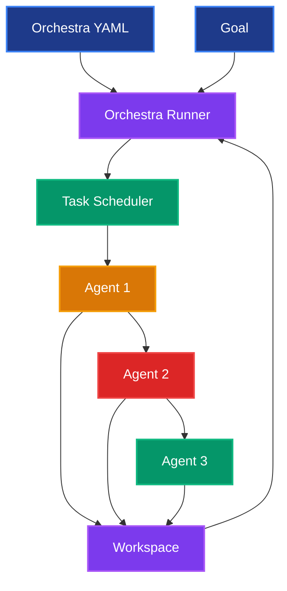

# 🎼 Orchestra Development Guide

> **Master multi-agent orchestration with SuperOptiX orchestras**

---

## 🎯 What Are SuperOptiX Orchestras?

SuperOptiX orchestras coordinate multiple agents to accomplish complex goals through **sequential execution**. Unlike individual agents that work in isolation, orchestras enable agents to:

- **Collaborate sequentially** - Each agent builds upon the previous agent's output
- **Share context** - Results from one agent become input for the next
- **Maintain state** - Workspace directories store intermediate results
- **Execute workflows** - Complex multi-step processes with dependencies

### 🔄 Execution Strategy Support

| Tier | Execution Strategy | Parallel Tasks | Advanced Techniques |
|------|-------------------|----------------|-------------------|
| **Oracles** | Sequential only | 1 | Basic orchestration |
| **Genies** | Sequential only | 1 | Basic orchestration |
| **Higher Tiers** | Parallel, Mixed, Hierarchical | Multiple | Kubernetes orchestration |

> **Note**: The current version (Oracles and Genies) supports **sequential execution only**. Advanced orchestration features are available in higher tiers.

---

## 🏗️ Orchestra Architecture

### Core Components



### Workspace Management

Orchestras use **shared workspaces** to maintain state between agents:

```
your-project/
├── orchestra_workspaces/
│   └── your_orchestra/
│       ├── task_outputs/
│       │   ├── agent1_output.txt
│       │   ├── agent2_output.txt
│       │   └── agent3_output.txt
│       ├── intermediate/
│       │   ├── data.json
│       │   └── artifacts/
│       └── final_results/
│           └── orchestra_output.txt
└── orchestras/
    └── your_orchestra.yaml
```

---

## 🚀 Creating Your First Orchestra

### 1. Create an Orchestra

```bash
# Create an orchestra with existing agents
super orchestra create sdlc

# This automatically:
# - Detects existing agents in your project
# - Loads tasks from agent playbooks
# - Generates orchestra configuration
# - Creates workspace directory
```

### 2. Orchestra Configuration

The generated orchestra file (`sdlc_orchestra.yaml`):

```yaml
metadata:
  name: "Sdlc Orchestra"
  id: "sdlc"
  version: "1.0.0"
  kind: "basic"
  description: "An orchestra to accomplish a specific goal with flexible execution strategies."

orchestra:
  id: "sdlc"
  name: "Sdlc Orchestra"
  description: "An orchestra to accomplish a specific goal with flexible execution strategies."
  
  # Shared workspace for stateful collaboration
  workspace:
    type: local_fs 
    path: "./orchestra_workspaces/sdlc"
  
  # Execution configuration (sequential only for current version)
  execution:
    strategy: "sequential"
    max_parallel_tasks: 1
    task_timeout_seconds: 300
    retry_strategy: "exponential_backoff"
    enable_metrics: true
    enable_trace: true

# Agents participating in the orchestra
agents:
  - developer
  - devops_engineer
  - qa_engineer

# Task definitions with dependencies
tasks:
  - name: implement_feature
    agent: developer
    description: >
      Apply developer expertise to '{goal}'. Implement the feature based on the provided requirement
    priority: "medium"
    timeout_seconds: 600
    
  - name: configure_ci_pipeline
    agent: devops_engineer
    description: >
      Apply devops engineer expertise to '{goal}'. Configure a basic CI/CD pipeline based on the project requirements
    context: ["implement_feature"]  # Depends on previous task
    priority: "medium"
    timeout_seconds: 600
    
  - name: create_test_plan
    agent: qa_engineer
    description: >
      Apply qa engineer expertise to '{goal}'. Create a high-level test plan including test cases for the given feature
    context: ["configure_ci_pipeline"]  # Depends on previous task
    priority: "medium"
    timeout_seconds: 600
```

### 3. Run the Orchestra

```bash
# Run with a specific goal
super orchestra run sdlc --goal "Build a simple login feature for a web application"
```

---

## 🎭 How Orchestras Work

### Sequential Execution Flow

The orchestra runner executes tasks in sequence, passing results between agents:

1. **Task 1** executes with the initial goal
2. **Task 1** output becomes input for **Task 2**
3. **Task 2** output becomes input for **Task 3**
4. This continues until all tasks are completed
5. Final result is the output from the last task

### Task Execution Process

1. **Task Loading**: Orchestra runner loads task definitions from YAML
2. **Dependency Resolution**: Determines execution order based on `context` dependencies
3. **Agent Execution**: Each task runs its assigned agent with current input
4. **Result Passing**: Output from one task becomes input for the next
5. **Workspace Storage**: Intermediate results are saved to workspace directory

### Workspace Integration

The orchestra runner automatically manages workspace directories:

- **Creates workspace** when orchestra starts
- **Saves task outputs** to individual files
- **Maintains state** between task executions
- **Provides access** to intermediate results

---

## 📋 Orchestra Examples

### Example 1: Software Development Lifecycle

```yaml
# sdlc_orchestra.yaml
metadata:
  name: "Software Development Lifecycle"
  id: "sdlc"

orchestra:
  workspace:
    type: local_fs 
    path: "./orchestra_workspaces/sdlc"
  execution:
    strategy: "sequential"
    max_parallel_tasks: 1

agents:
  - developer
  - devops_engineer
  - qa_engineer

tasks:
  - name: implement_feature
    agent: developer
    description: "Implement the feature based on requirements"
    
  - name: configure_ci_pipeline
    agent: devops_engineer
    description: "Set up CI/CD pipeline for the implemented feature"
    context: ["implement_feature"]
    
  - name: create_test_plan
    agent: qa_engineer
    description: "Create comprehensive test plan for the feature"
    context: ["configure_ci_pipeline"]
```

**Usage:**
```bash
super orchestra run sdlc --goal "Build a user authentication system"
```

### Example 2: Content Creation Pipeline

```yaml
# content_creation_orchestra.yaml
metadata:
  name: "Content Creation Pipeline"
  id: "content_creation"

orchestra:
  workspace:
    type: local_fs 
    path: "./orchestra_workspaces/content_creation"
  execution:
    strategy: "sequential"
    max_parallel_tasks: 1

agents:
  - researcher
  - writer
  - editor

tasks:
  - name: research_topic
    agent: researcher
    description: "Research the given topic thoroughly"
    
  - name: write_content
    agent: writer
    description: "Write comprehensive content based on research"
    context: ["research_topic"]
    
  - name: edit_and_polish
    agent: editor
    description: "Edit and polish the written content"
    context: ["write_content"]
```

**Usage:**
```bash
super orchestra run content_creation --goal "Create a comprehensive guide on machine learning"
```

### Example 3: Data Analysis Workflow

```yaml
# data_analysis_orchestra.yaml
metadata:
  name: "Data Analysis Workflow"
  id: "data_analysis"

orchestra:
  workspace:
    type: local_fs 
    path: "./orchestra_workspaces/data_analysis"
  execution:
    strategy: "sequential"
    max_parallel_tasks: 1

agents:
  - data_collector
  - data_analyzer
  - report_generator

tasks:
  - name: collect_data
    agent: data_collector
    description: "Collect and prepare data for analysis"
    
  - name: analyze_data
    agent: data_analyzer
    description: "Perform statistical analysis on the collected data"
    context: ["collect_data"]
    
  - name: generate_report
    agent: report_generator
    description: "Generate comprehensive report with insights"
    context: ["analyze_data"]
```

**Usage:**
```bash
super orchestra run data_analysis --goal "Analyze customer satisfaction survey data"
```

---

## 🔧 Customizing Orchestras

### 1. Modify Task Descriptions

Make task descriptions more specific to your goal:

```yaml
tasks:
  - name: implement_feature
    agent: developer
    description: >
      Implement a secure user authentication system with the following requirements:
      - User registration with email verification
      - Secure password hashing
      - JWT token-based authentication
      - Password reset functionality
      Use modern security best practices and provide clear documentation.
```

### 2. Adjust Task Priorities

Set task priorities to control execution order:

```yaml
tasks:
  - name: critical_feature
    agent: developer
    priority: "high"
    description: "Implement critical security feature"
    
  - name: nice_to_have
    agent: developer
    priority: "low"
    description: "Add optional UI enhancements"
```

### 3. Configure Timeouts

Set appropriate timeouts for different task types:

```yaml
tasks:
  - name: quick_validation
    agent: validator
    timeout_seconds: 60
    description: "Quick validation check"
    
  - name: complex_analysis
    agent: analyzer
    timeout_seconds: 1800  # 30 minutes
    description: "Complex data analysis"
```

---

## 📁 Workspace Management

### Workspace Structure

Orchestra workspaces are automatically created and managed:

```
orchestra_workspaces/
└── your_orchestra/
    ├── task_outputs/           # Individual task results
    │   ├── task1_output.txt
    │   ├── task2_output.txt
    │   └── task3_output.txt
    ├── intermediate/           # Shared data between tasks
    │   ├── shared_data.json
    │   └── artifacts/
    └── final_results/          # Final orchestra output
        └── orchestra_output.txt
```

### Accessing Workspace Data

```python
# In your custom tools or agents
import json
from pathlib import Path

def read_workspace_data(orchestra_name: str, filename: str):
    """Read data from orchestra workspace."""
    workspace_path = Path(f"./orchestra_workspaces/{orchestra_name}")
    file_path = workspace_path / "intermediate" / filename
    
    if file_path.exists():
        with open(file_path, 'r') as f:
            return json.load(f)
    return None

def write_workspace_data(orchestra_name: str, filename: str, data: dict):
    """Write data to orchestra workspace."""
    workspace_path = Path(f"./orchestra_workspaces/{orchestra_name}")
    intermediate_path = workspace_path / "intermediate"
    intermediate_path.mkdir(parents=True, exist_ok=True)
    
    file_path = intermediate_path / filename
    with open(file_path, 'w') as f:
        json.dump(data, f, indent=2)
```

### Workspace Cleanup

```bash
# Clean up workspace after orchestra completion
rm -rf orchestra_workspaces/your_orchestra/

# Or keep for analysis
ls -la orchestra_workspaces/your_orchestra/
```

---

## 🎯 Best Practices

### 1. Agent Preparation

Before running orchestras, ensure your agents are optimized:

```bash
# Compile all agents
super agent compile --all

# Evaluate baseline performance
super agent evaluate developer
super agent evaluate devops_engineer
super agent evaluate qa_engineer

# Optimize agents
super agent optimize developer
super agent optimize devops_engineer
super agent optimize qa_engineer

# Re-evaluate after optimization
super agent evaluate developer
super agent evaluate devops_engineer
super agent evaluate qa_engineer
```

### 2. Goal Definition

Write clear, specific goals for better orchestration results:

```bash
# Good: Specific and actionable
super orchestra run sdlc --goal "Build a secure user authentication system with JWT tokens, password hashing, and email verification"

# Avoid: Too vague
super orchestra run sdlc --goal "Make a login system"
```

### 3. Task Dependencies

Design logical task dependencies:

```yaml
tasks:
  - name: gather_requirements
    agent: analyst
    description: "Gather and document requirements"
    
  - name: design_architecture
    agent: architect
    description: "Design system architecture"
    context: ["gather_requirements"]  # Depends on requirements
    
  - name: implement_system
    agent: developer
    description: "Implement the system"
    context: ["design_architecture"]  # Depends on architecture
```

### 4. Error Handling

Monitor orchestra execution and handle failures:

```bash
# Run with verbose output for debugging
super orchestra run sdlc --goal "your goal" --verbose

# Check workspace for partial results
ls -la orchestra_workspaces/sdlc/task_outputs/
```

---

## 🔍 Monitoring and Debugging

### Execution Monitoring

The orchestra runner provides detailed execution information:

```bash
super orchestra run sdlc --goal "your goal" --verbose
```

**Output includes:**
- Task execution order
- Execution times
- Success/failure status
- Workspace location
- Tier validation results

### Workspace Analysis

After orchestra completion, analyze the workspace:

```bash
# View task outputs
cat orchestra_workspaces/sdlc/task_outputs/implement_feature_output.txt
cat orchestra_workspaces/sdlc/task_outputs/configure_ci_pipeline_output.txt
cat orchestra_workspaces/sdlc/task_outputs/create_test_plan_output.txt

# View final results
cat orchestra_workspaces/sdlc/final_results/orchestra_output.txt
```

### Debugging Failed Orchestras

```bash
# Check which task failed
ls -la orchestra_workspaces/sdlc/task_outputs/

# View error logs
cat orchestra_workspaces/sdlc/task_outputs/failed_task_output.txt

# Re-run with dry-run to validate configuration
super orchestra run sdlc --goal "your goal" --dry-run
```

---

## 🚀 Advanced Techniques (Higher Tiers)

> **Note**: These features are available in higher tiers beyond Oracles and Genies.

### Parallel Execution

```yaml
execution:
  strategy: "parallel"
  max_parallel_tasks: 3
```

### Mixed Strategy

```yaml
execution:
  strategy: "mixed"
  task_groups:
    - name: "research_phase"
      tasks: ["gather_data", "analyze_requirements"]
      execution_strategy: "parallel"
    - name: "development_phase"
      tasks: ["implement", "test"]
      execution_strategy: "sequential"
```

### Kubernetes Orchestration

```yaml
orchestration_type: "kubernetes"
replicas: 3
resources:
  cpu: "1000m"
  memory: "2Gi"
```

---

## 🎯 Next Steps

1. **Create your first orchestra**: `super orchestra create my_orchestra`
2. **Customize the configuration**: Edit the generated YAML file
3. **Run with a specific goal**: `super orchestra run my_orchestra --goal "your goal"`
4. **Analyze results**: Check the workspace directory
5. **Optimize agents**: Improve individual agent performance
6. **Iterate and improve**: Refine orchestra configuration based on results

---

## 🔗 Related Resources

- [Agent Development Guide](./agent-development.md) - Learn how to create agents for orchestration
- [Tool Development](./tool-development.md) - Create tools that work with orchestras
- [SuperSpec DSL Guide](./superspec.md) - Configure agents for orchestration
- [CLI Reference](../reference/cli.md) - Orchestra command reference
- [Quick Start Guide](../quick-start.md) - Complete orchestra example

---

*Ready to orchestrate multiple agents for complex goals? Start with sequential execution and build powerful multi-agent workflows! 🎼* 