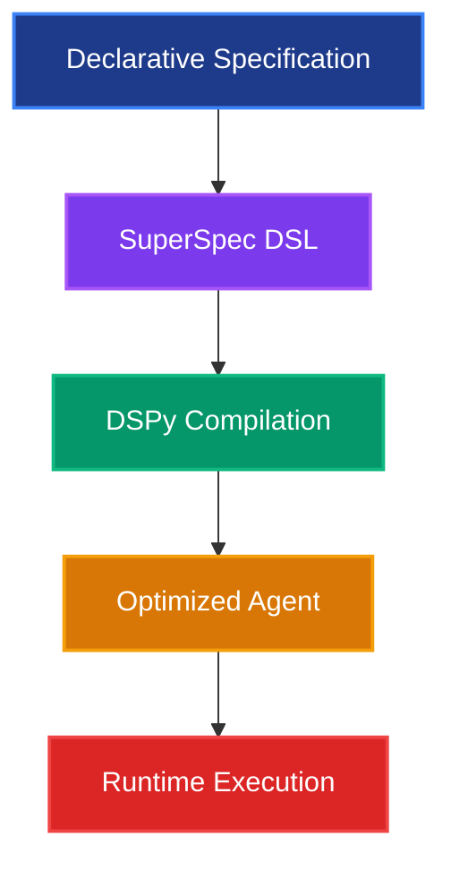

# 🏗️ SuperSpec Agent Building

<div style="text-align: center; margin: 2rem 0; padding: 1.5rem; background: linear-gradient(135deg, var(--md-primary-fg-color--light) 0%, var(--md-accent-fg-color--light) 50%, var(--md-primary-fg-color--lighter) 100%); border-radius: var(--border-radius); color: var(--md-default-fg-color); border: 2px solid var(--md-primary-fg-color--light);">
    <h2 style="color: var(--md-default-fg-color);">🏗️ SuperSpec Agent Building</h2>
    <p style="font-size: 1.1rem; margin-bottom: 1rem; color: var(--md-default-fg-color);">
        <strong>Build powerful AI agents with SuperSpec DSL</strong><br>
        Based on the actual SuperOptiX library implementation
    </p>
</div>

## 📋 **Overview**

Agent building in SuperSpec is the process of creating intelligent, autonomous systems using the SuperSpec Domain-Specific Language (DSL). This approach combines the power of DSPy with a structured, YAML-based specification format that makes agent development accessible, maintainable, and scalable.

## 🎯 **Agent Building Philosophy**

### **1. Declarative Design**

SuperSpec follows a **declarative approach** where you specify **what** the agent should do rather than **how** to do it. This separation of concerns allows the framework to handle the complex orchestration while you focus on defining the agent's capabilities and behavior.



### **2. Tier-Based Architecture**

SuperSpec implements a **tiered architecture** that provides different levels of capability:

| Tier | Capabilities | Use Cases |
|------|-------------|-----------|
| **Oracles** | Basic reasoning, text generation | Simple Q&A, content creation |
| **Genies** | Advanced reasoning, tools, memory, RAG | Complex tasks, multi-step workflows |

## 🏗️ **Agent Building Components**

### **1. Core Building Blocks**

Every SuperSpec agent consists of these fundamental components:

```yaml
metadata:
  name: "Agent Name"
  id: "agent_id"
  version: "1.0.0"
  level: oracles|genies

spec:
  language_model: {...}
  persona: {...}
  tasks: [...]
  agentflow: [...]
```

### **2. Language Model Configuration**

The foundation of any agent is its language model:

```yaml
spec:
  language_model:
    location: local|self-hosted|cloud
    provider: ollama|openai|anthropic|...
    model: llama3.2:1b|gpt-4|claude-3-sonnet
    temperature: 0.0
    max_tokens: 2048
    cache: true
```

#### **Model Selection Guidelines**

| Use Case | Recommended Model | Reasoning |
|----------|------------------|-----------|
| **Development/Testing** | `llama3.2:1b` | Fast, local, cost-effective |
| **Production (Oracles)** | `llama3.1:8b` | Good balance of speed/quality |
| **Production (Genies)** | `llama3.1:70b` | High-quality reasoning |
| **Cloud Production** | `gpt-4` or `claude-3-sonnet` | Best performance |

### **3. Persona Definition**

Define the agent's personality and expertise:

```yaml
spec:
  persona:
    name: "DataBot"
    role: "Data Analyst"
    goal: "Perform comprehensive data analysis and provide insights"
    traits:
    - analytical
    - detail-oriented
    - precise
    - helpful
    expertise_areas:
    - data analysis
    - statistical modeling
    - financial analysis
    - visualization
    communication_preferences:
      style: technical
      tone: professional
      verbosity: detailed
```

### **4. Task Specification**

Define what the agent can do:

```yaml
spec:
  tasks:
  - name: analyze_data
    description: "Perform comprehensive data analysis"
    instruction: |
      You are a Data Analyst. Analyze the provided data and generate insights, 
      visualizations, and recommendations. Use appropriate statistical methods 
      and create clear, actionable insights.
    inputs:
    - name: data_source
      type: str
      description: "Source of data to analyze"
      required: true
    - name: analysis_type
      type: str
      description: "Type of analysis to perform"
      required: true
    outputs:
    - name: analysis_report
      type: str
      description: "Comprehensive analysis report"
    - name: visualizations
      type: list[str]
      description: "Generated data visualizations"
    - name: recommendations
      type: str
      description: "Actionable recommendations"
```

### **5. AgentFlow Design**

Define how the agent executes tasks:

```yaml
spec:
  agentflow:
  - name: load_data
    type: ActWithTools
    task: analyze_data
  - name: perform_analysis
    type: Think
    task: analyze_data
    depends_on: ["load_data"]
  - name: generate_visualizations
    type: Generate
    task: create_visualization
    depends_on: ["perform_analysis"]
  - name: synthesize_results
    type: Generate
    task: analyze_data
    depends_on: ["generate_visualizations"]
```

#### **Available AgentFlow Types**

| Tier | Allowed Types | Description |
|------|---------------|-------------|
| **Oracles** | `Generate`, `Think`, `Compare`, `Route` | Basic reasoning and generation |
| **Genies** | `Generate`, `Think`, `ActWithTools`, `Search`, `Compare`, `Route` | Advanced reasoning with tools |

## 🚀 **Agent Building Workflow**

### **Step 1: Define Requirements**

```bash
# Start with a template
super spec generate my_agent basic --rag

# Or create from scratch
touch my_agent_playbook.yaml
```

### **Step 2: Configure Basic Structure**

```yaml
metadata:
  name: "My Custom Agent"
  id: "my_custom_agent"
  version: "1.0.0"
  level: genies
  description: "A custom agent for specific tasks"
  tags: ["custom", "specialized"]

spec:
  language_model:
    location: local
    provider: ollama
    model: llama3.1:8b
    temperature: 0.7
    max_tokens: 2048
```

### **Step 3: Define Persona**

```yaml
spec:
  persona:
    name: "CustomBot"
    role: "Specialized Assistant"
    goal: "Provide expert assistance in my domain"
    traits:
    - knowledgeable
    - helpful
    - precise
    expertise_areas:
    - my_domain
    - problem_solving
    communication_preferences:
      style: professional
      tone: helpful
      verbosity: detailed
```

### **Step 4: Specify Tasks**

```yaml
spec:
  tasks:
  - name: solve_problem
    description: "Solve problems in my domain"
    instruction: |
      You are a specialized assistant. Analyze the problem and provide 
      comprehensive solutions using your expertise and available tools.
    inputs:
    - name: problem
      type: str
      description: "The problem to solve"
      required: true
    - name: context
      type: str
      description: "Additional context"
      required: false
    outputs:
    - name: solution
      type: str
      description: "Comprehensive solution"
    - name: explanation
      type: str
      description: "Detailed explanation"
```

### **Step 5: Design AgentFlow**

```yaml
spec:
  agentflow:
  - name: analyze_problem
    type: Think
    task: solve_problem
  - name: gather_information
    type: ActWithTools
    task: solve_problem
    depends_on: ["analyze_problem"]
  - name: generate_solution
    type: Generate
    task: solve_problem
    depends_on: ["gather_information"]
```

### **Step 6: Add Advanced Features (Genies Only)**

```yaml
spec:
  # Memory for context retention
  memory:
    enabled: true
    short_term:
      enabled: true
      max_tokens: 1000
    long_term:
      enabled: true
      storage_type: local
      max_entries: 100

  # Tools for external capabilities
  tools:
    enabled: true
    categories:
    - core
    - utilities
    specific_tools:
    - calculator
    - text_analyzer
    - web_search

  # RAG for knowledge retrieval
  retrieval:
    enabled: true
    retriever_type: chroma
    config:
      top_k: 5
      chunk_size: 512
```

### **Step 7: Configure Evaluation**

```yaml
spec:
  evaluation:
    builtin_metrics:
    - name: answer_correctness
      threshold: 0.8
    - name: solution_quality
      threshold: 0.7
```

### **Step 8: Add BDD Scenarios**

```yaml
spec:
  feature_specifications:
    scenarios:
    - name: basic_functionality
      description: "The agent should solve basic problems"
      input:
        problem: "What is 2+2?"
      expected_output:
        solution: "Should provide correct answer"
    - name: complex_functionality
      description: "The agent should handle complex scenarios"
      input:
        problem: "Analyze this complex dataset"
      expected_output:
        solution: "Should provide comprehensive analysis"
```

## 🎯 **Agent Building Examples**

### **Example 1: Simple Oracle Agent**

```yaml
metadata:
  name: "Math Tutor"
  id: "math_tutor"
  version: "1.0.0"
  level: oracles
  description: "A simple math tutoring agent"
  tags: ["education", "math", "oracles"]

spec:
  language_model:
    location: local
    provider: ollama
    model: llama3.2:1b
    temperature: 0.0
    max_tokens: 1024

  persona:
    name: "MathTutor"
    role: "Math Tutor"
    goal: "Help students understand mathematical concepts"
    traits:
    - patient
    - encouraging
    - knowledgeable
    expertise_areas:
    - mathematics
    - teaching
    - problem_solving

  tasks:
  - name: explain_concept
    description: "Explain mathematical concepts clearly"
    instruction: |
      You are a Math Tutor. Explain mathematical concepts in a clear, 
      step-by-step manner that students can easily understand.
    inputs:
    - name: concept
      type: str
      description: "Mathematical concept to explain"
      required: true
    - name: student_level
      type: str
      description: "Student's level (beginner, intermediate, advanced)"
      required: false
    outputs:
    - name: explanation
      type: str
      description: "Clear explanation of the concept"
    - name: examples
      type: list[str]
      description: "Example problems and solutions"

  agentflow:
  - name: explain
    type: Generate
    task: explain_concept

  evaluation:
    builtin_metrics:
    - name: answer_correctness
      threshold: 0.9
    - name: explanation_clarity
      threshold: 0.8
```

### **Example 2: Advanced Genie Agent**

```yaml
metadata:
  name: "Financial Analyst"
  id: "financial_analyst"
  version: "1.0.0"
  level: genies
  description: "Advanced financial analysis agent"
  tags: ["finance", "analysis", "genies"]

spec:
  language_model:
    location: local
    provider: ollama
    model: llama3.1:8b
    temperature: 0.7
    max_tokens: 2048

  persona:
    name: "FinanceBot"
    role: "Financial Analyst"
    goal: "Provide comprehensive financial analysis and insights"
    traits:
    - analytical
    - detail-oriented
    - conservative
    - trustworthy
    expertise_areas:
    - financial_analysis
    - investment_planning
    - risk_assessment
    - market_research
    communication_preferences:
      style: professional
      tone: authoritative
      verbosity: detailed

  tasks:
  - name: analyze_investment
    description: "Analyze investment opportunities"
    instruction: |
      You are a Financial Analyst. Analyze investment opportunities 
      comprehensively, considering risk, return, market conditions, 
      and regulatory factors.
    inputs:
    - name: investment_data
      type: str
      description: "Investment data and parameters"
      required: true
    - name: risk_tolerance
      type: str
      description: "Investor's risk tolerance level"
      required: true
    outputs:
    - name: analysis_report
      type: str
      description: "Comprehensive investment analysis"
    - name: risk_assessment
      type: str
      description: "Detailed risk assessment"
    - name: recommendations
      type: str
      description: "Investment recommendations"

  agentflow:
  - name: gather_market_data
    type: ActWithTools
    task: analyze_investment
  - name: perform_analysis
    type: Think
    task: analyze_investment
    depends_on: ["gather_market_data"]
  - name: calculate_metrics
    type: ActWithTools
    task: analyze_investment
    depends_on: ["perform_analysis"]
  - name: generate_report
    type: Generate
    task: analyze_investment
    depends_on: ["calculate_metrics"]

  memory:
    enabled: true
    short_term:
      enabled: true
      max_tokens: 1000
    long_term:
      enabled: true
      storage_type: local
      max_entries: 100
    episodic:
      enabled: true
      max_episodes: 50

  tools:
    enabled: true
    categories:
    - core
    - finance
    - utilities
    specific_tools:
    - calculator
    - financial_calculator
    - text_analyzer
    - web_search

  retrieval:
    enabled: true
    retriever_type: chroma
    config:
      top_k: 5
      chunk_size: 512
    vector_store:
      collection_name: financial_knowledge

  evaluation:
    builtin_metrics:
    - name: analysis_accuracy
      threshold: 0.8
    - name: risk_assessment_quality
      threshold: 0.7
    - name: recommendation_safety
      threshold: 0.9

  feature_specifications:
    scenarios:
    - name: basic_analysis
      description: "Perform basic investment analysis"
      input:
        investment_data: "Stock price data for AAPL"
        risk_tolerance: "moderate"
      expected_output:
        analysis_report: "Should provide comprehensive analysis"
        risk_assessment: "Should assess risks appropriately"
        recommendations: "Should provide safe recommendations"
```

## 🧪 **Agent Building Best Practices**

### **1. Start Simple, Iterate**

```yaml
# Start with basic configuration
metadata:
  level: oracles  # Start with Oracles tier

# Add complexity gradually
spec:
  # Basic LLM
  language_model:
    location: local
    provider: ollama
    model: llama3.2:1b

  # Simple persona
  persona:
    role: "Assistant"
    goal: "Help with tasks"

  # Single task
  tasks:
  - name: help
    instruction: "Help with user requests"
    inputs:
    - name: request
      type: str
      required: true
    outputs:
    - name: response
      type: str
```

### **2. Use Descriptive Names and Descriptions**

```yaml
metadata:
  name: "Financial Data Analyst"  # Clear, descriptive name
  description: "Specialized agent for financial data analysis and reporting"
  tags: ["finance", "data-analysis", "genies"]

persona:
  role: "Financial Data Analyst"
  goal: "Provide accurate financial analysis and insights"
  traits:
  - analytical
  - detail-oriented
  - precise
```

### **3. Configure Appropriate Evaluation Metrics**

```yaml
evaluation:
  builtin_metrics:
  - name: answer_correctness
    threshold: 0.8
    weight: 2.0
  - name: analysis_quality
    threshold: 0.7
  - name: safety_compliance
    threshold: 1.0
    weight: 3.0
```

### **4. Use Comprehensive BDD Scenarios**

```yaml
feature_specifications:
  scenarios:
  - name: basic_functionality
    description: "The agent should perform basic tasks correctly"
    input:
      request: "What is the capital of France?"
    expected_output:
      response: "Should provide accurate information about Paris"
  - name: advanced_functionality
    description: "The agent should handle complex scenarios"
    input:
      request: "Analyze this financial dataset"
    expected_output:
      response: "Should provide comprehensive analysis"
```

### **5. Test and Validate**

```bash
# Validate your agent specification
super spec validate my_agent_playbook.yaml

# Test with sample inputs
super agent test my_agent_playbook.yaml --input "test input"

# Evaluate performance
super agent evaluate my_agent_playbook.yaml
```

## 🚀 **Advanced Agent Building Techniques**

### **1. Multi-Task Agents**

```yaml
spec:
  tasks:
  - name: analyze_data
    description: "Analyze data and generate insights"
    instruction: "Perform data analysis..."
    inputs: [...]
    outputs: [...]
    
  - name: create_visualization
    description: "Create data visualizations"
    instruction: "Create charts and graphs..."
    inputs: [...]
    outputs: [...]
    
  - name: generate_report
    description: "Generate comprehensive reports"
    instruction: "Create detailed reports..."
    inputs: [...]
    outputs: [...]

  agentflow:
  - name: analyze
    type: Think
    task: analyze_data
  - name: visualize
    type: Generate
    task: create_visualization
    depends_on: ["analyze"]
  - name: report
    type: Generate
    task: generate_report
    depends_on: ["visualize"]
```

### **2. Conditional AgentFlow**

```yaml
spec:
  agentflow:
  - name: analyze_input
    type: Think
    task: analyze_data
  - name: check_complexity
    type: Route
    task: analyze_data
    depends_on: ["analyze_input"]
  - name: simple_analysis
    type: Generate
    task: analyze_data
    depends_on: ["check_complexity"]
  - name: complex_analysis
    type: ActWithTools
    task: analyze_data
    depends_on: ["check_complexity"]
```

### **3. Tool-Specific Agents**

```yaml
spec:
  tools:
    enabled: true
    categories:
    - development
    specific_tools:
    - code_formatter
    - debugger
    - linter
    - git_manager
    - docker_manager

  tasks:
  - name: code_review
    description: "Review and improve code"
    instruction: |
      You are a Code Reviewer. Analyze code for quality, security, 
      and best practices. Use available tools to format, lint, and 
      improve the code.
```

## 🎉 **Conclusion**

Agent building with SuperSpec combines the power of DSPy with the simplicity of YAML configuration. By following the declarative approach and leveraging the tiered architecture, you can create sophisticated AI agents that are both powerful and maintainable.

The key to successful agent building is to:
1. **Start simple** with basic configurations
2. **Iterate gradually** adding complexity as needed
3. **Test thoroughly** with comprehensive scenarios
4. **Validate continuously** using built-in metrics
5. **Optimize performance** through DSPy-based improvements

---

💡 **Pro Tip**: Use the `super spec generate` command with domain-specific templates to jumpstart your agent development! 