# SuperOptiX Technical Architecture

## Overview

SuperOptiX is a comprehensive AI agent development framework built on top of DSPy (Declarative Self-improving Language Programs) that provides a structured approach to creating, evaluating, and optimizing AI agents. The framework implements a tier-based system with advanced features including RAG (Retrieval-Augmented Generation), memory management, observability, and BDD (Behavior-Driven Development) testing.

## Core Architecture Components

### 1. **Tier System** 🏗️

SuperOptiX implements a hierarchical tier system that defines agent capabilities and limitations:

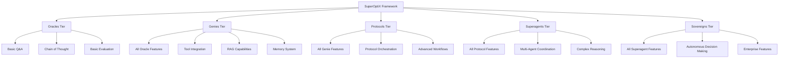

**Oracles Tier (Free)**

- Basic question-answering with Chain of Thought reasoning

- Simple evaluation metrics (exact match, F1 score)

- Basic optimization (BootstrapFewShot)

- Sequential task orchestration

**Genies Tier (Free)**

- All Oracle capabilities plus:

- Tool integration and ReAct reasoning

- RAG (knowledge retrieval) with multiple vector databases

- Agent memory (short-term and episodic)

- Basic streaming responses

**Protocols Tier**

- All Genie capabilities plus:

- Protocol orchestration and workflows

- Advanced task coordination

- Multi-step reasoning chains

**Superagents Tier**

- All Protocol capabilities plus:

- Multi-agent coordination

- Complex reasoning and planning

- Advanced optimization strategies

**Sovereigns Tier (Enterprise)**

- All Superagent capabilities plus:

- Autonomous decision making

- Enterprise-grade features

- Advanced evaluation metrics

### 2. **SuperSpec DSL** 📝

SuperSpec is a Domain-Specific Language for defining agent playbooks with validation and compliance:

```yaml
apiVersion: agent/v1
kind: AgentSpec
metadata:
  name: "Math Tutor"
  id: "math-tutor"
  namespace: "education"
  level: "oracles"
  version: "1.0.0"
spec:
  language_model:
    provider: "ollama"
    model: "llama3.2:1b"
  persona:
    role: "Mathematics Teacher"
    goal: "Help students learn mathematics concepts"
  tasks:
    - name: "solve_math_problem"
      instruction: "Solve the given mathematical problem step by step"
      inputs: [{"name": "problem", "type": "str"}]
      outputs: [{"name": "solution", "type": "str"}]
  agentflow:
    - name: "analyze_problem"
      type: "Think"
      task: "solve_math_problem"
```

**Key Features:**

- **Schema Validation**: Automatic validation of playbook structure

- **Tier Compliance**: Ensures features match tier limitations

- **Template Generation**: Pre-built templates for common use cases

- **Parsing & Analysis**: Tools for analyzing playbook collections

### 3. **DSPy Integration** 🔗

SuperOptiX leverages DSPy as its core reasoning engine:

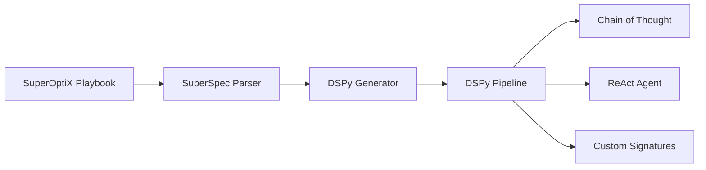

**DSPy Components:**

- **Signatures**: Define input/output schemas for agents

- **Modules**: Implement reasoning patterns (ChainOfThought, ReAct)

- **Optimizers**: BootstrapFewShot, LabeledFewShot for performance tuning

- **Evaluators**: SemanticF1, custom evaluation metrics

### 4. **RAG (Retrieval-Augmented Generation) System** 🔍

SuperOptiX implements a comprehensive RAG system supporting multiple vector databases:

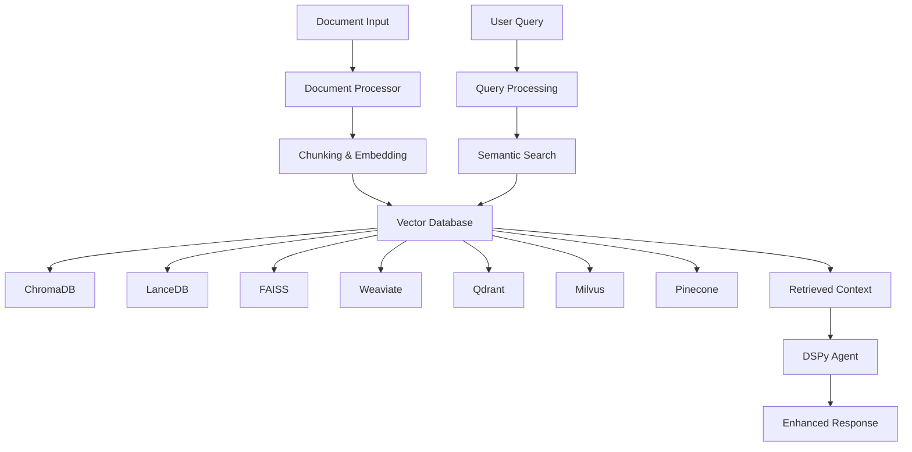

**Supported Vector Databases:**

- **ChromaDB**: Local vector database with persistence

- **LanceDB**: High-performance vector database

- **FAISS**: Facebook AI Similarity Search

- **Weaviate**: Vector search engine

- **Qdrant**: Vector similarity search engine

- **Milvus**: Open-source vector database (third-party)

- **Pinecone**: Cloud vector database

**RAG Features:**

- Automatic document ingestion and chunking

- Semantic search and retrieval

- Integration with DSPy ReAct agents

- Configurable retrieval parameters (top_k, similarity thresholds)

### 5. **Memory System** 🧠

SuperOptiX implements a multi-layered memory system:

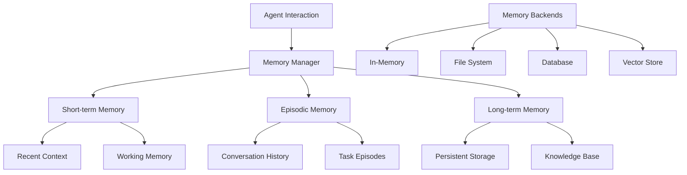

**Memory Components:**

- **Short-term Memory**: Recent context and working memory

- **Episodic Memory**: Conversation history and task episodes

- **Long-term Memory**: Persistent storage and knowledge base

- **Context Manager**: Manages memory retrieval and storage

**Memory Backends:**

- In-memory storage for fast access

- File system persistence

- Database integration

- Vector store for semantic memory

### 6. **Tool System** 🛠️

SuperOptiX provides a comprehensive tool ecosystem:

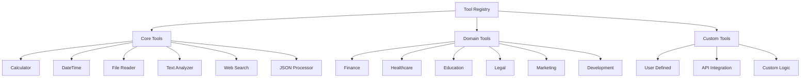

**Tool Categories:**

- **Core Tools**: Basic utilities (calculator, datetime, file operations)

- **Domain Tools**: Industry-specific tools (finance, healthcare, education)

- **Custom Tools**: User-defined tools and API integrations

**Tool Features:**

- Automatic tool registration and discovery

- Tool validation and error handling

- Integration with DSPy ReAct agents

- Custom tool factory for extensibility

### 7. **Observability & Tracing** 📊

SuperOptiX implements comprehensive observability:

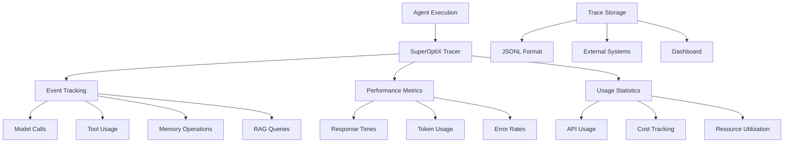

**Observability Features:**

- **Event Tracing**: Track all agent operations

- **Performance Monitoring**: Response times, token usage, error rates

- **Usage Tracking**: API usage, cost tracking, resource utilization

- **Dashboard**: Web-based monitoring interface

- **External Integration**: Support for external observability systems

### 8. **BDD (Behavior-Driven Development) Testing** 🧪

SuperOptiX implements BDD testing for agent validation:

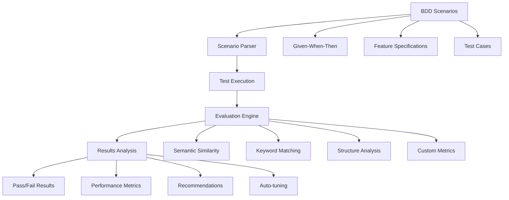

**BDD Features:**

- **Scenario Definition**: Given-When-Then format for test cases

- **Feature Specifications**: Comprehensive test coverage

- **Evaluation Metrics**: Semantic similarity, keyword matching, structure analysis

- **Auto-tuning**: Automatic optimization based on test results

- **Reporting**: Detailed test reports and recommendations

### 9. **Model Management** 🤖

SuperOptiX provides comprehensive model management:

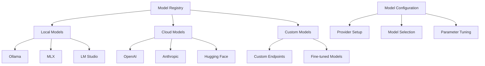

**Supported Backends:**

- **Ollama**: Local model serving (recommended for cross-platform)

- **MLX**: Apple Silicon optimization

- **LM Studio**: Local model management

- **Hugging Face**: Cloud model hosting

- **Custom**: Custom endpoints and fine-tuned models

**Model Features:**

- Automatic model installation and setup

- Provider-specific optimizations

- Parameter configuration and tuning

- Model switching and fallback

### 10. **CLI Interface** 💻

SuperOptiX provides a comprehensive CLI for all operations:

```bash
# Project Management
super init <project_name>
super spec generate <playbook_name> <template> --rag

# Agent Operations
super agent pull <agent_name>
super agent compile <agent_name>
super agent evaluate <agent_name>
super agent optimize <agent_name>
super agent run <agent_name>

# Model Management
super model install <model_name> -b <backend>
super model list
super model server

# Marketplace
super market browse agents
super market install agent <agent_name>
super market search "<query>"

# Observability
super observe dashboard
super observe traces
```

## Data Flow Architecture

### Agent Execution Flow

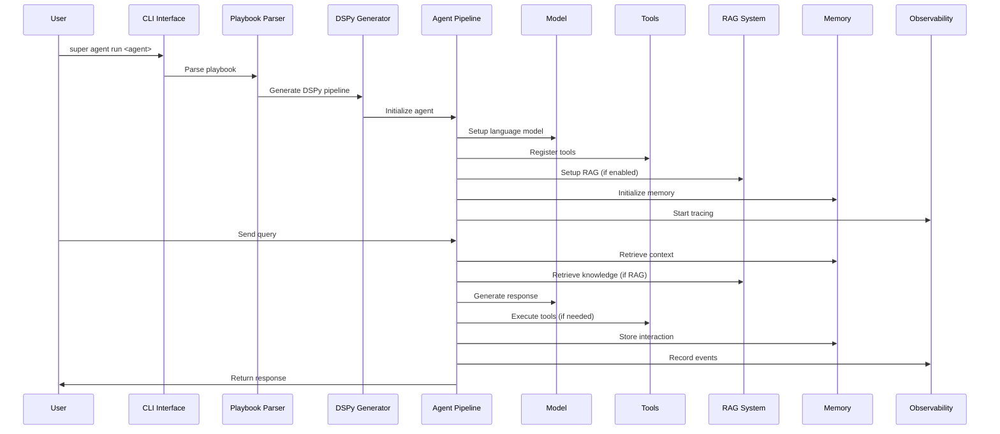

### RAG Processing Flow

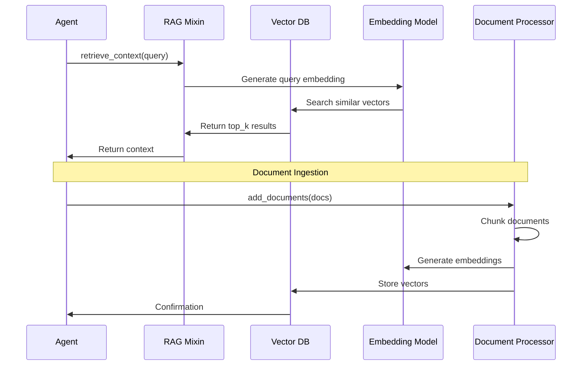

## Performance Optimization

### 1. **Model Optimization**

- Tier-specific model selection

- Parameter tuning (temperature, max_tokens)

- Provider-specific optimizations

- Caching and connection pooling

### 2. **RAG Optimization**

- Efficient chunking strategies

- Embedding model selection

- Vector database optimization

- Query caching and result ranking

### 3. **Memory Optimization**

- Memory hierarchy management

- Context window optimization

- Storage backend selection

- Garbage collection strategies

### 4. **Tool Optimization**

- Tool caching and reuse

- Parallel tool execution

- Error handling and retry logic

- Resource usage optimization

## Security & Compliance

### 1. **Data Security**

- Local model execution for sensitive data

- Encrypted storage for memory and traces

- Secure API key management

- Data anonymization in observability

### 2. **Access Control**

- Tier-based feature restrictions

- User authentication and authorization

- API rate limiting

- Resource usage quotas

### 3. **Compliance**

- GDPR compliance for data handling

- Audit trails for all operations

- Data retention policies

- Privacy-preserving evaluation

## Deployment Architecture

### 1. **Local Development**
```bash
# Single machine setup
super init my_project
super model install llama3.1:8b -b ollama
super agent run my_agent
```

### 2. **Production Deployment**
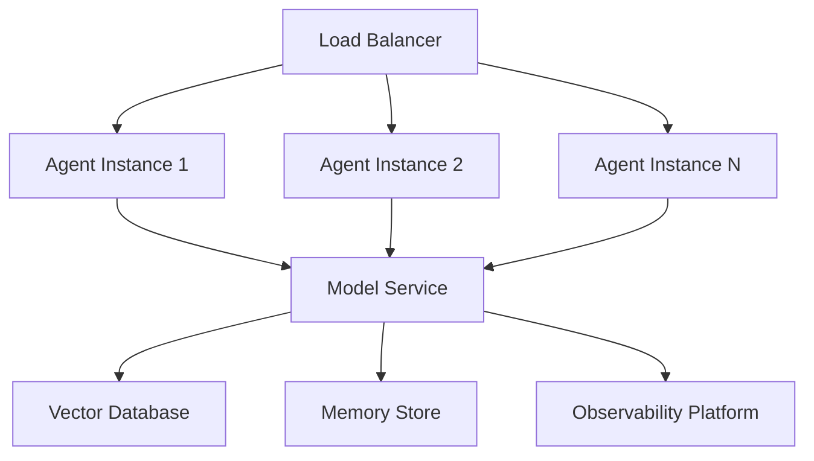

### 3. **Scalability Features**

- Horizontal scaling of agent instances

- Model serving optimization

- Database connection pooling

- Caching layers for performance

## Integration Points

### 1. **External Systems**

- Vector databases (ChromaDB, Pinecone, etc.)

- Model providers (OpenAI, Anthropic, etc.)

- Observability platforms (Prometheus, Grafana)

- CI/CD pipelines (GitHub Actions, GitLab CI)

### 2. **API Integration**

- RESTful API endpoints

- WebSocket support for streaming

- GraphQL interface (planned)

- SDK for multiple languages

### 3. **Framework Integration**

- DSPy ecosystem compatibility

- LangChain integration (planned)

- Hugging Face ecosystem

- Custom model frameworks

## Development Workflow

### 1. **Agent Development**
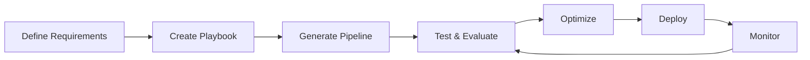

### 2. **Testing Strategy**

- Unit tests for individual components

- Integration tests for full pipelines

- BDD tests for behavior validation

- Performance benchmarks

- Security testing

### 3. **Quality Assurance**

- Automated playbook validation

- Tier compliance checking

- Performance monitoring

- Error tracking and alerting

## Future Roadmap

### 1. **Planned Features**

- Advanced optimization algorithms

- Multi-agent orchestration

- Real-time collaboration

- Advanced evaluation metrics

- Enterprise security features

### 2. **Performance Improvements**

- Model serving optimization

- RAG performance enhancements

- Memory system improvements

- Tool execution optimization

### 3. **Ecosystem Expansion**

- Additional vector databases

- More model providers

- Enhanced tool ecosystem

- Community marketplace growth

---

This technical architecture provides a comprehensive overview of SuperOptiX's design, implementation, and capabilities. The framework is built with modularity, extensibility, and performance in mind, enabling developers to create sophisticated AI agents while maintaining simplicity and ease of use. 