# 🎭 SuperOptiX Agent Tiers

## 🎯 Overview

SuperOptiX introduces a **5-tier evolutionary system** inspired by Nick Bostrom's Superintelligence and Sam Altman's AGI stages. This progressive architecture allows you to scale from simple automation to enterprise-grade AI operations.

!!! success "🎉 Free Tiers Available"
    **Oracle and Genie tiers are completely FREE to try** - no credit card required! Experience the power of SuperOptiX with full access to these tiers.

!!! info "💼 Commercial Tiers"
    **Protocol, Superagent, and Sovereign tiers** are commercial offerings with advanced enterprise features. Contact us for pricing and licensing.

## 🆓 Free Tiers vs 💼 Commercial Tiers

| Aspect | 🆓 Free Tiers | 💼 Commercial Tiers |
|--------|---------------|-------------------|
| **Tiers** | Oracle, Genie | Protocol, Superagent, Sovereign |
| **Cost** | Completely Free | Commercial licensing |
| **Access** | Immediate download | Contact sales |
| **Features** | Core functionality | Advanced enterprise features |
| **Support** | Community support | Enterprise support |
| **Use Cases** | Development, testing, small projects | Production, enterprise, large-scale |

## 🏗️ Tier Architecture

```mermaid
graph TD
    A[🧙‍♂️ Oracle] --> B[🧞‍♂️ Genie]
    B --> C[🎭 Protocol]
    C --> D[🤖 Superagent]
    D --> E[👑 Sovereign]
    
    A --> A1[Single-step reasoning]
    B --> B1[Multi-step reasoning]
    C --> C1[Complex workflows]
    D --> D1[Multi-agent coordination]
    E --> E1[Autonomous operations]
    
    style A fill:#1e3a8a,stroke:#3b82f6,stroke-width:2px,color:#ffffff
    style B fill:#7c3aed,stroke:#a855f7,stroke-width:2px,color:#ffffff
    style C fill:#059669,stroke:#10b981,stroke-width:2px,color:#ffffff
    style D fill:#d97706,stroke:#f59e0b,stroke-width:2px,color:#ffffff
    style E fill:#dc2626,stroke:#ef4444,stroke-width:2px,color:#ffffff
    style A1 fill:#1e40af,stroke:#3b82f6,stroke-width:1px,color:#ffffff
    style B1 fill:#6d28d9,stroke:#a855f7,stroke-width:1px,color:#ffffff
    style C1 fill:#047857,stroke:#10b981,stroke-width:1px,color:#ffffff
    style D1 fill:#b45309,stroke:#f59e0b,stroke-width:1px,color:#ffffff
    style E1 fill:#b91c1c,stroke:#ef4444,stroke-width:1px,color:#ffffff
```



## 🧙‍♂️ Oracle Tier (Entry Level)

!!! success "🆓 FREE TIER"
    **No credit card required** - Start building immediately!

**Status**: ✅ Available (Free to Try)  
**Complexity**: Low  
**Use Case**: Basic automation, simple Q&A

### What is an Oracle?

Oracles are simple, single-purpose agents that provide fast question-answering capabilities. They interact directly with LLMs and respond to queries without external data connections. The output quality depends entirely on the LLM's training data.

This is a simple and fast question answering system that involves interaction with LLMs and responding to your queries. There is no connection to external data and quality of output directly depends on the quality of the LLMs used. This system can be very useful when you have fine-tuned models for specific tasks and give reliable outputs for your task but has limited external interaction and knowledge.

### Key Characteristics

- ✅ **Single-step reasoning**: Direct question-to-answer mapping
- ✅ **Template-based responses**: Consistent output formats
- ✅ **Built-in optimization**: DSPy-powered prompt tuning
- ✅ **Simple validations**: Basic output verification
- ✅ **Perfect for automation**: Ideal for repetitive tasks

### Features Included

| Feature | Description |
|---------|-------------|
| **Any LLM Support** | Works with any language model |
| **Model Management** | Built-in model switching |
| **Few Shot Optimization** | DSPy-powered prompt optimization |
| **Simple Evals** | Basic evaluation metrics |
| **BDD Spec Runner** | Behavior-driven testing |
| **Simple Sequential Multi Agent Orchestra** | Basic agent coordination |
| **Static Pipelines Code with SuperOptiX DSPy Mixin** | Optimized pipeline generation |
| **Demo Purpose Outputs** | Production-ready formatting |
| **Basic tracing and observability** | Simple monitoring |

### Example Use Cases

```yaml
# FAQ Bot
apiVersion: agent/v1
kind: Agent
metadata:
  name: faq-bot
  tier: oracle
spec:
  tasks:
    - name: answer_faq
      template: "Answer this FAQ: {question}"
```

```yaml
# Data Formatter
apiVersion: agent/v1
kind: Agent
metadata:
  name: data-formatter
  tier: oracle
spec:
  tasks:
    - name: format_data
      template: "Format this data as JSON: {input}"
```

### When to Use Oracles

- 🎯 **Simple Q&A systems**
- 📝 **Data formatting tasks**
- 🔄 **Basic automation workflows**
- 🧪 **Prototyping and testing**
- 📊 **Simple reporting tasks**

---

## 🧞‍♂️ Genie Tier (Intermediate)

!!! success "🆓 FREE TIER"
    **No credit card required** - Advanced features included!

**Status**: ✅ Available (Free to Try)  
**Complexity**: Medium  
**Use Case**: Customer service, content creation, complex problem-solving

### What is a Genie?

Genies are multi-step reasoning agents that can interact with external systems through tools, memory, and RAG (Retrieval-Augmented Generation). They use reasoning and action (ReAct) patterns to perform controlled actions on your behalf.

This is an agent system that involves interaction with LLMs and external systems like knowledge and tools. There is limited connection to external data and quality of output directly depends on the quality of the LLMs, knowledge, and tools used. This system uses reasoning and action (ReAct) to perform controlled actions on your behalf which can be powerful to connect your internal resources to the agent with low risk.

### Key Characteristics

- ✅ **Multi-step reasoning**: Chain-of-thought problem solving
- ✅ **Dynamic tool selection**: Intelligent tool usage
- ✅ **Memory integration**: Learning from interactions
- ✅ **RAG support**: Knowledge retrieval from vector databases
- ✅ **Ideal for complex problem-solving**: Advanced reasoning capabilities

### Features Included

| Feature | Description |
|---------|-------------|
| **Function calling LLM Support** | Advanced LLM capabilities |
| **Custom Function calling DSPy tools** | Extensible tool framework |
| **RAG with favorite vectorDB Support** | Knowledge integration |
| **Model Management with MLX, HF, Ollama and LM Studio** | Multiple model backends |
| **Few Shot and Labeled Few Shot Optimization** | Advanced prompt optimization |
| **Simple Evals** | Basic evaluation metrics |
| **Basic DSPy Memory Support** | Multi-layer memory system |
| **BDD Spec Runner basic metrics** | Behavior-driven testing |
| **Sequential Multi Agent Orchestra** | Coordinated agent workflows |
| **Static Pipelines Code with SuperOptiX DSPy Mixin** | Optimized pipeline generation |
| **Demo Purpose Outputs with usage tracking** | Analytics and monitoring |
| **Basic Tool Tracing Observability and Tool call** | Advanced observability |
| **Multi-Agent Orchestra with demo outputs** | Demo orchestration capabilities |

### Example Use Cases

```yaml
# Customer Service Agent
apiVersion: agent/v1
kind: Agent
metadata:
  name: customer-service
  tier: genie
spec:
  context:
    memory: true
    tools: true
    retrieval: true
  tasks:
    - name: handle_inquiry
      description: "Handle customer inquiries with context"
    - name: lookup_order
      description: "Look up order information"
    - name: process_return
      description: "Process return requests"
```

```yaml
# Content Creator
apiVersion: agent/v1
kind: Agent
metadata:
  name: content-creator
  tier: genie
spec:
  context:
    memory: true
    tools: ["research", "writing", "editing"]
    retrieval: true
  tasks:
    - name: research_topic
      description: "Research content topics"
    - name: write_content
      description: "Create engaging content"
    - name: edit_content
      description: "Polish and refine content"
```

### When to Use Genies

- 🎯 **Customer service automation**
- 📝 **Content creation and editing**
- 🔍 **Research and analysis**
- 🛠️ **Tool-based workflows**
- 📊 **Data analysis and reporting**

---

## 🎭 Protocol Tier (Advanced)

!!! warning "💼 COMMERCIAL TIER"
    **Contact us for pricing and licensing** - Advanced enterprise features

**Status**: 🔒 Commercial (Contact Us)  
**Complexity**: High  
**Use Case**: Business processes, decision making, complex workflows

### What is a Protocol?

Protocols are highly advanced agents that support industry-evolving protocols like MCP (Model Context Protocol) and A2A (Agent-to-Agent) communication. They combine all Oracle and Genie capabilities with advanced orchestration and production deployment features.

This is a highly advanced tier with support of industry-evolving protocols like MCP and A2A, covering all features from Oracles and Genies. This layer not only uses tools and memory but also uses advanced industry protocols like MCP, A2A to make agents better and communicate with LLMs and communicate with each other. This involves agents performing multiple tasks and multiple steps.

### Key Characteristics

- ✅ **Advanced agent protocols**: MCP, A2A integration
- ✅ **Complex workflow management**: Multi-step business processes
- ✅ **Parallel orchestration**: Concurrent agent execution
- ✅ **Production deployment**: Enterprise-grade infrastructure
- ✅ **Advanced optimization**: Custom DSPy pipelines

### Features Included

| Feature | Description |
|---------|-------------|
| **Everything from Oracles & Genies** | Full backward compatibility |
| **Custom Function calling DSPy tools** | Advanced tool framework |
| **Agentic RAG with popular vectorDB Support** | Intelligent knowledge retrieval |
| **AgentVectorDB Integration** | Advanced vector storage |
| **Advanced Model Management with vLLM, SGLang, TGI servers for Production deployment** | Production-ready model serving |
| **Advanced DSPy and Custom Optimizers** | Custom optimization pipelines |
| **Layered Memory Support** | Multi-level memory architecture |
| **Automated Basic Synthetic Data Generation** | Automated test data creation |
| **BDD Spec Runner with advanced metrics and validations** | Comprehensive metrics and validation |
| **Parallel Multi Agent Orchestra** | Concurrent agent coordination |
| **Controlled DSPy Pipelines (No Mixin)** | Full control without mixins |
| **Production Worthy Agent Output format suitable for multi-agent system** | Multi-agent system compatible |
| **Advanced Tracing Observability and Tool** | Comprehensive observability |
| **Integration with third party tools like MLflow** | MLOps integration |
| **Basic Planner → Executor Multi Agent Orchestra** | Advanced workflow patterns |
| **Basic Kubernetes Style Orchestra** | Production deployment ready |

### Example Use Cases

```yaml
# Sales Qualification Agent
apiVersion: agent/v1
kind: Agent
metadata:
  name: sales-qualifier
  tier: protocol
spec:
  context:
    memory: true
    tools: ["crm", "email", "calendar"]
    protocols: ["mcp", "a2a"]
  workflow:
    - name: lead_analysis
      type: "parallel"
    - name: qualification_scoring
      type: "sequential"
    - name: follow_up_scheduling
      type: "orchestrated"
```

```yaml
# Risk Assessment Agent
apiVersion: agent/v1
kind: Agent
metadata:
  name: risk-assessor
  tier: protocol
spec:
  context:
    memory: true
    tools: ["risk_models", "regulatory_db"]
    protocols: ["mcp", "a2a"]
  workflow:
    - name: data_collection
      type: "parallel"
    - name: risk_calculation
      type: "sequential"
    - name: compliance_check
      type: "orchestrated"
```

### When to Use Protocols

- 🎯 **Complex business workflows**
- 📊 **Decision-making systems**
- 🔄 **Multi-step processes**
- 🏢 **Enterprise applications**
- 🔗 **System integration**

---

## 🤖 Superagent Tier (Expert)

!!! warning "💼 COMMERCIAL TIER"
    **Contact us for pricing and licensing** - Expert-level orchestration

**Status**: 🔒 Commercial (Work in Progress)  
**Complexity**: Expert  
**Use Case**: Complex business workflows, research teams, e-commerce platforms

### What is a Superagent?

Superagents are multi-agent systems where a lead agent (Superagent) manages and coordinates other agents. They can spawn ephemeral subagents to perform tasks and work with other superagents. This tier involves high-level orchestration managed by AgentLines.

In the Superagents tier, there are multiple agents managing other agents or working together. In this, a lead agent called Superagent may spawn automated subagents to perform tasks and work with other superagents. This layer combines multiple agent architectures and topologies to orchestrate AI Agents. This involves higher levels of orchestration which will be managed by AgentLines. AgentLines are designed to manage multiple agents, superagents, and orchestras. Execution of AgentLines involves spawning ephemeral agents to perform tasks and needs high level of compute and resource management. This is the tier where high-level use of Kubernetes-style orchestration will happen and which involves using higher-level protocols than MCP may play the roles. The Agent2Agent Protocol is suitable in this tier.

### Key Characteristics

- ✅ **Multi-agent coordination**: Lead agent management
- ✅ **Dynamic subagent spawning**: On-demand agent creation
- ✅ **AgentLines integration**: Advanced orchestration
- ✅ **High-level protocols**: Beyond MCP and A2A
- ✅ **Resource management**: Compute and memory optimization

### Tentative Features

| Feature | Description |
|---------|-------------|
| **Everything from Oracles, Genies and Protocols** | Full feature compatibility |
| **Agentic DSPy Pipeline for Superagent** | Superagent-specific optimization |
| **Advanced Model Management with vLLM, SGLang, TGI servers for Production deployment** | Production-ready model serving |
| **Integration with high level GPU infra and MLOps tools for deployment** | High-performance computing |
| **Combination of LLM and Fine Tuned SLMs** | Optimized model usage |
| **Context Management with VectorDBs and Advanced Memory** | Advanced context handling |
| **Agentic BDD Spec Runner within orchestra and AgentLines** | Orchestra and AgentLines testing |
| **Human in the loop interaction based on defined criteria** | Interactive decision making |
| **Integration with third party DevOps, MLOps Cloud providers** | Cloud provider support |

### Example Use Cases

```yaml
# E-commerce Platform
apiVersion: superagent/v1
kind: Superagent
metadata:
  name: ecommerce-platform
  tier: superagent
spec:
  subagents:
    - name: inventory-manager
      role: stock_management
    - name: pricing-optimizer
      role: dynamic_pricing
    - name: customer-service
      role: support_coordination
    - name: recommendation-engine
      role: product_suggestions
  coordination: "agentlines"
```

```yaml
# Research Team
apiVersion: superagent/v1
kind: Superagent
metadata:
  name: research-team
  tier: superagent
spec:
  subagents:
    - name: data-collector
      role: information_gathering
    - name: analyst
      role: data_analysis
    - name: synthesizer
      role: insight_generation
    - name: writer
      role: report_creation
  coordination: "agentlines"
```

### When to Use Superagents

- 🎯 **Complex multi-agent systems**
- 🔬 **Research and development**
- 🛒 **E-commerce platforms**
- 🏢 **Enterprise workflows**
- 🤖 **AI-powered organizations**

---

## 👑 Sovereign Tier (Enterprise)

!!! warning "💼 COMMERCIAL TIER"
    **Contact us for pricing and licensing** - Enterprise autonomy

**Status**: 🔒 Commercial (Coming Soon)  
**Complexity**: Enterprise  
**Use Case**: Large-scale AI operations, AI-powered companies, research labs

### What is a Sovereign?

Sovereigns are autonomous AI systems that can discover agents based on tasks, make decisions, and handle complex enterprise workflows. They represent the highest level of AI autonomy and are suitable for large-scale AI operations.

These are autonomous AI systems suitable for large-scale AI operations and enterprise workflows. These are the highest level of AI autonomy with advanced multi-agent orchestration and strategic planning capabilities.

### Key Characteristics

- ✅ **Autonomous decision-making**: Independent operation
- ✅ **Agent discovery**: Automatic agent selection
- ✅ **Cross-domain synthesis**: Multi-domain knowledge
- ✅ **Real-time governance**: Dynamic management
- ✅ **Enterprise-grade security**: Production security

### Tentative Features

| Feature | Description |
|---------|-------------|
| **Automatic discovery of agents based on task or goal** | Task-based agent selection |
| **Ephemeral Agents making decisions and handling tasks** | Dynamic agent creation |
| **Integration with agent marketplace for choosing agents for tasks** | Third-party agent selection |
| **Multiple LLM and Fine Tuned SLMs** | Hybrid model architecture |
| **Context Management with VectorDBs and Advanced Memory** | Advanced context handling |
| **Agentic BDD Spec Runner within orchestra and AgentLines** | Comprehensive testing |
| **Integration with Multiple third party DevOps, MLOps Cloud providers** | Multi-cloud support |
| **Enterprise Security** | Production-grade security |
| **Real-time Governance** | Dynamic oversight |
| **Failover Agents** | High availability |

### Example Use Cases

```yaml
# AI-Powered Company
apiVersion: sovereign/v1
kind: Sovereign
metadata:
  name: ai-company
  tier: sovereign
spec:
  capabilities:
    - agent_discovery
    - cross_domain_synthesis
    - real_time_governance
    - autonomous_decision_making
  governance: "enterprise_grade"
  security: "production_ready"
```

```yaml
# Research Lab
apiVersion: sovereign/v1
kind: Sovereign
metadata:
  name: research-lab
  tier: sovereign
spec:
  capabilities:
    - research_coordination
    - experiment_management
    - publication_assistance
    - collaboration_facilitation
  governance: "academic_grade"
```

### When to Use Sovereigns

- 🎯 **Large-scale AI operations**
- 🏢 **AI-powered companies**
- 🔬 **Research laboratories**
- 🏛️ **Government agencies**
- 🏥 **Healthcare systems**

---

## 📊 Tier Comparison Matrix

| Feature | Oracle | Genie | Protocol | Superagent | Sovereign |
|---------|--------|-------|----------|------------|-----------|
| **Complexity** | Low | Medium | High | Expert | Enterprise |
| **Reasoning** | Single-step | Multi-step | Complex | Orchestrated | Autonomous |
| **Tools** | Basic | Advanced | Protocol-based | Multi-agent | Discovery |
| **Memory** | Simple | Multi-layer | Layered | Advanced | Sovereign |
| **Orchestration** | Sequential | Sequential | Parallel | AgentLines | Autonomous |
| **Deployment** | Demo | Demo | Production | Enterprise | Sovereign |
| **Cost** | 🆓 Free | 🆓 Free | 💼 Commercial | 💼 Commercial | 💼 Commercial |

## 🎯 Quick Decision Guide

### 🆓 **Start Here - Free Tiers**

**Oracle Tier** - Perfect for:
- ✅ Simple Q&A systems
- ✅ Data formatting tasks  
- ✅ Basic automation
- ✅ Learning and prototyping
- ✅ Small projects

**Genie Tier** - Great for:
- ✅ Customer service bots
- ✅ Content creation
- ✅ Research and analysis
- ✅ Tool-based workflows
- ✅ Medium complexity projects

### 💼 **Scale Up - Commercial Tiers**

**Protocol Tier** - For:
- 🔒 Complex business workflows
- 🔒 Multi-step processes
- 🔒 Enterprise integration
- 🔒 Production deployment

**Superagent Tier** - For:
- 🔒 Multi-agent systems
- 🔒 Research teams
- 🔒 E-commerce platforms
- 🔒 Advanced orchestration

**Sovereign Tier** - For:
- 🔒 Large-scale AI operations
- 🔒 AI-powered companies
- 🔒 Autonomous systems
- 🔒 Enterprise governance

## 🚀 Getting Started

### Choose Your Tier

1. **Start with Oracle** if you need simple automation
2. **Upgrade to Genie** when you need tools and memory
3. **Consider Protocol** for complex business workflows
4. **Explore Superagent** for multi-agent systems
5. **Contact us for Sovereign** enterprise solutions

### Migration Path


### Next Steps

- 📖 Read the [Quick Start Guide](../quick-start.md) to build your first agent
- 🔧 Learn about [SuperSpec DSL](superspec.md) for declarative specifications
- 🧪 Understand [BDD Testing](bdd.md) for validation

---

*Ready to build the future of AI agents? Start with SuperOptiX today! 🚀* 