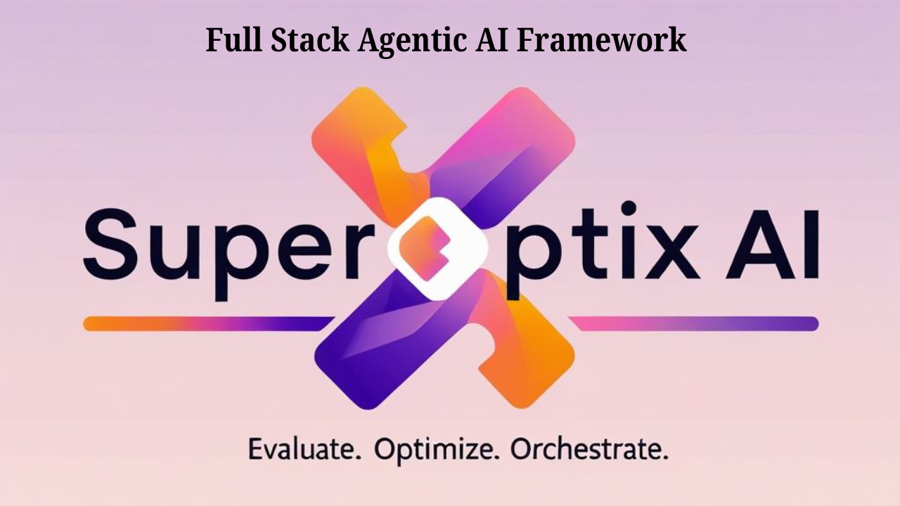

<!-- =================================================================== -->
<!-- HERO SECTION                                                        -->
<!-- =================================================================== -->

  <h1 class="hero-heading gradient-animated">👑 SUPEROPTIX AI</h1>
  
Full Stack Agentic AI Framework

  

    🎉 Oracle & Genies are FREE to try!
    

      <a href="guides/tiers" class="tier-link">📊 View All Tiers →</a>
    

  

  

    🧪 Evaluation-First ⚡ Optimization-Core 🕸️ Multi-Agent Orchestration
  

  
Powered by DSPy. Refined by Superagentic AI.

  

    <a class="md-button md-button--primary" href="quick-start">🚀Quick Start</a>
    <a class="md-button" href="introduction">📖Learn More</a>
    <a class="md-button" href="guides/">📚Guides</a>
  

  

    
↓

  

<!-- Hero Image Section -->

  

<!-- =================================================================== -->
<!-- WHAT IS SUPEROPTIX?                                                 -->
<!-- =================================================================== -->

  <h2>🔍 What is SuperOptiX?</h2>
  

    
SuperOptiX is a <strong>Full-Stack Agentic AI Framework</strong> designed to help developers and teams build optimized, production-grade AI agents from day one. It brings together declarative agent specification, automatic optimization, built-in evaluation, and multi-agent orchestration—all grounded in the principles of test-driven development and context engineering.

    
Unlike most frameworks that bolt on evals and monitoring as an afterthought, SuperOptiX makes <strong>evaluation, optimization, and guardrails core to the development lifecycle</strong>. Whether you're deploying a single agent or a coordinated system of agents, SuperOptiX gives you the power to go from prototype to production—faster, safer, and smarter.

    
🎯 Declarative by Design. ⚡ Optimized by Default. 🎼 Orchestration-Ready.

    
With its native DSL (SuperSpec), DSPy-based optimization layer, structured agent tiers (Oracles, Genies, Protocols, Superagents, Sovereigns), and full-stack abstractions, SuperOptiX empowers you to build reliable, adaptive, and intelligent agentic systems—without reinventing the wheel.

  

<!-- =================================================================== -->
<!-- CORE FEATURES                                                       -->
<!-- =================================================================== -->

  <h2>⚡ Core Features</h2>
  

    
<h3>🎯 Evaluation-First by Design</h3>
Agents are defined and validated using BDD-style specs before orchestration. Every agent starts with behavior-driven goals.

    
<h3>✅ BDD-Style Spec Runner</h3>
Write agent specs in a human-readable DSL (SuperSpec), execute them as tests, and optimize your agents iteratively—just like TDD for AI.

    
<h3>⚙️ DSPy-Powered Optimization Engine</h3>
SuperOptiX builds on DSPy for declarative optimization of agents, prompts, chains, and protocols—with transparent tracing and tuning.

    
<h3>🚀 Agentic DSPy Evolution</h3>
Custom modules for multi-agent coordination, protocol support (MCP, A2A), and advanced agentic scenarios beyond standard DSPy.

    
<h3>🧩 Modular Optimization Architecture</h3>
DSPy as primary adapter with framework-agnostic design. Ready to integrate future optimization frameworks while maintaining user choice.

    
<h3>✍️ Prompt & Context Optimization</h3>
Automatically decompose, optimize, and test prompts and embedded context for better grounding, relevance, and goal alignment.

    
<h3>⚡ Automated Agent Pipeline Generation</h3>
Define your high-level spec, and SuperOptiX generates the entire agent optimization pipeline—including DSPy Signatures, Modules, Evaluation, and Optimization—from prompt tuning to memory wiring.

    
<h3>📄 SuperSpec DSL</h3>
A domain-specific language to declaratively define agents, roles, evaluation specs, tools, and coordination flows. Think Gherkin for agents.

    
<h3>🧠 Inbuilt Memory System</h3>
Modular memory layers (short-term, vector, long-term, ephemeral) that can be composed per agent, protocol, or tier.

    
<h3>📈 Built-in Evals</h3>
Native evaluation suite for functional, behavioral, and optimization-level tests. Run metrics, comparisons, and scenario-based scoring.

    
<h3>📦 Context Engineering Layer</h3>
Structured context frames, templating, prompt modularization, and evaluation-backed refactoring tools.

    
<h3>🤖 Model & Inference Management</h3>
Plug-and-play with OpenAI, Anthropic, HuggingFace, Ollama, Groq, or Apple MLX. Swap models dynamically, locally or via API.

    
<h3>🏪 Marketplace for Prebuilt Agents & Tools</h3>
Discover and deploy pre-optimized Genies, Protocols, memory templates, and tooling components. Build faster with reusable agents.

    
<h3>📊 AgentOps Layer</h3>
Observability, replay, versioning, and adaptive agent debugging. Perfect for production feedback and runtime evaluation.

  

<!-- =================================================================== -->
<!-- SUPEROPTIX AND DSPY                                                 -->
<!-- =================================================================== -->

  <h2>🧠 SuperOptiX & DSPy</h2>
  
  

    <!-- Hero Section -->
    

      <h3 class="gradient-text">Agentic DSPy - Taking Optimization to the Next Level</h3>
      

        <strong>SuperOptiX harnesses the full power of DSPy's optimization principles and elevates them to the agentic layer.</strong> 
        We're not just a DSPy wrapper—we're <em>Agentic DSPy</em>.
      

    

    

      DSPy is the <strong>most powerful optimization framework</strong> in the AI space and the <strong>only framework that systematically optimizes</strong> language model programs. SuperOptiX recognizes this strength and builds upon DSPy's revolutionary optimization-first approach, extending it specifically for agentic AI and multi-agent orchestration.
    

    <!-- Why DSPy Section -->
    

      <h3>🎯 Why DSPy is Perfect for Agentic Systems</h3>
      
DSPy's <strong>iterative optimization principles</strong> align perfectly with <strong>Test-Driven Development (TDD)</strong> and <strong>Behavior-Driven Development (BDD)</strong> methodologies. It's as if DSPy was designed specifically for building reliable, testable agentic systems:

      
      

        <table>
          <thead>
            <tr>
              <th>DSPy Core Strength</th>
              <th>Agentic System Need</th>
              <th>SuperOptiX Innovation</th>
            </tr>
          </thead>
          <tbody>
            <tr>
              <td><strong>Optimization-First</strong></td>
              <td>Reliable agent behavior</td>
              <td>BDD-style agent specifications</td>
            </tr>
            <tr>
              <td><strong>Assertions & Evaluations</strong></td>
              <td>Agent validation</td>
              <td>Multi-tier evaluation framework</td>
            </tr>
            <tr>
              <td><strong>Signature Generation</strong></td>
              <td>Context engineering</td>
              <td>Advanced prompt optimization</td>
            </tr>
            <tr>
              <td><strong>Module Composition</strong></td>
              <td>Multi-agent coordination</td>
              <td>Orchestra-level optimization</td>
            </tr>
          </tbody>
        </table>
      

    

    <!-- SuperOptiX Evolution Section -->
    

      <h3>🚀 SuperOptiX: The Agentic Evolution of DSPy</h3>
      
      <h4>Advanced Custom Modules for Agentic AI</h4>
      
SuperOptiX includes sophisticated modules designed specifically for agentic and multi-agent scenarios that extend beyond the standard DSPy offering:

      
      

        

          
🤝

          <h4 class="gradient-text">Multi-Agent Coordination Modules</h4>
          
Advanced orchestration patterns for complex multi-agent scenarios

        

        

          
🔗

          <h4 class="gradient-text">Protocol Support Modules</h4>
          
MCP (Model Context Protocol) and A2A (Agent-to-Agent) integration

        

        

          
🧠

          <h4 class="gradient-text">Memory-Optimized Modules</h4>
          
Context-aware memory management across agent interactions

        

        

          
🛡️

          <h4 class="gradient-text">Guardrail Modules</h4>
          
Safety and compliance checks for production deployment

        

      

      <h4>⚡ Automatic Pipeline Generation from Specifications</h4>
      
SuperOptiX uses DSPy's optimization engine to automatically generate entire agent pipelines from high-level specifications:

      
      

        

          

            
1

            

              <strong class="gradient-text">Auto-generates DSPy Signatures</strong> based on agent role and context
            

          

          

            
2

            

              <strong class="gradient-text">Creates optimized DSPy Modules</strong> for multi-step reasoning
            

          

          

            
3

            

              <strong class="gradient-text">Builds complete evaluation pipelines</strong> with behavioral tests
            

          

          

            
4

            

              <strong class="gradient-text">Generates optimization workflows</strong> tailored to agent requirements
            

          

        

      

      <h4>🧩 Modular Optimization Architecture</h4>
      
SuperOptiX takes a <strong>modular approach</strong> to optimization and evaluation:

      
      

        

          
🔧

          

            <strong class="gradient-text">DSPy as Primary Adapter</strong>
            Leverages DSPy's proven optimization capabilities
          

        

        

          
🌐

          

            <strong class="gradient-text">Framework Agnostic</strong>
            Ready to integrate other optimization frameworks as they emerge
          

        

        

          
⚙️

          

            <strong class="gradient-text">Custom Optimization Layer</strong>
            Users can implement specialized optimization strategies
          

        

        

          
🎯

          

            <strong class="gradient-text">Choice and Flexibility</strong>
            Multiple optimization paths for different use cases
          

        

      

    

    <!-- Perfect Marriage Section -->
    

      <h3>💫 The Perfect Marriage: DSPy + Agentic AI</h3>
      
DSPy's emphasis on <strong>systematic optimization</strong>, <strong>evaluation-driven development</strong>, and <strong>composable modules</strong> makes it the ideal foundation for building robust agentic systems. SuperOptiX extends this foundation with:

      
      

        

          
📝

          <h4 class="gradient-text">Application-Layer Abstractions</h4>
          
SuperSpec DSL for declarative agent building

        

        

          
✅

          <h4 class="gradient-text">BDD Testing Framework</h4>
          
Behavior-driven specifications for agent validation

        

        

          
🏛️

          <h4 class="gradient-text">Multi-Tier Architecture</h4>
          
Progressive complexity from Oracles to Sovereigns

        

        

          
🛠️

          <h4 class="gradient-text">Production-Ready Features</h4>
          
Memory management, observability, and deployment tools

        

      

    

    

      
SuperOptiX transforms DSPy from a research framework into a production-ready agentic AI platform.

    

  

<!-- =================================================================== -->
<!-- SUPERSPEC CTA                                                       -->
<!-- =================================================================== -->

  

    <h2 class="gradient-text">💎 SuperSpec - The Heart of Agent Building</h2>
    

      <strong>SuperSpec is our declarative DSL that makes agent building as simple as writing a specification.</strong> Think of it as "Kubernetes for AI agents" - you describe what you want, and SuperOptiX builds the entire pipeline.
    

    

      
📝 Declarative Agent Specs

      
✅ BDD-Style Testing

      
⚙️ Auto-Optimization

      
⚡ Pipeline Generation

    

    

      <a href="guides/superspec" class="md-button md-button--primary">💎 Explore SuperSpec</a>
      <a href="reference/api/superspec" class="md-button">📗 DSL Reference</a>
    

  

<!-- =================================================================== -->
<!-- WHY SUPEROPTIX SECTION                                              -->
<!-- =================================================================== -->

  

    <h2>🤔 Why SuperOptiX?</h2>
    

      

        <h3>🚨 The Challenge</h3>
        
Building production-grade AI agents remains a significant challenge. Most available frameworks are designed for demos, not deployment, and rely on hardcoded prompts with no built-in optimization. This leads to fragile systems and reinvention of common components.

        
As a result, <strong>over 95% of AI projects never make it to production</strong>—not due to lack of ambition, but due to lack of the right tooling, standards, and engineering discipline.

        <ul>
          <li>❌ Fragile, hardcoded prompts</li>
          <li>❌ No systematic optimization</li>
          <li>❌ Lack of evaluation frameworks</li>
          <li>❌ Production deployment challenges</li>
        </ul>
      

      

        <h3>✨ Our Solution</h3>
        
SuperOptiX AI is the first evolution‑first, behavior‑driven framework that combines:

        <ul>
          <li><strong>✅ Built‑in Evaluation (BDD first)</strong>: Write behavior‑driven specs that serve as executable tests.</li>
          <li><strong>✅ Optimization at the Core</strong>: Data‑driven performance tuning, powered by DSPy.</li>
          <li><strong>✅ Orchestration‑Ready Pipelines</strong>: Kubernetes‑style DSL and multi‑agent coordination.</li>
          <li><strong>✅ Production‑Grade Monitoring</strong>: Guardrails, observability, and safe‑by‑design architecture.</li>
        </ul>
        
All within a single, end‑to‑end solution—no stitching together siloed tools.

      

    

  

<!-- =================================================================== -->
<!-- FREE TIERS CTA                                                      -->
<!-- =================================================================== -->

!!! success "🆓 Start Free Today!"
    **Oracle & Genie tiers are completely FREE to try!** No credit card required.
    
    - 🧙‍♂️ **Oracle Tier**: Simple Q&A and automation - **FREE**
    - 🧞‍♂️ **Genie Tier**: Multi-step reasoning with tools & RAG - **FREE**
    - 🎭 **Protocol Tier+**: Advanced enterprise features - Commercial
    
    **[Get Started Now](quick-start)** | **[View All Tiers](guides/tiers)** | **[Install SuperOptiX](setup)**

<!-- =================================================================== -->
<!-- NEW TO SUPEROPTIX?                                                  -->
<!-- =================================================================== -->

!!! tip "🎉 New to SuperOptiX?"
    **Start with our [Quick Start Guide](quick-start)** - designed to be your "wow moment" with SuperOptiX!
    
    **Need to set up first?** Check out [Installation](setup) and [LLM Setup](llm-setup) to get everything configured.
    
    Or jump directly to [Create First Genies Agent](tutorials/genies-agent) to get hands-on experience.

<!-- =================================================================== -->
<!-- WHAT MAKES SUPEROPTIX SPECIAL?                                      -->
<!-- =================================================================== -->

  <h2>🌟 What Makes SuperOptiX Special?</h2>
  
SuperOptiX isn't just another agent framework — it's the <strong>world's first optimization-first, orchestration-ready, evaluation-built Agentic AI framework</strong>. Here's what sets us apart:

  <h3>⚡ Optimization-First Philosophy</h3>
  
Traditional AI frameworks treat optimization as an afterthought. SuperOptiX puts it at the core:

| Traditional Approach | SuperOptiX Approach |
|:---|:---|
| ❌ Build → Hope it works | ✅ **Specify → Evaluate → Optimize → Deploy** |
| ❌ Manual prompt tuning | ✅ **Automated DSPy optimization** |
| ❌ No systematic testing | ✅ **BDD-driven evaluation** |
| ❌ Production surprises | ✅ **Safe-by-design validation** |

   

  <h3>🏆 The SuperOptiX Differentiator</h3>

| Feature | SuperOptiX | Other Frameworks |
|:---|:---:|:---:|
| **Agent Optimization** | ✅ Built-in DSPy optimization | ❌ (DSPy exception) |
| **Agent Creation & Orchestration** | ✅ Complete framework | ✅ (basic) |
| **InBuilt Model Management** | ✅ MLX/HF/Ollama/LM Studio | ❌ |
| **BDD/TDD Spec Runner** | ✅ Professional evaluation | ❌ |
| **Local Inference + Memory + RAG** | ✅ Integrated solution | ✅ (external) |
| **DSL for Agent Specs (SuperSpec)** | ✅ Kubernetes-style | ❌ |
| **Tracing & Observability** | ✅ Built-in monitoring | ✅ |

<!-- =================================================================== -->
<!-- PROGRESSIVE TIER SYSTEM                                             -->
<!-- =================================================================== -->

  <h2>🏗️ Progressive Tier System</h2>
  
  !!! info "💼 Commercial Package with Free Tiers"
      **SuperOptiX is a commercial package**, but we offer **Oracle and Genie tiers completely free to try**! This allows you to experience the power of SuperOptiX before considering our commercial tiers (Protocol, Superagent, and Sovereign) for advanced enterprise features.
  
  
Scale from simple to enterprise complexity with our 5-tier architecture inspired by Nick Bostrom's Superintelligence and Sam Altman's AGI stages:

=== "🧙‍♂️ Oracles (Free to Try)"
    **Simple, fast question answering system** that involves interaction with LLMs and responding to your queries. There is no connection to external data and quality of output directly depends on the quality of the LLMs used.
    
    - **Status**: ✅ Available (Free to Try)
    - **What**: Simple, single-purpose agents
    - **Use Case**: Basic automation, simple Q&A
    - **Example**: FAQ bot, data formatter
    - **Complexity**: Low
    - **Cost**: 🆓 Free
    
    **Key Features:**
    - Single-step reasoning
    - Template-based responses
    - Built-in optimization and validations
    
    **Includes:**
    - Any LLM Support, Model Management, Few Shot Optimization, Simple Evals, BDD Spec Runner, Simple Sequential Multi Agent Orchestra, Static Pipelines Code with SuperOptiX DSPy Mixin, Demo Purpose Outputs, Basic tracing and observability

=== "🧞‍♂️ Genies (Free to Try)"
    **Multi-step reasoning agents** that involve interaction with LLMs and external systems like knowledge and tools. This system uses reasoning and action (ReAct) to perform controlled actions on your behalf.
    
    - **Status**: ✅ Available (Free to Try)
    - **What**: Multi-step reasoning agents
    - **Use Case**: Customer service, content creation
    - **Example**: Support agent, content writer
    - **Complexity**: Medium
    - **Cost**: 🆓 Free
    
    **Key Features:**
    - Multi-step reasoning with ReAct
    - Dynamic tool selection and usage
    - Memory integration and learning through RAG
    
    **Includes:**
    - Function calling LLM Support, Custom Function calling DSPy tools, RAG with favorite vectorDB Support, Model Management with MLX, HF, Ollama and LM Studio, Few Shot and Labeled Few Shot Optimization, Simple Evals, Basic DSPy Memory Support, BDD Spec Runner basic metrics, Sequential Multi Agent Orchestra, Static Pipelines Code with SuperOptiX DSPy Mixin, Demo Purpose Outputs with usage tracking, Basic Tool Tracing Observability and Tool call, Multi-Agent Orchestra with demo outputs

=== "🎭 Protocols (Commercial)"
    **Highly advanced tier** with support of industry-evolving protocols like MCP and A2A, covering all features from Oracles and Genies. This layer uses advanced industry protocols to make agents better and communicate with LLMs and each other.
    
    - **Status**: 🔒 Commercial (Contact Us)
    - **What**: Complex workflow agents
    - **Use Case**: Business processes, decision making
    - **Example**: Sales qualification, risk assessment
    - **Complexity**: High
    - **Cost**: 💼 Commercial
    
    **Key Features:**
    - Advanced agents with MCP & A2A protocols
    - Integrate with external APIs, systems, workflows
    
    **Includes:**
    - Everything from Oracles and Genies, Custom Function calling DSPy tools, Agentic RAG with popular vectorDB Support, AgentVectorDB Integration, Advanced Model Management with vLLM, SGLang, TGI servers for Production deployment, Advanced DSPy and Custom Optimizers, Layered Memory Support, Automated Basic Synthetic Data Generation, BDD Spec Runner with advanced metrics and validations, Parallel Multi Agent Orchestra, Controlled DSPy Pipelines (No Mixin), Production Worthy Agent Output format suitable for multi-agent system, Advanced Tracing Observability and Tool, Integration with third party tools like MLflow, Basic Planner → Executor Multi Agent Orchestra, Basic Kubernetes Style Orchestra

=== "🤖 Superagents (Commercial)"
    **Multi-agent systems with coordination** where a lead agent called Superagent may spawn automated subagents to perform tasks and work with other superagents. This involves higher levels of orchestration managed by AgentLines.
    
    - **Status**: 🔒 Commercial (Work in Progress)
    - **What**: Multi-agent systems with coordination
    - **Use Case**: Complex business workflows
    - **Example**: E-commerce platform, research team
    - **Complexity**: Expert
    - **Cost**: 💼 Commercial
    
    **Key Features:**
    - Superagents orchestrating other agents
    - AgentLines for scalable multi-agent governance
    
    **Tentative Features:**
    - Everything from Oracles, Genies and Protocols, Agentic DSPy Pipeline for Superagent, Advanced Model Management with vLLM, SGLang, TGI servers for Production deployment, Integration with high level GPU infra and MLOps tools for deployment, Combination of LLM and Fine Tuned SLMs, Context Management with VectorDBs and Advanced Memory, Agentic BDD Spec Runner within orchestra and AgentLines, Human in the loop interaction based on defined criteria, Integration with third party DevOps, MLOps Cloud providers

=== "👑 Sovereigns (Commercial)"
    **Autonomous AI systems** suitable for large-scale AI operations and enterprise workflows. These are the highest level of AI autonomy with advanced multi-agent orchestration and strategic planning.
    
    - **Status**: 🔒 Commercial (Coming Soon)
    - **What**: Autonomous AI
    - **Use Case**: Large-scale AI operations
    - **Example**: AI-powered company, research lab
    - **Complexity**: Enterprise
    - **Cost**: 💼 Commercial
    
    **Key Features:**
    - Advanced multi-agent orchestration
    - Strategic planning and execution
    
    **Tentative Features:**
    - Automatic discovery of agents based on task or goal, Ephemeral Agents making decisions and handling tasks, Integration with agent marketplace for choosing agents for tasks, Multiple LLM and Fine Tuned SLMs, Context Management with VectorDBs and Advanced Memory, Agentic BDD Spec Runner within orchestra and AgentLines, Integration with Multiple third party DevOps, MLOps Cloud providers

<!-- =================================================================== -->
<!-- KEY CAPABILITIES                                                    -->
<!-- =================================================================== -->

  <h2>🔧 Key Capabilities</h2>
  

    
✅ BDD Testing

    
✅ Performance Optimization

    
✅ Multi-Agent Orchestration

    
✅ Production Operations

    
✅ Memory Systems

    
✅ RAG Integration

    
✅ Model Management

    
✅ Local & Cloud Inference

  

<!-- =================================================================== -->
<!-- FINAL CTA                                                           -->
<!-- =================================================================== -->

  <h2 class="gradient-text">🚀 Ready to Build the Future of AI?</h2>
  

    Join the SuperOptiX movement to create intelligent, optimized, and reliable AI agents.
  

  

    🆓 <strong>Start FREE today</strong> with Oracle & Genie tiers - no credit card required!
  

  

    <a href="quick-start" class="md-button md-button--primary">🚀 Start Free</a>
    <a href="tutorials/genies-agent" class="md-button">🤖 Create First Agent</a>
    <a href="guides/tiers" class="md-button">🎭 View Tiers</a>
  

<em>👑 SuperOptiX: The King of Agent Frameworks - Where optimization meets intelligence.</em>

