<h1 class="hero-heading gradient-text">🎯 Introduction to SuperOptiX AI</h1>
<div class="hero-heading-underline"></div>

<div class="hero-section" style="text-align: center; margin: 3rem 0; padding: 2rem; background: linear-gradient(135deg, rgba(139, 92, 246, 0.1) 0%, rgba(236, 72, 153, 0.1) 50%, rgba(245, 158, 11, 0.1) 100%); border-radius: var(--border-radius); border: 2px solid rgba(139, 92, 246, 0.3);">
    <p class="hero-tagline" style="background: linear-gradient(135deg, #8B5CF6 0%, #EC4899 50%, #F59E0B 100%); background-clip: text; -webkit-background-clip: text; -webkit-text-fill-color: transparent; font-size: 1.8rem; font-weight: bold; margin-bottom: 1rem;">🚀 Super Quick Intro to SuperOptiX</p>
    <p class="hero-subtitle" style="background: linear-gradient(135deg, #10B981 0%, #3B82F6 50%, #A855F7 100%); background-clip: text; -webkit-background-clip: text; -webkit-text-fill-color: transparent; font-size: 1.2rem; margin-bottom: 1rem;">A Brief Walkthrough to Understand the Future of Agentic AI</p>
    <p class="hero-gradient-text" style="background: linear-gradient(135deg, #DC2626 0%, #EA580C 50%, #D97706 100%); background-clip: text; -webkit-background-clip: text; -webkit-text-fill-color: transparent; font-size: 1rem;"><strong>Get up to speed with SuperOptiX concepts in minutes, not hours.</strong></p>
</div>

## 🚀 What is SuperOptiX?

<div style="text-align: center; margin: 3rem 0; padding: 2rem; background: linear-gradient(135deg, rgba(139, 92, 246, 0.1) 0%, rgba(236, 72, 153, 0.1) 50%, rgba(245, 158, 11, 0.1) 100%); border-radius: var(--border-radius); border: 2px solid rgba(139, 92, 246, 0.3);">
    <h3 style="margin-bottom: 1rem; background: linear-gradient(135deg, #8B5CF6 0%, #EC4899 50%, #F59E0B 100%); background-clip: text; -webkit-background-clip: text; -webkit-text-fill-color: transparent; font-weight: bold;">👑 The King of Agent Frameworks</h3>
    <p style="font-size: 1.1rem; margin-bottom: 2rem;">
        <strong>SuperOptiX is a Full-Stack Agentic AI Framework designed to help developers and teams build optimized, production-grade AI agents from day one.</strong>
    </p>
</div>

**SuperOptiX** brings together declarative agent specification, automatic optimization, built-in evaluation, and multi-agent orchestration—all grounded in the principles of test-driven development and context engineering.

### 🎯 **Core Philosophy**

Unlike most frameworks that bolt on evals and monitoring as an afterthought, SuperOptiX makes **evaluation, optimization, and guardrails core** to the development lifecycle. Whether you're deploying a single agent or a coordinated system of agents, SuperOptiX gives you the power to go from prototype to production—faster, safer, and smarter.

**🧠 Declarative by Design. Optimized by Default. Orchestration-Ready.**

With its native DSL (SuperSpec), DSPy-based optimization layer, structured agent tiers (Oracles, Genies, Protocols, Superagents, Sovereigns), and full-stack abstractions, SuperOptiX empowers you to build reliable, adaptive, and intelligent agentic systems—without reinventing the wheel.

## 🧬 Core Features

<div style="display: grid; grid-template-columns: repeat(auto-fit, minmax(300px, 1fr)); gap: 1.5rem; margin: 2rem 0;">
    <div style="background: linear-gradient(135deg, rgba(139, 92, 246, 0.1) 0%, rgba(236, 72, 153, 0.1) 100%); border: 1px solid rgba(139, 92, 246, 0.3); border-radius: 12px; padding: 1.5rem;">
        <h4 style="color: #8B5CF6; margin-bottom: 0.5rem;">🧪 Evaluation-First Architecture</h4>
        <p>BDD-style specifications with built-in testing and validation from day one.</p>
    </div>
    
    <div style="background: linear-gradient(135deg, rgba(16, 185, 129, 0.1) 0%, rgba(59, 130, 246, 0.1) 100%); border: 1px solid rgba(16, 185, 129, 0.3); border-radius: 12px; padding: 1.5rem;">
        <h4 style="color: #10B981; margin-bottom: 0.5rem;">⚙️ DSPy-Powered Optimization</h4>
        <p>Automatic optimization of prompts, context, and multi-agent coordination.</p>
    </div>
    
    <div style="background: linear-gradient(135deg, rgba(245, 158, 11, 0.1) 0%, rgba(236, 72, 153, 0.1) 100%); border: 1px solid rgba(245, 158, 11, 0.3); border-radius: 12px; padding: 1.5rem;">
        <h4 style="color: #F59E0B; margin-bottom: 0.5rem;">💎 SuperSpec DSL</h4>
        <p>Declarative language for agent specifications with Kubernetes-style versioning.</p>
    </div>
    
    <div style="background: linear-gradient(135deg, rgba(59, 130, 246, 0.1) 0%, rgba(168, 85, 247, 0.1) 100%); border: 1px solid rgba(59, 130, 246, 0.3); border-radius: 12px; padding: 1.5rem;">
        <h4 style="color: #3B82F6; margin-bottom: 0.5rem;">🧠 Context Engineering</h4>
        <p>Systematic approach to delivering optimal information and tools to agents.</p>
    </div>
    
    <div style="background: linear-gradient(135deg, rgba(236, 72, 153, 0.1) 0%, rgba(139, 92, 246, 0.1) 100%); border: 1px solid rgba(236, 72, 153, 0.3); border-radius: 12px; padding: 1.5rem;">
        <h4 style="color: #EC4899; margin-bottom: 0.5rem;">🎭 Multi-Tier Architecture</h4>
        <p>Progressive complexity from Oracles to Sovereigns with built-in safety.</p>
    </div>
    
    <div style="background: linear-gradient(135deg, rgba(16, 185, 129, 0.1) 0%, rgba(245, 158, 11, 0.1) 100%); border: 1px solid rgba(16, 185, 129, 0.3); border-radius: 12px; padding: 1.5rem;">
        <h4 style="color: #10B981; margin-bottom: 0.5rem;">🔄 Production-Ready</h4>
        <p>Built-in memory, observability, orchestration, and continuous improvement.</p>
    </div>
</div>

## 🔄 How SuperOptiX Differs from Other Agent Frameworks

<div style="text-align: center; margin: 3rem 0; padding: 2rem; background: linear-gradient(135deg, rgba(16, 185, 129, 0.1) 0%, rgba(59, 130, 246, 0.1) 50%, rgba(168, 85, 247, 0.1) 100%); border-radius: var(--border-radius); border: 2px solid rgba(16, 185, 129, 0.3);">
    <h3 style="margin-bottom: 1rem; background: linear-gradient(135deg, #10B981 0%, #3B82F6 50%, #A855F7 100%); background-clip: text; -webkit-background-clip: text; -webkit-text-fill-color: transparent; font-weight: bold;">🏆 Why SuperOptiX Stands Apart</h3>
    <p style="font-size: 1.1rem; margin-bottom: 2rem;">
        <strong>SuperOptiX isn't just another agent framework—it's a complete paradigm shift in how we build, test, and deploy AI agents.</strong>
    </p>
</div>

### 🎯 **Key Differentiators**

<div style="display: grid; grid-template-columns: repeat(auto-fit, minmax(300px, 1fr)); gap: 1.5rem; margin: 2rem 0;">
    <div style="background: linear-gradient(135deg, rgba(139, 92, 246, 0.1) 0%, rgba(236, 72, 153, 0.1) 100%); border: 1px solid rgba(139, 92, 246, 0.3); border-radius: 12px; padding: 1.5rem;">
        <h4 style="color: #8B5CF6; margin-bottom: 0.5rem;">🧪 Evaluation-First</h4>
        <p><strong>Other frameworks:</strong> Add evaluation as an afterthought<br>
        <strong>SuperOptiX:</strong> Evaluation built into core development cycle</p>
    </div>
    
    <div style="background: linear-gradient(135deg, rgba(16, 185, 129, 0.1) 0%, rgba(59, 130, 246, 0.1) 100%); border: 1px solid rgba(16, 185, 129, 0.3); border-radius: 12px; padding: 1.5rem;">
        <h4 style="color: #10B981; margin-bottom: 0.5rem;">📜 BDD-Style Development</h4>
        <p><strong>Other frameworks:</strong> Manual prompt engineering<br>
        <strong>SuperOptiX:</strong> Behavior-driven specifications with automated testing</p>
    </div>
    
    <div style="background: linear-gradient(135deg, rgba(245, 158, 11, 0.1) 0%, rgba(236, 72, 153, 0.1) 100%); border: 1px solid rgba(245, 158, 11, 0.3); border-radius: 12px; padding: 1.5rem;">
        <h4 style="color: #F59E0B; margin-bottom: 0.5rem;">⚙️ DSPy-Powered Optimization</h4>
        <p><strong>Other frameworks:</strong> Manual optimization or none<br>
        <strong>SuperOptiX:</strong> Automatic optimization using proven techniques</p>
    </div>
    
    <div style="background: linear-gradient(135deg, rgba(59, 130, 246, 0.1) 0%, rgba(168, 85, 247, 0.1) 100%); border: 1px solid rgba(59, 130, 246, 0.3); border-radius: 12px; padding: 1.5rem;">
        <h4 style="color: #3B82F6; margin-bottom: 0.5rem;">🏭 Production-Ready</h4>
        <p><strong>Other frameworks:</strong> Basic deployment capabilities<br>
        <strong>SuperOptiX:</strong> Built-in memory, observability, and orchestration</p>
    </div>
</div>

## 🧬 SuperOptiX vs DSPy: The Evolution

<div style="text-align: center; margin: 3rem 0; padding: 2rem; background: linear-gradient(135deg, rgba(139, 92, 246, 0.1) 0%, rgba(236, 72, 153, 0.1) 50%, rgba(245, 158, 11, 0.1) 100%); border-radius: var(--border-radius); border: 2px solid rgba(139, 92, 246, 0.3);">
    <h3 style="margin-bottom: 1rem; background: linear-gradient(135deg, #8B5CF6 0%, #EC4899 50%, #F59E0B 100%); background-clip: text; -webkit-background-clip: text; -webkit-text-fill-color: transparent; font-weight: bold;">🔥 Agentic DSPy - Taking Optimization to the Next Level</h3>
    <p style="font-size: 1.1rem; margin-bottom: 2rem;">
        <strong>SuperOptiX harnesses the full power of DSPy's optimization principles and elevates them to the agentic layer.</strong><br>
        We're not just a DSPy wrapper—we're <em>Agentic DSPy</em>.
    </p>
</div>

### 🚀 **Why DSPy is Perfect for Agentic Systems**

DSPy's **iterative optimization principles** align perfectly with **Test-Driven Development (TDD)** and **Behavior-Driven Development (BDD)** methodologies. It's as if DSPy was designed specifically for building reliable, testable agentic systems:

| DSPy Core Strength | Agentic System Need | SuperOptiX Innovation |
|-------------------|-------------------|---------------------|
| **Optimization-First** | Reliable agent behavior | BDD-style agent specifications |
| **Assertions & Evaluations** | Agent validation | Multi-tier evaluation framework |
| **Signature Generation** | Context engineering | Advanced prompt optimization |
| **Module Composition** | Multi-agent coordination | Orchestra-level optimization |

### 🧬 **SuperOptiX: The Agentic Evolution of DSPy**

**🔄 Advanced Custom Modules for Agentic AI**

SuperOptiX includes sophisticated modules designed specifically for agentic and multi-agent scenarios that extend beyond the standard DSPy offering:

- **🤖 Multi-Agent Coordination Modules** - Advanced orchestration patterns
- **🔄 Protocol Support Modules** - MCP (Model Context Protocol) and A2A (Agent-to-Agent) integration
- **🧠 Memory-Optimized Modules** - Context-aware memory management across agent interactions
- **🛡️ Guardrail Modules** - Safety and compliance checks for production deployment

**⚡ Automatic Pipeline Generation from Specifications**

SuperOptiX uses DSPy's optimization engine to automatically generate entire agent pipelines from high-level specifications:

- Auto-generates **DSPy Signatures** based on agent role and context
- Creates optimized **DSPy Modules** for multi-step reasoning
- Builds complete **evaluation pipelines** with behavioral tests
- Generates **optimization workflows** tailored to agent requirements

## 🎭 BDD and TDD in SuperOptiX

<div style="text-align: center; margin: 3rem 0; padding: 2rem; background: linear-gradient(135deg, rgba(16, 185, 129, 0.1) 0%, rgba(59, 130, 246, 0.1) 50%, rgba(168, 85, 247, 0.1) 100%); border-radius: var(--border-radius); border: 2px solid rgba(16, 185, 129, 0.3);">
    <h3 style="margin-bottom: 1rem; background: linear-gradient(135deg, #10B981 0%, #3B82F6 50%, #A855F7 100%); background-clip: text; -webkit-background-clip: text; -webkit-text-fill-color: transparent; font-weight: bold;">🧪 Test-Driven Agent Development</h3>
    <p style="font-size: 1.1rem; margin-bottom: 2rem;">
        <strong>SuperOptiX brings the proven methodologies of TDD and BDD to AI agent development.</strong><br>
        Write tests first, then build agents that pass them.
    </p>
</div>

### 🎯 **What is BDD (Behavior-Driven Development)?**

**Behavior-Driven Development (BDD)** is a software development methodology that bridges the gap between technical and non-technical stakeholders by describing software behavior in natural language. BDD focuses on **behavior** rather than implementation details.

### 🎯 **What is TDD (Test-Driven Development)?**

**Test-Driven Development (TDD)** is a development methodology where you write tests before writing the actual code. The cycle is: **Red** (write failing test) → **Green** (write code to pass test) → **Refactor** (improve code while keeping tests passing).

### 🤖 **BDD + TDD for AI Agents**

In SuperOptiX, BDD and TDD work together to create reliable, testable AI agents:

#### **1. BDD Scenarios as Agent Specifications**
```yaml
# SuperSpec Feature Specifications (BDD Scenarios)
feature_specifications:
  scenarios:
    - name: "robust_api_endpoint_creation"
      description: "Given a REST API requirement, the agent should generate secure, validated, well-documented endpoints"
      input:
        feature_requirement: "Create a user authentication endpoint with email validation, password hashing, rate limiting, and comprehensive error handling"
      expected_output:
        implementation: |
          from fastapi import APIRouter, HTTPException, Depends
          from pydantic import BaseModel, EmailStr
          from passlib.context import CryptContext
          from slowapi import Limiter, _rate_limit_exceeded_handler
          
          pwd_context = CryptContext(schemes=["bcrypt"], deprecated="auto")
          limiter = Limiter(key_func=lambda: "global")
          
          class AuthRequest(BaseModel):
              email: EmailStr
              password: str
          
          @router.post("/auth/login")
          @limiter.limit("5/minute")
          async def authenticate_user(request: AuthRequest):
              # Validate email format (handled by EmailStr)
              if not request.password or len(request.password) < 8:
                  raise HTTPException(status_code=400, detail="Invalid password format")
              
              # Hash password for comparison
              hashed_password = pwd_context.hash(request.password)
              
              # Database lookup would go here
              return {"status": "success", "token": "jwt_token_here"}
```

#### **2. TDD Cycle for Agent Development**
```bash
# 1. Write BDD scenarios (Red)
super agent evaluate developer

# 2. Build agent to pass scenarios (Green)
super agent compile developer

# 3. Optimize agent while maintaining quality (Refactor)
super agent optimize developer
```

### 🔄 **The Perfect Match: BDD + DSPy**

BDD is **perfectly suited** for AI agent development because:

- **🎯 Behavior-First Approach**: AI agents are defined by their behavioral capabilities
- **🔄 Iterative Improvement**: BDD scenarios become training data for optimization
- **🧪 Testable Specifications**: Every agent capability can be specified and tested

## ⚙️ Optimization & Evaluation in SuperOptiX

<div style="text-align: center; margin: 3rem 0; padding: 2rem; background: linear-gradient(135deg, rgba(245, 158, 11, 0.1) 0%, rgba(236, 72, 153, 0.1) 50%, rgba(139, 92, 246, 0.1) 100%); border-radius: var(--border-radius); border: 2px solid rgba(245, 158, 11, 0.3);">
    <h3 style="margin-bottom: 1rem; background: linear-gradient(135deg, #F59E0B 0%, #EC4899 50%, #8B5CF6 100%); background-clip: text; -webkit-background-clip: text; -webkit-text-fill-color: transparent; font-weight: bold;">🔬 Evaluation-First, Optimization-Core</h3>
    <p style="font-size: 1.1rem; margin-bottom: 2rem;">
        <strong>SuperOptiX makes evaluation and optimization core to the development lifecycle, not afterthoughts.</strong>
    </p>
</div>

### 🧪 **Evaluation Framework**

SuperOptiX provides a comprehensive evaluation framework that goes beyond simple accuracy metrics:

#### **1. Multi-Tier Evaluation**
- **Functional Tests**: Does the agent produce correct outputs?
- **Behavioral Tests**: Does the agent behave as expected?
- **Quality Tests**: Does the agent meet quality standards?
- **Compliance Tests**: Does the agent follow defined constraints?

#### **2. BDD-Style Evaluation**
```bash
# Run comprehensive evaluation
super agent evaluate developer

# Output includes:
# ✅ Functional accuracy: 95%
# ✅ Behavioral compliance: 92%
# ✅ Performance metrics: 1.2s avg response
# ✅ Safety checks: All passed
```

### ⚡ **Optimization Engine**

SuperOptiX uses DSPy's proven optimization techniques to continuously improve agent performance:

#### **1. Automatic Prompt Optimization**
- **Context Engineering**: Optimize the information provided to agents
- **Prompt Decomposition**: Break complex prompts into optimized components
- **Template Optimization**: Improve prompt templates based on evaluation results

#### **2. Multi-Agent Optimization**
- **Coordination Optimization**: Improve how agents work together
- **Protocol Optimization**: Optimize communication protocols
- **Context Optimization**: Optimize information delivery and retrieval

#### **3. Continuous Improvement Loop**
```bash
# 1. Establish baseline
super agent evaluate developer

# 2. Optimize based on evaluation results
super agent optimize developer

# 3. Re-evaluate to measure improvement
super agent evaluate developer

# 4. Repeat until quality targets are met
```

## 💎 SuperSpec and Context Engineering

<div style="text-align: center; margin: 3rem 0; padding: 2rem; background: linear-gradient(135deg, rgba(139, 92, 246, 0.1) 0%, rgba(236, 72, 153, 0.1) 50%, rgba(245, 158, 11, 0.1) 100%); border-radius: var(--border-radius); border: 2px solid rgba(139, 92, 246, 0.3);">
    <h3 style="margin-bottom: 1rem; background: linear-gradient(135deg, #8B5CF6 0%, #EC4899 50%, #F59E0B 100%); background-clip: text; -webkit-background-clip: text; -webkit-text-fill-color: transparent; font-weight: bold;">💎 SuperSpec - The Heart of Agent Building</h3>
    <p style="font-size: 1.1rem; margin-bottom: 2rem;">
        <strong>SuperSpec is our declarative DSL that makes agent building as simple as writing a specification.</strong><br>
        Think of it as "Kubernetes for AI agents" - you describe what you want, and SuperOptiX builds the entire pipeline.
    </p>
</div>

<div style="display: grid; grid-template-columns: repeat(auto-fit, minmax(250px, 1fr)); gap: 1.5rem; margin: 2rem 0;">
    <div style="background: linear-gradient(135deg, rgba(139, 92, 246, 0.1) 0%, rgba(236, 72, 153, 0.1) 100%); border: 1px solid rgba(139, 92, 246, 0.3); border-radius: 12px; padding: 1.5rem; text-align: center;">
        <div style="font-size: 2rem; margin-bottom: 0.5rem;">📝</div>
        <h4 style="color: #8B5CF6; margin-bottom: 0.5rem;">Declarative Agent Specs</h4>
        <p>Write agent specifications in YAML, not code</p>
    </div>
    
    <div style="background: linear-gradient(135deg, rgba(16, 185, 129, 0.1) 0%, rgba(59, 130, 246, 0.1) 100%); border: 1px solid rgba(16, 185, 129, 0.3); border-radius: 12px; padding: 1.5rem; text-align: center;">
        <div style="font-size: 2rem; margin-bottom: 0.5rem;">🧪</div>
        <h4 style="color: #10B981; margin-bottom: 0.5rem;">BDD-Style Testing</h4>
        <p>Behavior-driven specifications with automated validation</p>
    </div>
    
    <div style="background: linear-gradient(135deg, rgba(245, 158, 11, 0.1) 0%, rgba(236, 72, 153, 0.1) 100%); border: 1px solid rgba(245, 158, 11, 0.3); border-radius: 12px; padding: 1.5rem; text-align: center;">
        <div style="font-size: 2rem; margin-bottom: 0.5rem;">⚙️</div>
        <h4 style="color: #F59E0B; margin-bottom: 0.5rem;">Auto-Optimization</h4>
        <p>Automatic optimization using DSPy's proven techniques</p>
    </div>
    
    <div style="background: linear-gradient(135deg, rgba(59, 130, 246, 0.1) 0%, rgba(168, 85, 247, 0.1) 100%); border: 1px solid rgba(59, 130, 246, 0.3); border-radius: 12px; padding: 1.5rem; text-align: center;">
        <div style="font-size: 2rem; margin-bottom: 0.5rem;">🏗️</div>
        <h4 style="color: #3B82F6; margin-bottom: 0.5rem;">Pipeline Generation</h4>
        <p>Automatic generation of complete agent pipelines</p>
    </div>
</div>

### 🎯 **What is SuperSpec?**

**SuperSpec** (pronounced `/suː.pər spɛk/`) is the **context and agent engineering specification language** for AI agents. It's designed to provide the **just-right context** to agents so they perform better - not too much, not too little, but striking the perfect balance.

### 🏗️ **SuperSpec Design Principles**

#### **1. Declarative & Strongly Typed**
SuperSpec is **declarative** and **strongly typed** to ensure strong contracts between context and LLM output. This contract then converts into **DSPy Signatures** which validate the output even further.

#### **2. Kubernetes-Inspired**
Like Kubernetes DSL for declaring pods, deployments, and services, SuperSpec provides a **Kubernetes-style declarative specification** for AI agents:

```yaml
# Kubernetes-style declarative approach
apiVersion: agent/v1
kind: AgentSpec
metadata:
  name: my-agent
  namespace: production
spec:
  # Declare what you want, not how to get it
```

#### **3. Version Controllable**
SuperSpec specifications are **totally version controllable** and context can be versioned, enabling:
- **Git-based agent management**
- **Rollback capabilities**
- **A/B testing of agent configurations**
- **Team collaboration on agent development**

### 🧠 **Context Engineering**

**Context engineering** is the systematic approach to designing dynamic systems that deliver precisely the right information and tools in the optimal format, enabling LLMs to successfully accomplish their intended tasks.

**When agents fail to perform reliably, the root cause is almost always insufficient or poorly structured context, unclear instructions, or missing tools that haven't been properly communicated to the model.**

### 📋 **SuperSpec Structure Overview**

```yaml
apiVersion: agent/v1                    # REQUIRED - Schema version
kind: AgentSpec                        # REQUIRED - Object type
metadata:                              # REQUIRED - Agent identity
spec:                                  # REQUIRED - Agent specification
  language_model:                      # REQUIRED - LLM configuration
  persona:                             # OPTIONAL - Agent personality
  tasks:                               # REQUIRED - Agent capabilities
  agentflow:                           # OPTIONAL - Execution flow
  tools:                               # OPTIONAL - Tool integration
  memory:                              # OPTIONAL - Memory systems
  rag:                                 # OPTIONAL - Knowledge retrieval
  evaluation:                          # OPTIONAL - Quality metrics
  feature_specifications:              # OPTIONAL - BDD scenarios
  optimization:                        # OPTIONAL - Performance tuning
```

## 🔄 Agent Development Lifecycle in SuperOptiX

<div style="text-align: center; margin: 3rem 0; padding: 2rem; background: linear-gradient(135deg, rgba(16, 185, 129, 0.1) 0%, rgba(59, 130, 246, 0.1) 50%, rgba(168, 85, 247, 0.1) 100%); border-radius: var(--border-radius); border: 2px solid rgba(16, 185, 129, 0.3);">
    <h3 style="margin-bottom: 1rem; background: linear-gradient(135deg, #10B981 0%, #3B82F6 50%, #A855F7 100%); background-clip: text; -webkit-background-clip: text; -webkit-text-fill-color: transparent; font-weight: bold;">🔄 From Concept to Production</h3>
    <p style="font-size: 1.1rem; margin-bottom: 2rem;">
        <strong>SuperOptiX provides a complete development lifecycle for building production-ready AI agents.</strong>
    </p>
</div>

### 🎯 **The SuperOptiX Development Workflow**

```mermaid
graph LR
    A[📝 Define Agent Spec] --> B[🧪 Write BDD Scenarios]
    B --> C[🏗️ Compile Agent]
    C --> D[📊 Evaluate Baseline]
    D --> E[⚙️ Optimize Agent]
    E --> F[📊 Re-evaluate]
    F --> G{Quality Targets Met?}
    G -->|No| E
    G -->|Yes| H[🚀 Deploy to Production]
    H --> I[📈 Monitor & Iterate]
    
    style A fill:#1e3a8a,stroke:#3b82f6,stroke-width:2px,color:#ffffff
    style B fill:#7c3aed,stroke:#a855f7,stroke-width:2px,color:#ffffff
    style C fill:#059669,stroke:#10b981,stroke-width:2px,color:#ffffff
    style D fill:#d97706,stroke:#f59e0b,stroke-width:2px,color:#ffffff
    style E fill:#dc2626,stroke:#ef4444,stroke-width:2px,color:#ffffff
    style F fill:#059669,stroke:#10b981,stroke-width:2px,color:#ffffff
    style G fill:#dc2626,stroke:#ef4444,stroke-width:2px,color:#ffffff
    style H fill:#059669,stroke:#10b981,stroke-width:2px,color:#ffffff
    style I fill:#1e3a8a,stroke:#3b82f6,stroke-width:2px,color:#ffffff
```



### 📋 **Step-by-Step Development Process**

#### **1. 📝 Define Agent Specification**
```bash
# Option 1: Create a new agent specification
super spec generate developer_agent --tier oracles

# Option 2: Pull agent from marketplace and edit
super market install agent developer_assistant

# Option 3: Use Streamlit UI Studio to design agent
super agent design --tier oracles --mode studio
```

#### **2. 🧪 Write BDD Scenarios**
```yaml
# Define behavior-driven scenarios
feature_specifications:
  scenarios:
    - name: "code_review_assistance"
      description: "Agent should provide helpful code review feedback"
      input:
        code: "def calculate_sum(a, b): return a + b"
      expected_output:
        feedback: "Consider adding type hints and error handling"
```

#### **3. 🏗️ Compile Agent**
```bash
# Compile the agent from specification
super agent compile developer_agent
```

#### **4. 📊 Evaluate Baseline**
```bash
# Run initial evaluation
super agent evaluate developer_agent
```

#### **5. ⚙️ Optimize Agent**
```bash
# Optimize based on evaluation results
super agent optimize developer_agent
```

#### **6. 🚀 Deploy to Production**
```bash
# Deploy the optimized agent
super agent run developer_agent --goal "your_goal"
```

### 🎭 **Multi-Tier Agent Architecture**

SuperOptiX provides a progressive complexity model for agent development:

| Tier | Complexity | Use Case | Capabilities |
|------|------------|----------|--------------|
| **🔮 Oracles** | Simple | Q&A, Basic Tasks | Single-turn interactions |
| **🧞 Genies** | Moderate | Multi-step Tasks | Tool usage, Memory |
| **🤝 Protocols** | Advanced | Multi-Agent Coordination | Agent-to-Agent communication |
| **👑 Superagents** | Complex | Autonomous Systems | Self-improvement, Planning |
| **🌟 Sovereigns** | Expert | Full Autonomy | Self-governing, Meta-cognition |

## 🚀 Building Production-Worthy AI Agents

<div style="text-align: center; margin: 3rem 0; padding: 2rem; background: linear-gradient(135deg, rgba(139, 92, 246, 0.1) 0%, rgba(236, 72, 153, 0.1) 50%, rgba(245, 158, 11, 0.1) 100%); border-radius: var(--border-radius); border: 2px solid rgba(139, 92, 246, 0.3);">
    <h3 style="margin-bottom: 1rem; background: linear-gradient(135deg, #8B5CF6 0%, #EC4899 50%, #F59E0B 100%); background-clip: text; -webkit-background-clip: text; -webkit-text-fill-color: transparent; font-weight: bold;">🏭 From Prototype to Production</h3>
    <p style="font-size: 1.1rem; margin-bottom: 2rem;">
        <strong>SuperOptiX provides everything you need to build, test, and deploy production-ready AI agents.</strong>
    </p>
</div>

### 🎯 **Production-Ready Features**

#### **1. 🧪 Comprehensive Testing**
- **BDD Scenarios**: Behavior-driven specifications
- **Functional Tests**: Output validation
- **Quality Tests**: Quality standards validation
- **Compliance Tests**: Constraint validation

#### **2. 🔧 Built-in Optimization**
- **Automatic Prompt Optimization**: DSPy-powered improvements
- **Context Engineering**: Optimal information delivery
- **Multi-Agent Coordination**: Optimized agent interactions
- **Continuous Improvement**: Automated optimization loops


#### **4. 🔄 Continuous Improvement**
- **Automated Optimization**: Continuous performance improvement
- **Evaluation Loops**: Regular quality assessment
- **Feedback Integration**: Learn from real-world usage
- **Version Management**: Track and manage improvements

### 🚀 **Getting Started with Production Agents**

#### **1. Start with Oracles**
```bash
# Create a simple Q&A agent
super spec generate qa_agent --tier oracles
super agent compile qa_agent
super agent evaluate qa_agent
```

#### **2. Progress to Genies**
```bash
# Add tool usage and memory
super spec generate assistant_agent --tier genies
super agent compile assistant_agent
super agent optimize assistant_agent
```

#### **3. Scale to Multi-Agent Systems**
```bash
# Create coordinated agent systems
super orchestra create development_team
super orchestra run development_team --goal "your goal"
```


## 🎯 **Next Steps**

<div style="text-align: center; margin: 3rem 0; padding: 2rem; background: linear-gradient(135deg, rgba(16, 185, 129, 0.1) 0%, rgba(59, 130, 246, 0.1) 50%, rgba(168, 85, 247, 0.1) 100%); border-radius: var(--border-radius); border: 2px solid rgba(16, 185, 129, 0.3);">
    <h3 style="margin-bottom: 1rem; background: linear-gradient(135deg, #10B981 0%, #3B82F6 50%, #A855F7 100%); background-clip: text; -webkit-background-clip: text; -webkit-text-fill-color: transparent; font-weight: bold;">🚀 Ready to Build Your First Agent?</h3>
    <p style="font-size: 1.1rem; margin-bottom: 2rem;">
        <strong>Now that you understand SuperOptiX, it's time to start building!</strong>
    </p>
    <div style="display: flex; justify-content: center; gap: 1rem; flex-wrap: wrap;">
        <a href="quick-start" style="background: linear-gradient(135deg, #667eea 0%, #764ba2 100%); color: white; padding: 1rem 2rem; border-radius: 8px; text-decoration: none; font-weight: bold; box-shadow: 0 4px 6px rgba(102, 126, 234, 0.25);">🚀 Quick Start Guide</a>
        <a href="tutorials/oracles-agent" style="background: linear-gradient(135deg, #10B981 0%, #059669 100%); color: white; padding: 1rem 2rem; border-radius: 8px; text-decoration: none; font-weight: bold; box-shadow: 0 4px 6px rgba(16, 185, 129, 0.25);">🎯 Your First Agent</a>
        <a href="tutorials/genies-agent" style="background: linear-gradient(135deg, #8B5CF6 0%, #EC4899 100%); color: white; padding: 1rem 2rem; border-radius: 8px; text-decoration: none; font-weight: bold; box-shadow: 0 4px 6px rgba(139, 92, 246, 0.25);">🎯 Agent with Tools & RAG</a>
        <a href="tutorials/first-orchestra" style="background: linear-gradient(135deg, #F59E0B 0%, #D97706 100%); color: white; padding: 1rem 2rem; border-radius: 8px; text-decoration: none; font-weight: bold; box-shadow: 0 4px 6px rgba(245, 158, 11, 0.25);">🎼 Your First Orchestra</a>
        <a href="guides/superspec" style="background: linear-gradient(135deg, #f093fb 0%, #f5576c 100%); color: white; padding: 1rem 2rem; border-radius: 8px; text-decoration: none; font-weight: bold; box-shadow: 0 4px 6px rgba(240, 147, 251, 0.25);">💎 Learn SuperSpec</a>
        <a href="examples/" style="background: linear-gradient(135deg, #4facfe 0%, #00f2fe 100%); color: white; padding: 1rem 2rem; border-radius: 8px; text-decoration: none; font-weight: bold; box-shadow: 0 4px 6px rgba(79, 172, 254, 0.25);">🔗 View Examples</a>
    </div>
</div>

### 📚 **Recommended Learning Path**

1. **🚀 Quick Start**: Build your first agent in minutes
2. **🎯 Your First Agent**: Build a reasoning-focused agent with chain-of-thought capabilities
3. **🎯 Agent with Tools & RAG**: Build a production-ready agent with tools and RAG
4. **🎼 Your First Orchestra**: Build a multi-agent team with coordinated workflows
5. **💎 SuperSpec Guide**: Master the declarative DSL
6. **🧪 BDD Guide**: Learn behavior-driven development
7. **⚙️ Optimization Guide**: Understand DSPy-powered optimization
8. **🎭 Multi-Agent Guide**: Build coordinated agent systems
9. **🏭 Production Guide**: Deploy and monitor in production

### 🎯 **Key Takeaways**

- **SuperOptiX** is a full-stack agentic AI framework built on proven principles
- **Evaluation-first** approach ensures reliable, testable agents
- **BDD and TDD** methodologies bring software engineering best practices to AI
- **DSPy-powered optimization** provides continuous improvement
- **SuperSpec DSL** makes agent building declarative and version-controllable
- **Multi-tier architecture** supports progressive complexity
- **Production-ready features** enable enterprise deployment

**Ready to revolutionize your AI agent development? Start with SuperOptiX today! 🚀** 